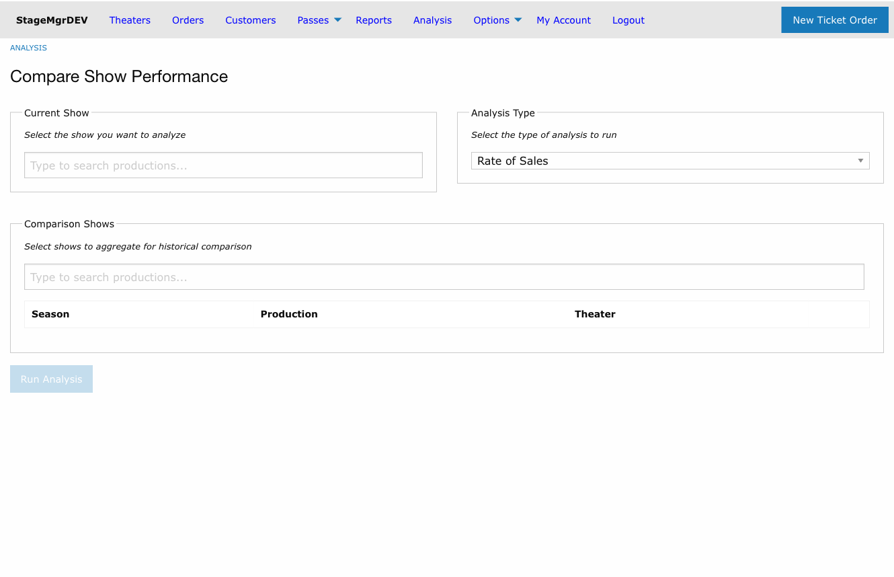
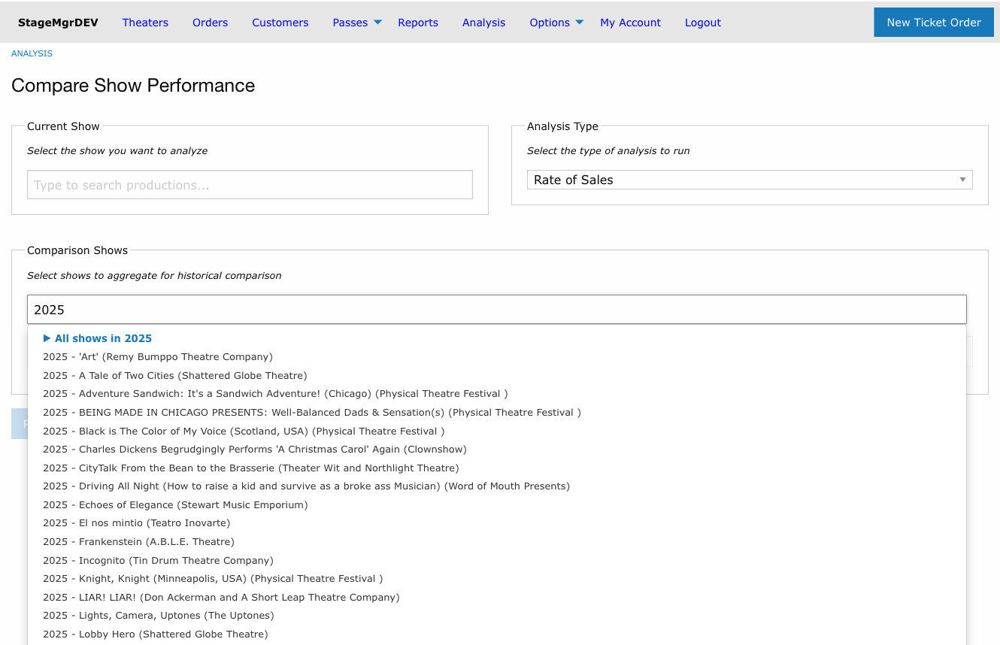
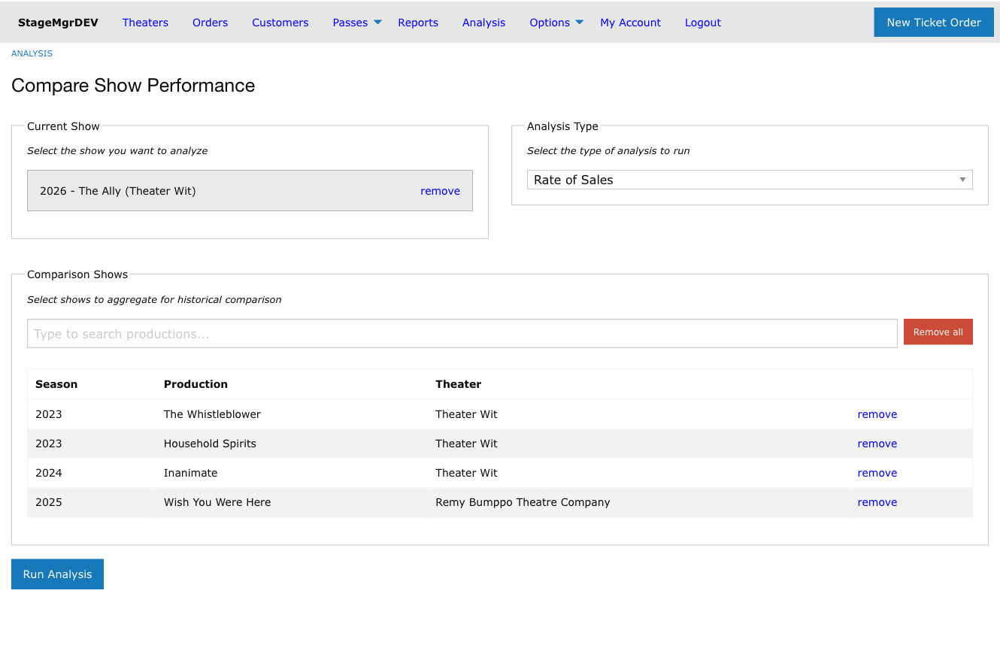

# Analysis Overview

!!! info "Access"
    Analysis is available to **Admin** and **Theater** users. Box Office users do not have
    access. Theater users see only productions belonging to their theaters.

**Navigation:** Admin Menu > Analysis

---

## About Analysis

The Analysis section lets you compare a current show's sales performance against a set of
historical productions. Unlike Reports, which export raw data, Analysis provides computed
insights, visual comparisons, and revenue projections to help you make decisions about
marketing spend, run extensions, and programming.

## Analysis Types

### Rate of Sales

Compares week-over-week growth in ticket sales and revenue between a current show and a
set of historical comparison shows. Includes:

- **Daily Average Rate of Sales** -- Rolling 7-day revenue for the current show, plotted
  daily for a high-resolution view of sales momentum
- **Rate of Sales Charts** -- Week-over-week percentage change in tickets and revenue for
  the current show, alongside the historical aggregate average
- **Performance Insights** -- Computed metrics comparing the current show to historical
  averages (tickets/week, revenue/week, growth trajectory, lifecycle position)
- **Revenue Projection** -- Two projected cumulative revenue lines through end of run:
  a **Historical-scaled** line that applies the current show's performance ratio to a
  comparison-show lifecycle curve, and a **Self-scaled (momentum)** line that extends
  the current show's own recent growth rate forward. Both lines are capped by remaining
  seat inventory and support modeling run extensions.

See [Rate of Sales Analysis](rate-of-sales.md) for full details.

### Ticket Revenue

Analyzes how tickets were distributed across price tiers and how that distribution
affected gross revenue. For each price bucket -- a grouping of related ticket classes --
it shows ticket counts, capacity and sold percentages, sell-through rate, actual gross,
and (when dynamic pricing is configured) flat-base gross and dynamic lift.

- **Price Distribution Charts** -- One bar per price bucket, showing its share of total
  capacity or total paid sales. Comp and Unsold bars fill the remainder.
- **Revenue Summary** -- Performances, paid tickets, comp tickets, total capacity,
  capacity utilization, gross revenue, and overall average paid price
- **Per-Bucket Detail Table** -- Full breakdown by price tier including allocation cap
  flags (⚑) for buckets that sold to their limit
- **Dynamic Pricing Lift** -- For productions using dynamic pricing promotion triggers,
  the revenue earned above the flat entry-price baseline

Unlike Rate of Sales, a historical comparison is optional for Ticket Revenue. You can
analyze a single show or compare it side-by-side with one historical production.

See [Ticket Revenue Analysis](ticket-revenue.md) for full details.

## Setting Up an Analysis

Selecting **Analysis Type** from the dropdown changes which comparison field is shown:

- **Rate of Sales** -- Shows a multi-show comparison table. At least one comparison show
  is required.
- **Ticket Revenue** -- Shows a single historical production field. No comparison is
  required; you can run the analysis on a single show.

### Rate of Sales

Every Rate of Sales analysis requires two selections:

1. **Current Show** -- The production you want to analyze. Select one show using the
   autocomplete search field.
2. **Comparison Shows** -- One or more historical productions to aggregate as the baseline.
   You can add shows individually or use bulk shortcuts.

### Ticket Revenue

Ticket Revenue requires only a **Current Show**. Optionally add one **Historical
Production** to display side-by-side charts and tables. The "Run Analysis" button enables
as soon as a current show is selected.

### Searching for Productions

Type at least 2 characters in either search field. You can search by:

- Production name
- Season year (e.g., "2025")
- Production code

Productions on **Presale** status are excluded from search results. All other statuses
(Active, Inactive, Private) are available.

### Bulk Selection Shortcuts

When adding comparison shows, the autocomplete offers group shortcuts at the top of the
results list, shown with a triangle icon:

- **All shows in [year]** -- Adds every production from that season
- **All shows by [company]** -- Adds every production by that theater company

Selecting a group shortcut expands it into individual productions in the comparison table.
You can then remove any shows you don't want included. Theater users only see groups for
their own theaters.

### Managing the Comparison List

Each comparison show appears in a table with Season, Production, and Theater columns.
You can:

- **Remove individual shows** by clicking "remove" on any row
- **Remove all shows** by clicking the "Remove all" button (with confirmation)
- **Return with selections intact** -- The "Back to Analysis" button on the results page
  preserves your current and comparison selections

### Running the Analysis

Once you have the required selections for the chosen analysis type, click **Run
Analysis** to generate results.

## Tips

- For meaningful comparisons, select shows with similar characteristics (venue size,
  genre, audience demographics). A small fringe show compared against a large-venue
  musical will produce skewed ratios.
- For Rate of Sales, include 3-5 comparison shows when possible. A single comparison
  show reflects that one show's specific trajectory; multiple shows smooth out anomalies.
- For Ticket Revenue, choose a comparison show from a prior year's run of the same title
  or a show with similar pricing structure to see whether your current pricing mix is
  yielding better or worse results.
- Season-based selection ("All shows in 2024") is useful for understanding how this
  year's programming compares to a prior season overall.
- Theater-based selection ("All shows by Theater Wit") is useful for understanding a
  company's historical sales pattern.
