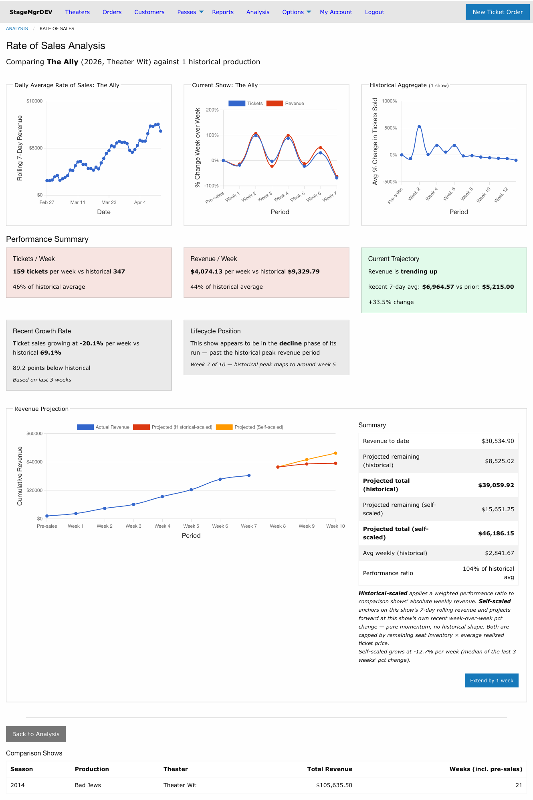
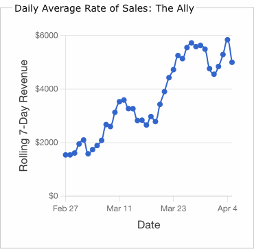
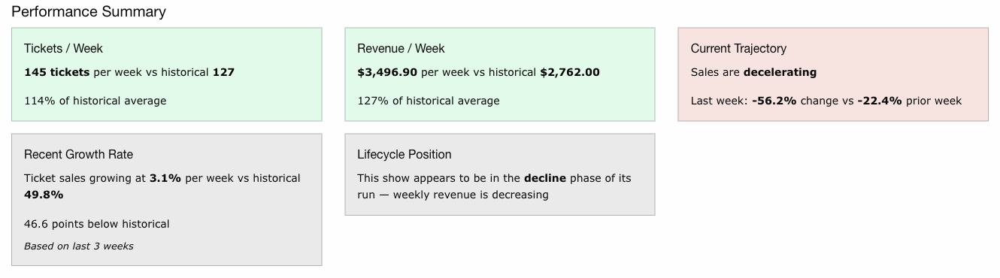
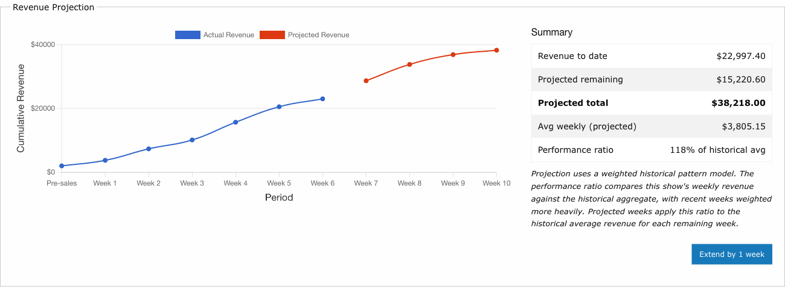

# Rate of Sales Analysis

!!! info "Access"
    Available to Admin and Theater users. Theater users see only their own productions.

**Navigation:** Analysis > Select shows > Run Analysis (Rate of Sales)

---

## What It Shows

Rate of Sales analysis answers the question: *"Given the historical sales pattern of shows
Y, how does the current show X compare, and what revenue might I expect through the end of
the run?"*

The analysis page has five sections:

1. [Daily Average Rate of Sales](#daily-average-rate-of-sales)
2. [Rate of Sales Charts](#rate-of-sales-charts)
3. [Performance Summary](#performance-summary)
4. [Revenue Projection](#revenue-projection)
5. [Comparison Shows Table](#comparison-shows-table)

---

## Daily Average Rate of Sales

A daily line chart showing the **rolling 7-day sum of gross revenue** for the current
show. Each point on the chart represents the total gross sales for that day plus the
previous 6 days.

- **X-axis** -- Calendar dates from the start of Week 1 through the most recent
  completed day
- **Y-axis** -- Rolling 7-day revenue in dollars

This chart provides a higher-resolution view of revenue momentum than the weekly charts.
Look for:

- **Sustained upward trends** indicating growing audience demand
- **Dips followed by recovery** which may correspond to mid-week lulls vs weekend surges
- **Flattening or declining curves** suggesting the show may be entering a plateau or
  decline phase

!!! tip "Reading the Ramp-Up"
    The first few data points will appear lower because the rolling window extends before
    the start of the sales period (those earlier days count as $0). The chart naturally
    ramps up as the full 7-day window fills with actual sales data.

---

## Rate of Sales Charts

Two side-by-side line charts showing week-over-week percentage change in sales.

### Current Show Chart

Displays two lines:

- **Tickets** -- Percentage change in paid tickets sold, week over week
- **Revenue** -- Percentage change in gross revenue, week over week

The current incomplete week is excluded to avoid showing partial data.

### Historical Aggregate Chart

Displays a single line showing the average week-over-week percentage change in ticket
sales across all selected comparison shows. Weeks where a comparison production had zero
sales are excluded from the average.

### Week Numbering

Both charts use normalized week labels:

| Label | Period |
|-------|--------|
| **Pre-sales** | All sales more than 3 weeks before first preview (collapsed to one point) |
| **Week 1** | 21-15 days before first preview |
| **Week 2** | 14-8 days before first preview |
| **Week 3** | 7-1 days before first preview |
| **Week 4+** | First preview week onward, sequential through end of run |

This normalization lets you compare shows with different start dates and run lengths on
the same scale.

### How to Read the Charts

- **Positive values** mean sales increased from the previous week.
- **Negative values** mean sales decreased.
- **A value of 0%** means sales were flat compared to the prior week.

Compare the shape of the current show's curve against the historical aggregate. If the
current show's line is consistently above the aggregate, sales are growing faster than
history. If below, sales are lagging.

!!! warning "Early Week Spikes"
    The first few weeks often show very large percentage changes (e.g., 500%) because
    the base numbers are small. A jump from 5 tickets to 30 tickets is a 500% increase
    but may only represent $750. Focus on weeks 3+ for meaningful trend comparison.

---

## Performance Summary

Six computed metrics comparing the current show to the historical baseline. Each metric
is displayed in a color-coded card:

- **Green** -- 110% or more of historical average (outperforming)
- **Yellow** -- 90-110% of historical average (tracking normally)
- **Red** -- Below 90% of historical average (underperforming)

### Tickets / Week

Average paid tickets sold per week for the current show vs the historical average over
the same weeks. Shows the ratio as a percentage of historical.

### Revenue / Week

Average gross revenue per week for the current show vs the historical average. Shows the
ratio as a percentage of historical.

### Current Trajectory

Whether revenue is **trending up**, **trending down**, or **holding steady** based on the
daily rolling 7-day revenue data. Compares the average rolling revenue over the last 7
days against the prior 7 days. Shows both averages as dollar amounts and the percentage
change between them. Requires at least 14 days of sales data to appear.

### Recent Growth Rate

Average week-over-week percentage change in ticket sales over the **last 3 completed
weeks** for both the current show and the historical aggregate. Uses only recent weeks
to avoid early-run spikes that make full-run averages misleading.

### Lifecycle Position

Estimates whether the show is currently in:

- **Growth** -- Historically, shows at this point in their run are still building revenue
- **Plateau** -- The show is near the point where historical shows reached peak revenue
- **Decline** -- The show is past the historical peak revenue period

Based on mapping the current show's position (week N of M) against where historical
comparison shows peaked. Shows the mapped peak week for reference.

---

## Revenue Projection

A cumulative revenue chart with two lines:

- **Actual Revenue** (solid) -- Cumulative gross revenue through the last completed week
- **Projected Revenue** (continues from actual) -- Estimated cumulative revenue through
  end of run

### How the Projection Works

The projection uses a **scaled historical pattern model with lifecycle curve fitting**:

1. **Performance ratio**: Compares the current show's weekly revenue to the historical
   aggregate's weekly revenue, with recent weeks weighted more heavily (exponential
   decay factor of 0.7). This ratio indicates how the current show is performing
   relative to history.

2. **Lifecycle curve**: The historical aggregate's revenue curve is split into two phases:
   - **Body** (growth + plateau) -- Detected dynamically from the data as everything
     up to and including the peak week
   - **Decline tail** -- The sustained decline from after the peak through end of run

3. **Curve stretching**: The body phase is stretched to fill the projected run length.
   The decline tail is appended at the end unchanged. This ensures that every
   projection -- regardless of run length -- ends with the natural audience decline
   pattern from historical data.

4. **Revenue calculation**: Each projected week's revenue = interpolated historical
   value at that position in the curve, multiplied by the performance ratio.

### Summary Table

| Metric | Description |
|--------|-------------|
| **Revenue to date** | Actual cumulative gross revenue through last completed week |
| **Projected remaining** | Estimated revenue for all remaining weeks |
| **Projected total** | Revenue to date + projected remaining |
| **Avg weekly (projected)** | Projected remaining divided by number of projected weeks |
| **Performance ratio** | Current show's revenue as a percentage of historical average |

### Run Extensions

The **Extend by 1 week** button models what happens if the run is extended beyond its
scheduled closing date. Each click adds one week to the projection and recalculates
all projected values.

When extending:

- The historical lifecycle curve is stretched to fit the longer run
- The decline tail (end-of-run audience dropoff) shifts to the new end date
- Projected remaining revenue and totals update to reflect the extension
- The **Extended by N weeks** label shows how many weeks have been added
- Click **Reset** to return to the original run length

!!! tip "Extension Modeling"
    Use extensions to evaluate whether adding weeks to a run is likely to generate
    meaningful additional revenue. If each additional week projects declining returns,
    it may not justify the additional costs. Compare the projected average weekly
    revenue against your weekly operating costs to make the decision.

---

## Comparison Shows Table

Lists all selected comparison shows with:

| Column | Description |
|--------|-------------|
| **Season** | The season year |
| **Production** | Show name |
| **Theater** | Producing company |
| **Total Revenue** | Total gross revenue across the entire sales lifecycle (including pre-sales) |
| **Weeks (incl. pre-sales)** | Number of weeks with sales data, including the pre-preview period |

The **Back to Analysis** button above this table returns to the selection page with all
current and comparison show selections preserved, so you can adjust and re-run.
