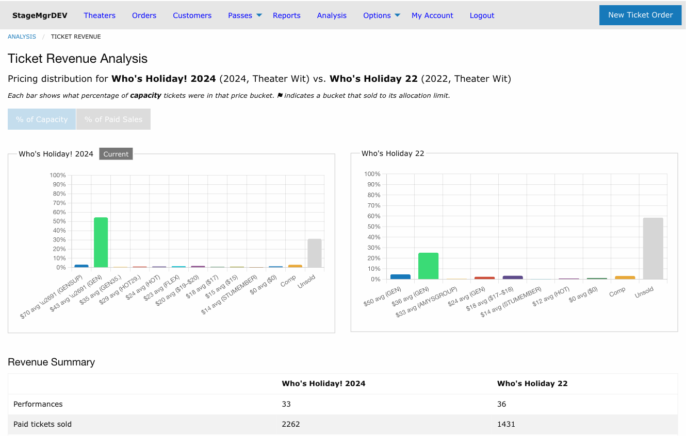
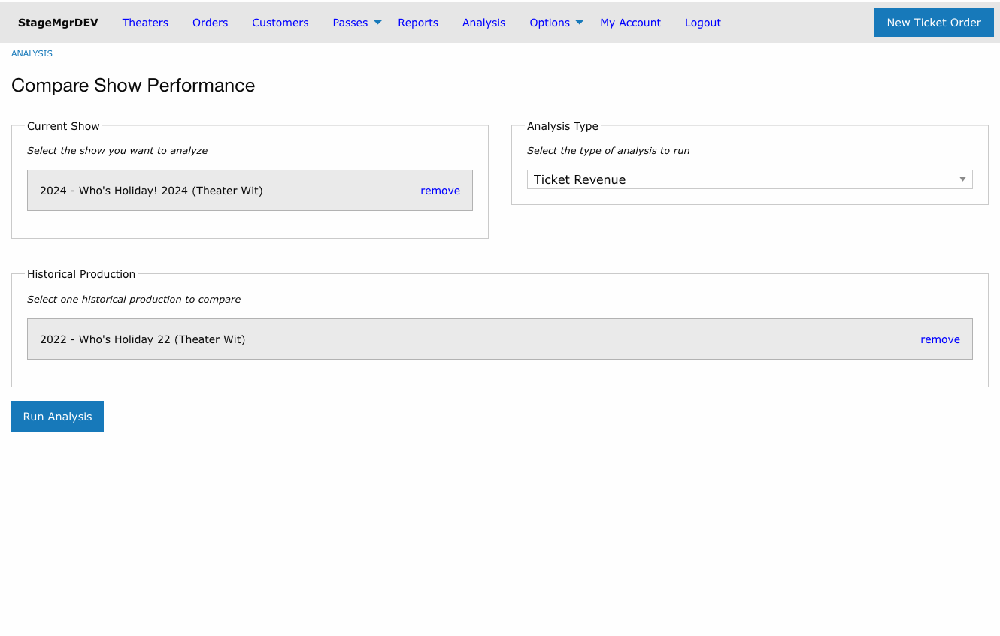
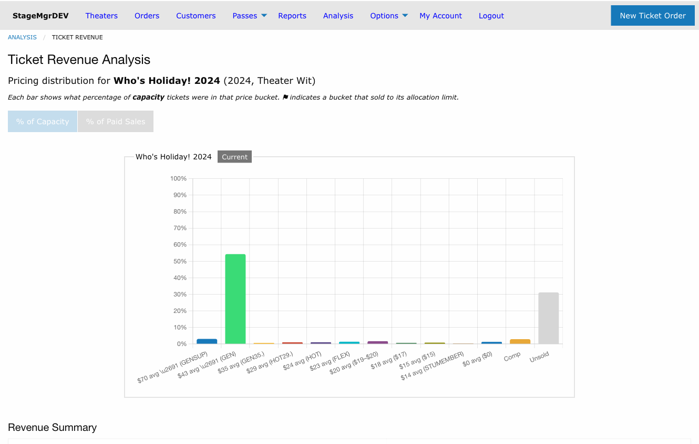
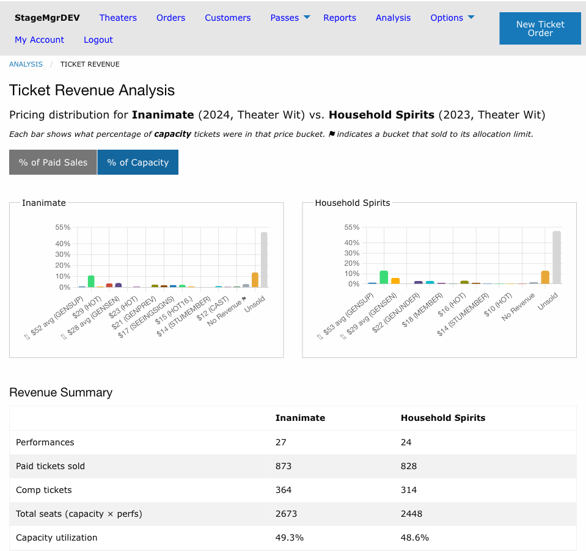
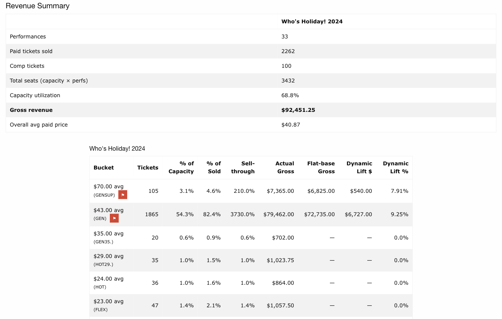
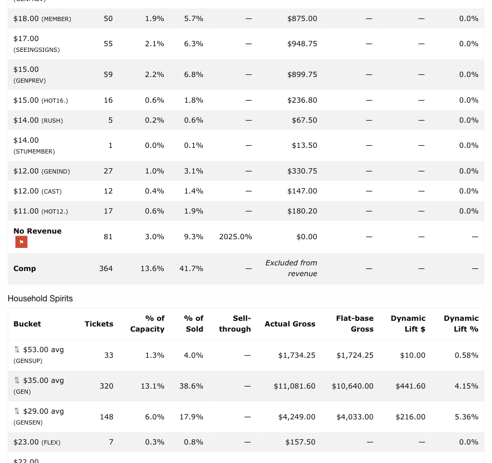
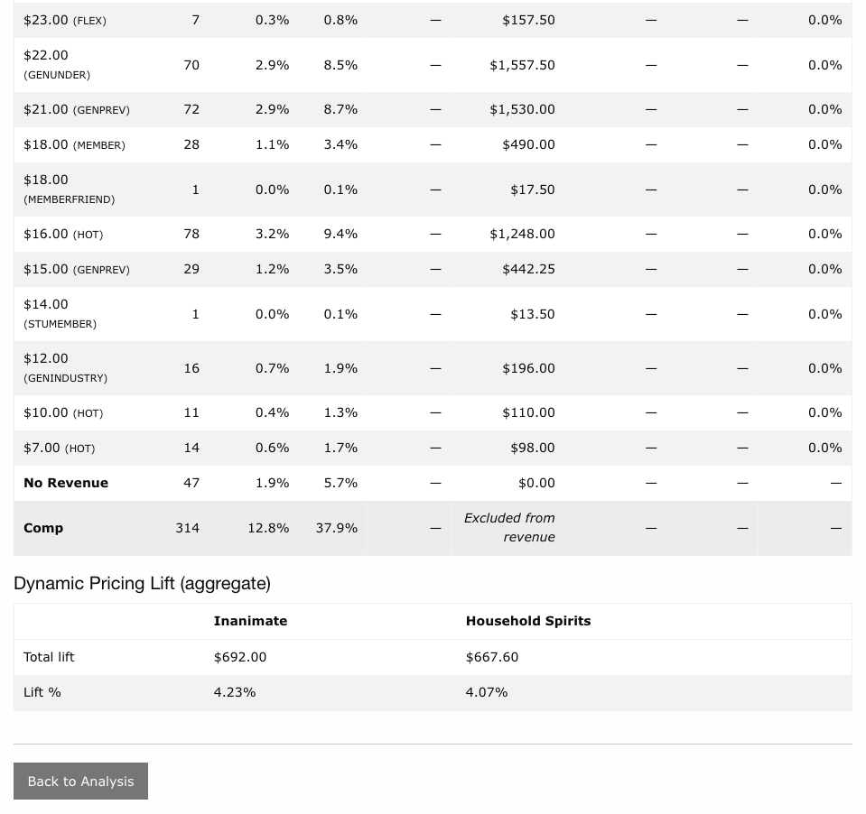
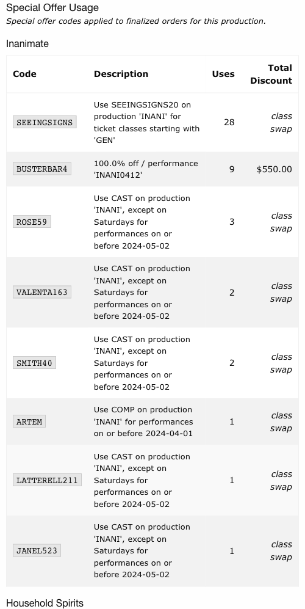
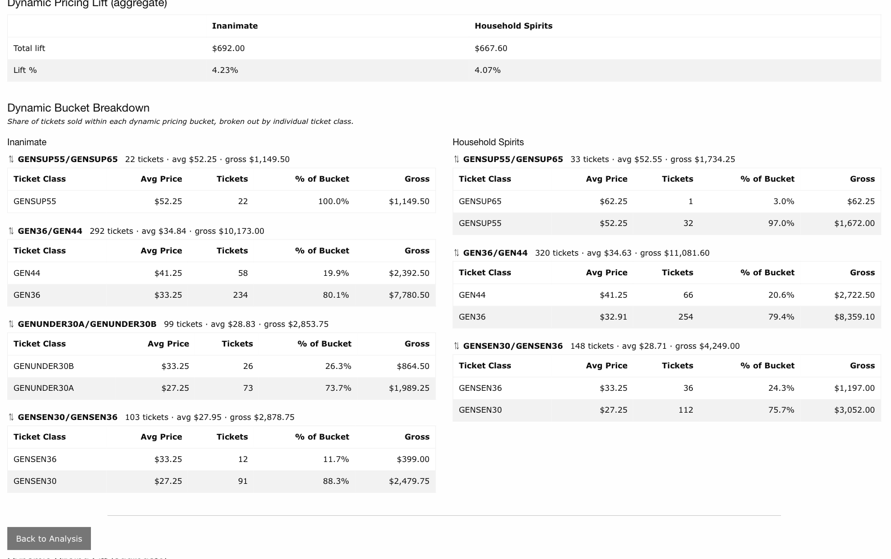

# Ticket Revenue Analysis

!!! info "Access"
    Available to Admin and Theater users. Theater users see only their own productions.

**Navigation:** Analysis > Select show > Run Analysis (Ticket Revenue)

---

## What It Shows

Ticket Revenue analysis answers the question: *"How are tickets distributed across price
points, and how does our pricing strategy affect total revenue?"*

Rather than tracking when tickets were sold, Ticket Revenue focuses on the final state of
the run -- what did tickets actually sell for, and how much revenue did each price tier
contribute? You can analyze a single show or compare it side-by-side with one historical
production.

The analysis page has four sections:

1. [Price Distribution Charts](#price-distribution-charts)
2. [Revenue Summary](#revenue-summary)
3. [Per-Bucket Detail Table](#per-bucket-detail-table)
4. [Dynamic Pricing Lift](#dynamic-pricing-lift)

---

## Setting Up the Analysis

Ticket Revenue is selected from the **Analysis Type** dropdown on the Analysis selection
page. Unlike Rate of Sales, a historical comparison production is **optional** -- you can
run the analysis on a single show without selecting a comparison.

**Current Show** -- The production you want to analyze. Required.

**Historical Production** -- A single historical production to compare against. Optional.
When selected, charts and tables appear side-by-side for both shows.

Selecting the analysis type changes the comparison field from the multi-show table (used
for Rate of Sales) to a single-production search.

!!! tip "Single-show mode"
    Running the analysis without a comparison production is useful when you want to
    evaluate your current show's pricing distribution on its own -- for example, to
    understand how much revenue is coming from discounted tiers vs full price.

---

## Price Distribution Charts

Each chart shows one bar per **price bucket** -- a grouping of related ticket classes.
Bar height represents what percentage of tickets (relative to total capacity or total paid
sales) fell into that price tier.

### Toggle: % of Paid Sales vs % of Capacity

The **% of Paid Sales** / **% of Capacity** buttons control the denominator used for bar
heights and apply to both charts simultaneously.

| Mode | Denominator | What it shows |
|------|-------------|---------------|
| **% of Paid Sales** (default) | Total paid tickets sold | The pricing mix among revenue-generating tickets only. Comp and No Revenue buckets are hidden. |
| **% of Capacity** | Total seats × performances | How each bucket contributed to filling the house, including Comp, No Revenue, and Unsold. |

In capacity mode, two additional bars always appear at the right:

- **No Revenue** -- Tickets from classes with a configured price of $0 that are not flagged
  as complimentary (e.g. rush passes, staff tickets). Shown in grey-blue.
- **Unsold** -- Seats that were neither sold nor comped. Shown in light grey.

### Allocation Cap Flag

A **⚑** flag on a bucket label indicates that the bucket **sold to its allocation limit**
-- every ticket allocated to that price tier was sold. This is a signal that demand at
that price point exceeded supply; more tickets could likely have been sold at that price.

### In-Progress Shows

When a production is still running, a warning banner appears below the chart:

> **Run in progress** -- N of M performances complete.

This reminds you that the revenue picture is incomplete. Either show can be in progress,
and each banner appears independently under its own chart.

### How to Read the Chart

- **Tall bars at high price points** -- Strong uptake at premium prices. If those bars
  also have ⚑ flags, you may have underpriced or under-allocated that tier.
- **Tall bars at discounted prices** -- A significant share of revenue came from
  discounted tickets. Compare to your comparison show to see if this pattern differs.
- **Large Unsold bar** -- Low overall capacity utilization. Combined with small bars at
  higher price points, this may suggest pricing was too high for the demand level.
- **Large Comp or No Revenue bar** -- A significant portion of seats were issued without
  generating revenue. Comp tickets are intentional; a large No Revenue bar may indicate
  free-ticket classes that were not configured as complimentary.

---

## Revenue Summary

Scroll below the charts to see a summary table comparing both shows side-by-side.

| Row | Description |
|-----|-------------|
| **Performances** | Total number of scheduled performances |
| **Paid tickets sold** | Tickets sold through paid orders at a positive price (excludes Comp and No Revenue) |
| **Comp tickets** | Total complimentary tickets issued |
| **Total seats (capacity × perfs)** | Venue capacity multiplied by number of performances -- total available seat-slots |
| **Capacity utilization** | (Paid + Comp + No Revenue) ÷ Total seats, as a percentage |
| **Gross revenue** | Total cash collected across every settled order for this production (credit card, cash, membership, flex pass, and any other payment type), netted against refund and exchange offsets. This figure matches the gross column of the Production Sales by Performance report. |
| **Ticket face value (net of ticketing fees)** | Sum of the ticket line items in the bucket breakdown below, minus the per-ticket ticketing fee. Processing fees and non-ticket items are excluded; refunded and exchanged orders are not included. Customer-facing special offer discounts are reported separately below and are not subtracted here. Use this to reason about pricing distribution, not cash flow. |
| **Overall avg paid price** | Ticket face value ÷ paid tickets sold |

---

## Per-Bucket Detail Table

Below the summary, a separate detail table is rendered for each show, listing every
price bucket with full metrics.

| Column | Description |
|--------|-------------|
| **Bucket** | Price label, ticket class code label, and ⚑ flag if allocation limit was reached |
| **Tickets** | Total tickets sold in this bucket |
| **% of Capacity** | Bucket tickets ÷ total capacity |
| **% of Sold** | Bucket tickets ÷ total paid tickets sold |
| **Sell-through** | Bucket tickets ÷ bucket allocation. Only shown when explicit ticket limits are set on the allocations; displays `—` otherwise |
| **Actual Gross** | Total revenue from this bucket at the prices actually charged, net of ticketing fees |
| **Flat-base Gross** | *(Dynamic buckets only)* -- What gross would have been if all tickets sold at the lowest price in the bucket |
| **Dynamic Lift $** | *(Dynamic buckets only)* -- Actual Gross minus Flat-base Gross |
| **Dynamic Lift %** | *(Dynamic buckets only)* -- Lift as a percentage of Flat-base Gross |

The **Comp** and **No Revenue** rows appear at the bottom of each table with muted styling.
Comp tickets show "Excluded from revenue" in the Actual Gross column. No Revenue tickets
show $0.00.

### Bucket Labels

How a bucket is labeled depends on its type:

- **⇅ $52 avg (GEN)** -- A dynamic pricing bucket. The ⇅ symbol indicates that Stagemgr's
  dynamic pricing can shift tickets between price classes in this group. The dollar amount
  is the demand-weighted average paid price; "avg" appears because multiple price points
  exist within the bucket.
- **$29 (HOT)** -- A singleton bucket: one ticket class with no promotion links. The dollar
  amount is the single price for this class; "avg" is omitted because there is only one
  configured price.
- **Comp** -- All complimentary ticket classes combined into one row.
- **No Revenue** -- All non-comp ticket classes with a configured price of $0 combined
  into one row.

The subtitle in parentheses is derived from the ticket class codes:

- If all class codes share a common prefix (e.g., `GEN35`, `GEN40`, `GEN44` → **GEN**),
  the shared prefix is shown.
- If there is no common prefix, the price range is shown instead (e.g., **$17--$20**).

---

## Dynamic Pricing Lift

When any bucket contains multiple linked ticket classes (a dynamic pricing bucket), additional
columns appear in the bucket detail table and a **Dynamic Pricing Lift (aggregate)**
rollup table appears at the bottom of the page.

### How Dynamic Buckets Work

Dynamic pricing in Stagemgr works by defining **promotion triggers** on ticket class
allocations: when a ticket class fills past a time or capacity threshold, available
inventory shifts to a higher-priced class. Ticket Revenue Analysis traces these promotion
links and groups all connected classes into a single bucket, marked with ⇅.

For a dynamic bucket:

- **Floor price** is the lowest configured price (net of ticketing fees) across all classes
  in the bucket
- **Flat-base Gross** is what revenue would have been if every ticket sold at the floor
  price
- **Dynamic Lift $** is the additional revenue earned because some tickets sold at higher
  promoted prices
- **Dynamic Lift %** is the lift as a fraction of the flat-base

!!! note "Lift and the floor price"
    Both Flat-base Gross and Actual Gross are calculated net of ticketing fees, so the
    comparison is consistent. A dynamic lift of $0 means all tickets in the bucket
    happened to sell at the lowest configured price, even if promotion triggers were active.

### Aggregate Lift Table

| Row | Description |
|-----|-------------|
| **Total lift** | Sum of Dynamic Lift $ across all dynamic buckets |
| **Lift %** | Total lift ÷ total flat-base gross across dynamic buckets |

A positive lift percentage means dynamic pricing generated more revenue than a flat
pricing strategy would have. A zero lift means all tickets sold at the floor price even
though promotion triggers were configured.

### Special Offer Usage

Between the bucket detail tables and the dynamic pricing section, a **Special Offer Usage**
table lists every special offer code that was applied to finalized orders for the
production. The table renders once per show when comparing two productions.

| Column | Description |
|--------|-------------|
| **Code** | The offer code customers entered at checkout |
| **Description** | Human-readable description generated from the offer's rules (theater/production/performance scope, ticket class filter, day restrictions, date range) |
| **Uses** | Number of finalized orders that applied the code |
| **Total Discount** | Sum of discount amounts applied through this offer. Shows `class swap` for ticket-class offers where the discount is realized by reassigning the ticket to a different class rather than as a dollar-value line item. |

Rows are sorted by number of uses, descending.

---

### Dynamic Bucket Breakdown

Below the aggregate lift table, a per-bucket breakdown shows the mix of ticket classes
inside each dynamic pricing bucket. This lets you see exactly how tickets distributed
across the tiers in the promotion chain.

For each dynamic bucket (one table per bucket, per show):

| Column | Description |
|--------|-------------|
| **Ticket Class** | The class code (e.g. `GEN36`, `GEN40`, `GEN44`) |
| **Avg Price** | Demand-weighted average price actually paid for tickets in this class, net of fees |
| **Tickets** | Tickets sold in this class |
| **% of Bucket** | This class's share of total tickets in the bucket |
| **Gross** | Net revenue from this class, net of ticketing fees |

Classes are sorted from highest to lowest average price. The header above each table shows
the bucket total (tickets, average price, and gross) for quick comparison.

!!! tip "Reading the breakdown"
    A dynamic bucket where most tickets landed in the lowest-priced class means promotions
    rarely triggered -- either demand never hit capacity thresholds, or the time-based
    triggers fired late. A bucket where most tickets landed in the highest-priced class
    means early tiers filled quickly and patrons paid premium prices for most of the run.

!!! tip "Using Lift to Tune Dynamic Pricing"
    If lift is very low (near 0%), check whether promotion triggers are set too
    aggressively (thresholds never reached) or too conservatively (shifted too late in the
    run to affect many tickets). If lift is high and ⚑ flags appear on the promoted
    buckets, consider whether your allocation limits are leaving revenue on the table.

---

## Price Buckets Explained

Buckets are determined automatically from the production's ticket class configuration.
There are four bucket types, applied in order of precedence:

| Bucket type | Symbol | Criteria |
|-------------|--------|----------|
| **Dynamic** | ⇅ | Ticket class appears in any promotion link (as source or destination) in any allocation for this production. All transitively connected classes share one bucket. |
| **Singleton** | *(none)* | Ticket class has no promotion links in any allocation. Each class is its own bucket. |
| **No Revenue** | *(none)* | Non-complimentary class with a configured price of $0 or less and no promotion links. All such classes are collapsed into one bucket. |
| **Comp** | *(none)* | Ticket class is flagged complimentary. All comp classes share one bucket, always shown last. |

When a class participates in promotion links in some performances but appears alone in
others, it is always treated as **dynamic** (the presence of any promotion link takes
precedence).

!!! note "Revenue is net of ticketing fees"
    All gross revenue figures have ticketing fees (per-ticket facility fees configured on
    each ticket class) deducted. The figures represent net revenue to the production, not
    the total amount charged to patrons.

!!! note "Revenue includes royalty-priced tickets"
    Some ticket classes have a list price of $0 but a non-zero royalty amount. These
    tickets contribute revenue at the royalty amount for bucket assignment and gross
    revenue calculation.

!!! note "Refunded tickets excluded"
    Revenue figures reflect the final settled state of all orders. Tickets from refunded
    or canceled orders are not counted. Exchange orders are counted in the replacement
    ticket's bucket.
