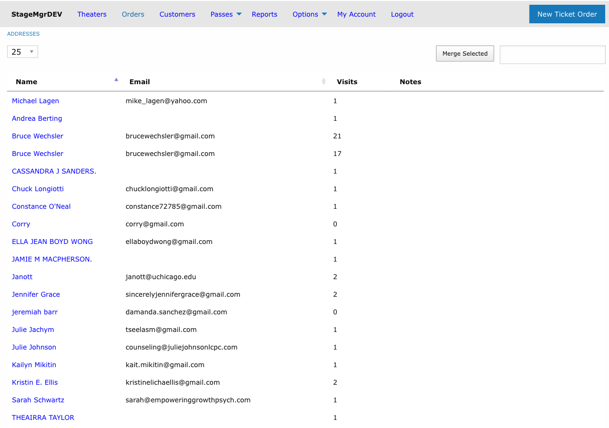

# Merging Duplicate Patrons

!!! info "Role: Administrators Only"
    Merging duplicate patron records is a permanent, irreversible operation restricted to administrators. Use caution and verify selections before confirming a merge.

**Navigation:** Admin > Addresses > Merge Selected

---

## When Duplicates Arise

Duplicate patron records are created when:

- A patron purchases tickets using a different name variation (e.g., "Bob Smith" vs. "Robert Smith").
- Online purchases create a new record because the email or name does not exactly match an existing entry.
- Box office staff create a new record without checking for an existing one.
- A patron uses different email addresses for separate purchases.
- Group orders or will-call entries generate placeholder records that overlap with real patron records.

!!! tip
    Regularly reviewing patron records for duplicates helps maintain clean data. Look for patrons with the same email address, similar names, or identical phone numbers.

---

## How to Merge Duplicates

1. Navigate to **Admin > Addresses**.
2. Search for the patron whose duplicates you want to consolidate.
3. Identify all duplicate records in the search results.
4. Select the checkbox next to each duplicate record.
5. Click **Merge Selected**.
6. Confirm the merge operation.

---

## Merge Rules

The merge follows a specific set of rules to determine which record survives and how data is consolidated:

| Rule | Detail |
|------|--------|
| Surviving record | The record with the **lowest ID** (oldest record) is kept |
| Contact information | The surviving record's name, address, email, and phone are preserved |
| Orders | All orders from merged records are reassigned to the surviving record |
| Tags | All patron tags from merged records are transferred to the surviving record |
| Memberships | All membership records are reassigned to the surviving record |
| Flex passes | All flex pass records are reassigned to the surviving record |
| Donations | All donation history is consolidated under the surviving record |

!!! warning
    The merge operation is **permanent and cannot be undone**. The non-surviving duplicate records are removed from the system after their associated data is transferred. Always double-check that you have selected the correct records before confirming.

---

## What Happens During a Merge

When you merge two or more patron records, Stagemgr performs the following steps:

1. **Identifies the survivor**: The record with the lowest database ID becomes the surviving record.
2. **Transfers orders**: Every order linked to the duplicate records is re-associated with the surviving record.
3. **Transfers tags**: All patron tags from duplicates are moved to the surviving record. If both records have the same tag label for the same theater, both tag entries are preserved.
4. **Transfers memberships and flex passes**: Membership and flex pass records are reassigned to the surviving record.
5. **Removes duplicates**: The now-empty duplicate records are deleted from the system.

---

## Before You Merge

Review the following checklist before performing a merge:

- [ ] Verify that the records truly belong to the same person.
- [ ] Note which record has the lowest ID -- this will be the surviving record.
- [ ] Check that the surviving record has the most accurate contact information (name, email, address). If not, update it before merging.
- [ ] Review tags on all records to understand what metadata will be consolidated.
- [ ] Confirm you have administrator access.

---

## Handling Contact Information Conflicts

Because the surviving record (lowest ID) retains its own contact information, you should update it before merging if a newer duplicate has more accurate details. For example:

| Scenario | Action |
|----------|--------|
| Surviving record has outdated address | Edit the surviving record's address before merging |
| Duplicate has a valid email but survivor does not | Copy the email to the surviving record first |
| Name spelling differs between records | Correct the surviving record's name before merging |

!!! tip
    Open both patron records in separate browser tabs to compare their information side by side before initiating the merge.

---

## Common Merge Scenarios

| Scenario | Recommended Approach |
|----------|---------------------|
| Same person, different email addresses | Merge and keep the preferred email on the surviving record |
| "Bob" vs. "Robert" with same last name and email | Safe to merge |
| Same name but different addresses | Verify they are the same person (check order history, phone) before merging |
| Placeholder record alongside a real patron record | Merge the placeholder into the real record |
| More than two duplicates | Select all duplicates at once for a single merge operation |

---

## Restrictions

- Only users with **administrator** privileges can perform merges.
- Records associated with finalized orders can be merged (orders transfer to the survivor), but individual records with finalized orders cannot be deleted outside of the merge process.
- The merge operation processes all selected records in a single transaction.
