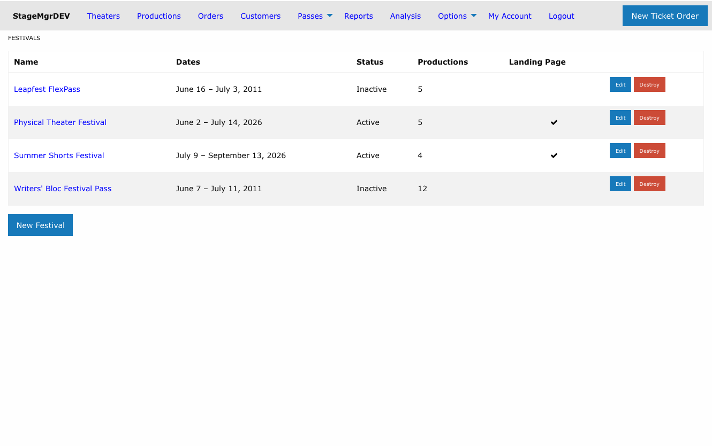
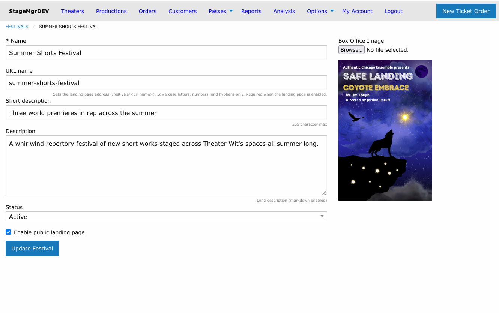
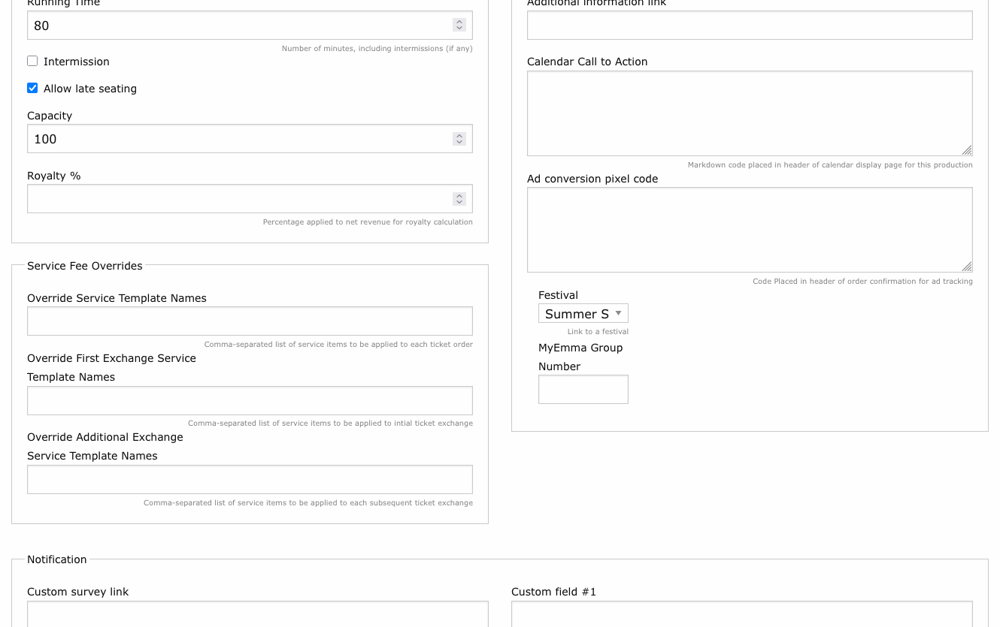
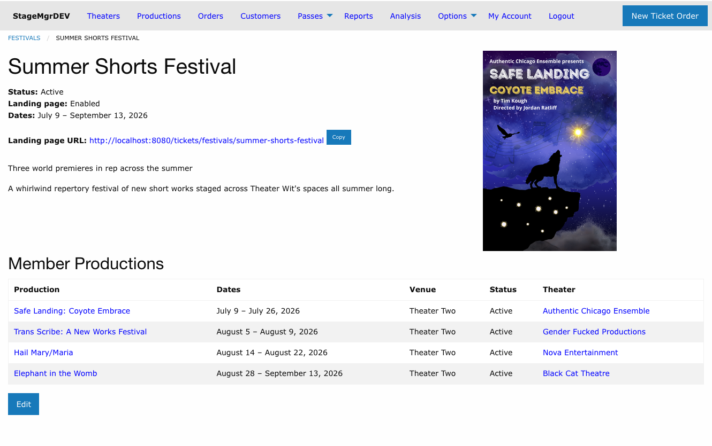

# Festivals Overview

!!! info "Who uses this?"
    **Box Office Managers** create and manage festivals. **Theater Users** can view festivals but cannot change them. Only **Administrators** can delete a festival.

**Navigation:** Options > Festivals

---

## What Is a Festival?

A festival is a branded grouping of productions that are marketed together -- for example, a summer shorts series or a touring showcase. A festival has its own name, artwork, and description, independent of the shows inside it, and its member productions may span multiple theaters and venues.

Once productions are linked to a festival, Stagemgr treats them as a unit wherever it makes sense:

- The public box office page groups them under a single branded callout (see [Public Display](public-display.md)).
- Flex passes can be restricted to the festival, and memberships can cap advance festival bookings (see [Festival Passes & Membership Caps](passes-and-membership-caps.md)).
- Reports and analysis pickers offer the festival as a one-click group (see [Festival Reporting](festival-reporting.md)).

## Creating a Festival

From **Options > Festivals**, click **New Festival**.

| Field | Description |
|-------|-------------|
| **Name** | The festival's display name, shown everywhere the festival appears. Required. |
| **URL name** | Sets the public landing page address (`/festivals/<url name>`). Lowercase letters, numbers, and hyphens only; must be unique. Auto-fills from the name if left blank. Required when the landing page is enabled. |
| **Short description** | One-line summary (255 characters max). Shown on the embedded now-playing tile and in the confirmation email's "Also playing" slot. |
| **Description** | Long description (markdown enabled). Shown on the box office callout and the landing page. |
| **Status** | **Active** or **Inactive**. Only active festivals group their shows and appear to the public. |
| **Enable public landing page** | When checked, the festival gets its own public page at the URL name address. |
| **Box Office Image** | The festival's artwork (JPEG or PNG). Used on the box office callout, the landing page hero, the embedded now-playing tile, and in email. |

!!! note "Festival dates are always derived"
    A festival has no date fields of its own. Its date range runs from the earliest member production's first performance to the latest member's closing, and updates automatically as shows are added, removed, or rescheduled. It displays in a human format such as "July 8 -- July 15, 2026".

## Assigning Productions

Productions join a festival from the production form: edit the production and choose the festival in the **Festival** dropdown (in the **Sales** fieldset).

The dropdown lists **active festivals only**, plus the production's current assignment -- so a historical production keeps showing its (now inactive) festival without you having to scroll past every festival ever created.

## The Festival Detail Page

The detail page shows the festival's status, derived date range, and artwork, plus:

- **Landing page URL** -- when the landing page is enabled, the full public address appears as a clickable link with a **Copy** button for quick review and sharing. If the festival is Inactive, a note reminds you the public page returns a 404 until it is reactivated.
- **Member Productions** -- every assigned production with its dates (first preview through closing, sorted by preview date), venue, status, and theater. On small screens the table collapses to just the Production and Dates columns.

## Festival Lifecycle

| Status | Behavior |
|--------|----------|
| **Active** | Members group into the branded callout/tile, the landing page (if enabled) is live, and festival entitlement rules apply. |
| **Inactive** | The festival disappears from all public display and grouping. Member productions render as ordinary shows. The landing page returns a 404. Historical assignments are preserved. |

!!! warning "Deleting a festival"
    Only Administrators can delete a festival, and deletion is blocked while any productions are still assigned. Unassign the productions first -- or simply mark the festival **Inactive**, which preserves history and is almost always the better choice.

!!! tip "One show left?"
    A festival needs at least two upcoming shows to earn its grouped callout. When only a single show remains (or is yet to open), that show automatically returns to the regular listings as an ordinary production card labeled "Part of the {Festival Name}" -- no configuration needed.
