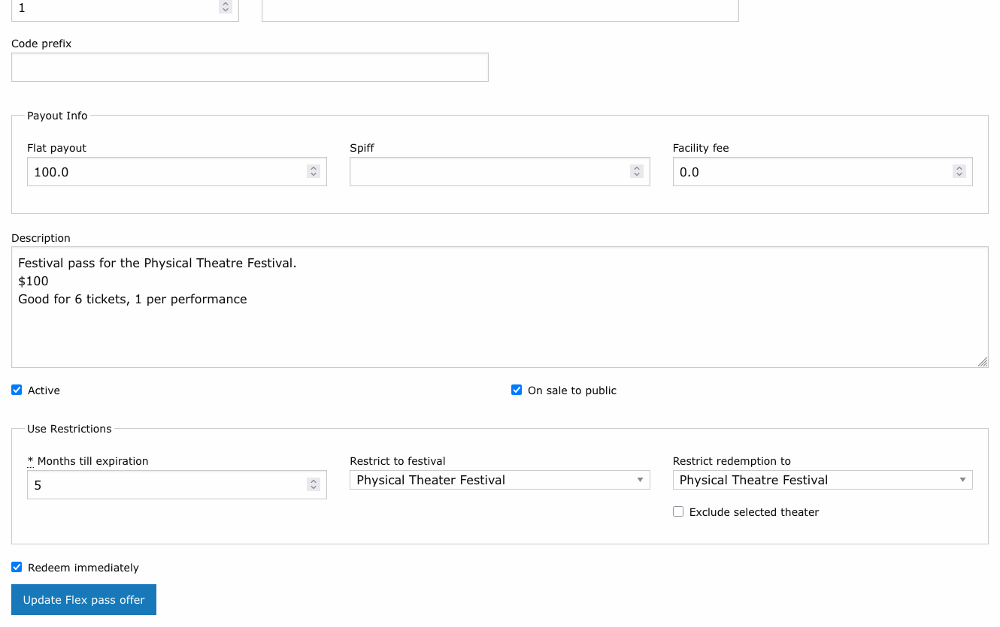
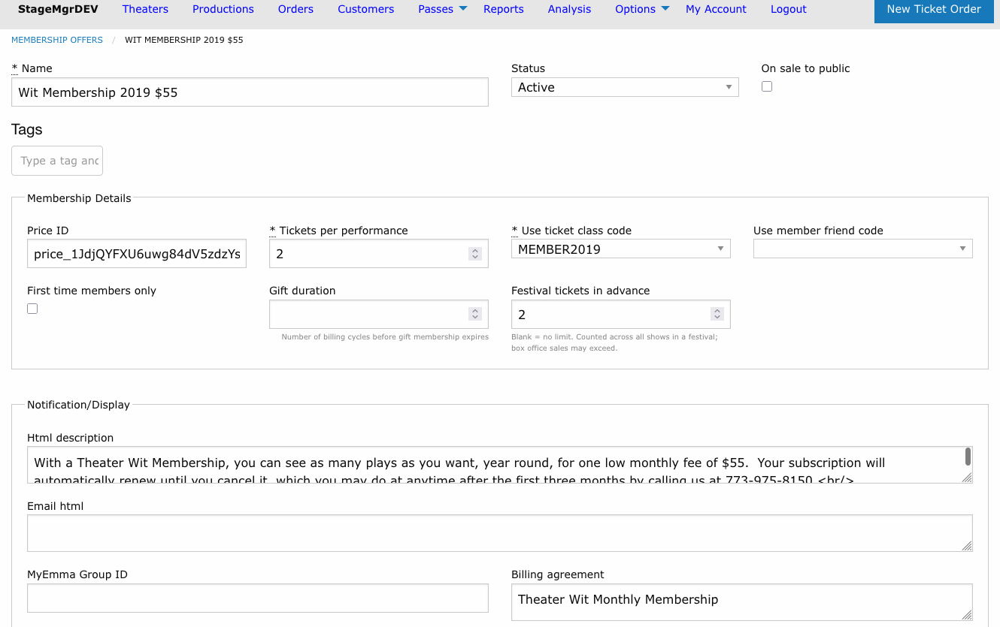

# Festival Passes & Membership Caps

!!! info "Who uses this?"
    **Box Office Managers** configure festival restrictions on flex pass and membership offers. The rules then apply automatically during checkout and box office sales.

**Navigation:** Passes > Flex Pass Offers / Membership Offers

---

## Restricting a Flex Pass to a Festival

A flex pass offer can be tied to a festival so its tickets redeem only for that festival's shows. On the flex pass offer form, choose the festival in the **Restrict to festival** dropdown (in the **Use Restrictions** fieldset).

When a patron redeems a festival-restricted pass for a show outside the festival, the redemption is refused with:

> That FlexPass is only valid for {Festival Name} shows. Please contact our box office for details.

!!! warning "Festival restriction stacks with the other gates"
    The festival gate is **additional** -- it never replaces the pass's existing rules. Theater restrictions, ticket class, expiration, and the Maximum Uses Per Production / Per Performance limits all still apply exactly as before. A pass restricted to both a theater and a festival must satisfy both.

## Limiting Tickets per Show

Festival passes usually pair the festival restriction with a redemption cap from the flex pass offer form (see [Flex Pass Offers](../offers/flex-pass-offers.md)):

| Goal | Setting |
|------|---------|
| One seat at every festival show | **Maximum Uses Per Performance** = 1, with **Number of Tickets** equal to the number of shows. |
| See any festival show, alone or with a guest | **Maximum Uses Per Production** = 2. |

Both caps may be set together -- for example, per-performance 1 with per-production 2 lets a patron use the pass at two different performances of the same show, but never two seats at once.

!!! note "Legacy festival passes"
    Before festivals existed, a **Treat as Festival Pass** flag and per-production pass links approximated this behavior. That mechanism has been removed; festival grouping now comes solely from the **Festival** dropdown on the production form and the **Restrict to festival** dropdown here.

## Capping Membership Advance Bookings

A membership offer can limit how many festival tickets a member books **in advance**, across the whole festival, while leaving day-of-show sales to box office discretion. On the membership offer form, set **Festival tickets in advance** (in the **Membership Details** fieldset).

| Value | Behavior |
|-------|----------|
| *(blank)* | No festival cap -- membership tickets for festival shows follow the offer's normal rules. |
| A number *N* | The membership covers at most *N* advance tickets **summed across all of the festival's shows**. |

When a member hits the cap during online checkout, the order is refused with:

> This membership covers {N} {Festival Name} tickets in advance. Additional festival tickets are available at the box office on the day of each performance.

!!! tip "Box office sales bypass the cap"
    Orders created through the admin interface are exempt from the festival cap -- the limit governs *advance self-service* booking, and box office staff can always seat a member at the door or extend a courtesy. The membership's regular per-production quota still applies.

## How the Cap Is Counted

- All membership tickets on attending orders for any production in the festival count toward the cap.
- Cancelled and refunded orders do not count.
- The cap applies per membership, so each membership in a household is counted separately.
