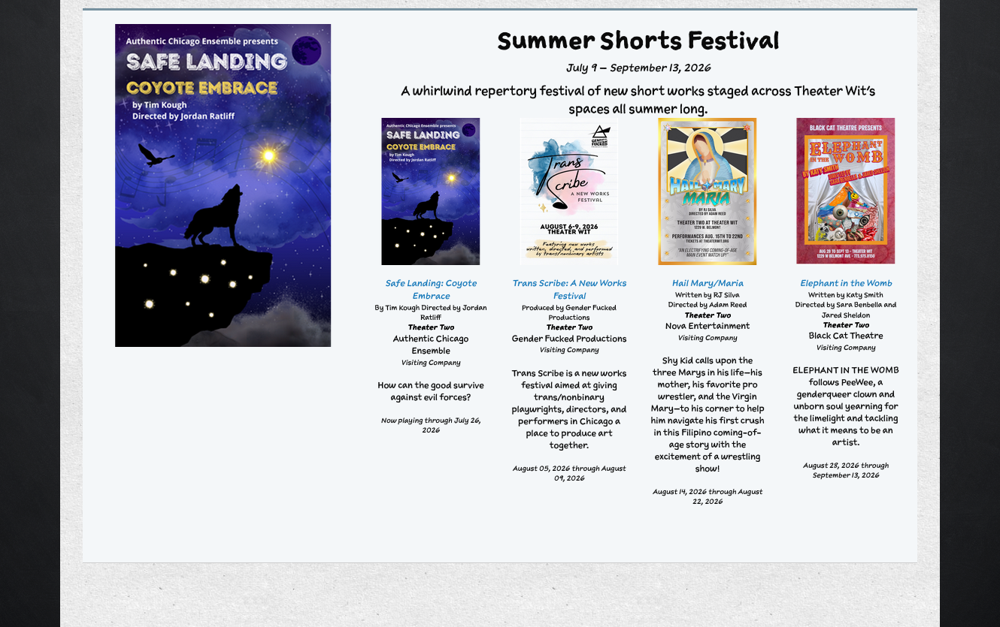
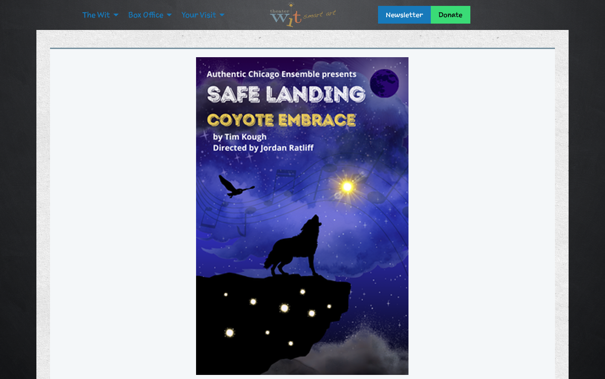

# Festival Public Display

!!! info "Who uses this?"
    This page describes what **patrons** see once a festival is active. Box Office Managers control it through the festival's status, artwork, descriptions, and landing page settings.

**Navigation:** Options > Festivals (configuration) -- the display itself appears on the public box office page, the website's now-playing section, the landing page, and confirmation emails

---

## The Box Office Callout

On the public box office page, an active festival's shows never appear as scattered individual cards. Instead the festival gets **one branded callout** -- artwork on the left; the festival name, dates, description, and a compact grid of every upcoming member show on the right.

How the callout is placed:

- It appears **once per page**, in the earliest section where the festival has a show -- Now Playing wins over Coming Soon. All of the festival's upcoming shows are listed inside it, even ones that would otherwise fall in a later section.
- In **Later This Season**, the festival never gets a full callout. A festival whose shows are all that far out is represented by its artwork alone, linking to the landing page when one is enabled.
- Each callout carries an anchor (`#festival-<id>`) so email and external links can jump straight to it.

!!! note "The single-show rule"
    A festival earns the callout only while it has **two or more upcoming shows**. Once a single show remains, that show renders as a normal production card in whatever section it belongs, with a "Part of the {Festival Name}" line after its dates. The same rule applies everywhere festivals group shows.

## The Embedded Now-Playing Section

The theater website embeds Stagemgr's now-playing section. There, the festival renders as a **tile the same size and style as the production thumbs**: the artwork as the image, "Festival" where a show's venue name would be, the name linking to the landing page (or to the box office callout when no landing page exists), the short description, and a "N shows · date range" line.

While a festival holds a venue's stage, that venue contributes no thumb of its own -- the festival tile carries that stretch of programming. Once the festival's final show at the venue closes, the venue's next regular show resumes the slot.

## The Landing Page

When **Enable public landing page** is checked (and a URL name is set), the festival gets its own public page at `/festivals/<url name>`:

The landing page includes:

- A hero with the festival artwork, name, derived date range, and full description.
- A **festival pass callout** above the show list whenever the festival has a flex pass on sale to the public -- a purchase button with the pass name and price, plus an invitation to buy individual tickets below.
- Cards for every visible, publicly sellable member show, linking to their performance calendars.

!!! warning "The landing page requires an Active festival"
    The page returns a 404 (page unavailable) unless the festival is **Active** and the landing page is **enabled**. The admin festival page links the full URL so you can verify it before publicizing.

## Confirmation Emails

The "Also playing" section of order confirmation emails promotes a few other current shows at random. An active festival occupies **exactly one slot** in that rotation -- its artwork, name, short description, and show count with dates -- rather than each member show competing for slots individually. The entry links to the landing page when enabled, otherwise to the festival's callout on the box office page.

## Festival Attribution on Show Cards

Anywhere a festival member appears as an individual card *outside* festival-branded surroundings -- a lone remaining show on the box office page, or a venue thumb on the embedded section -- it carries a **"Part of the {Festival Name}"** line so patrons still see the association. Cards inside the festival callout or on the landing page skip the line, since the surrounding branding already says it.
