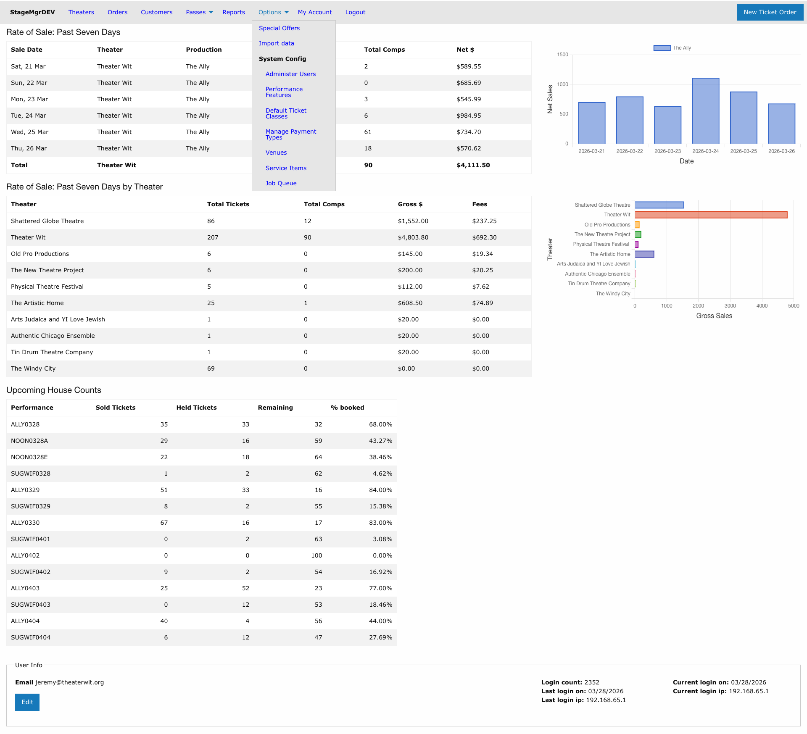
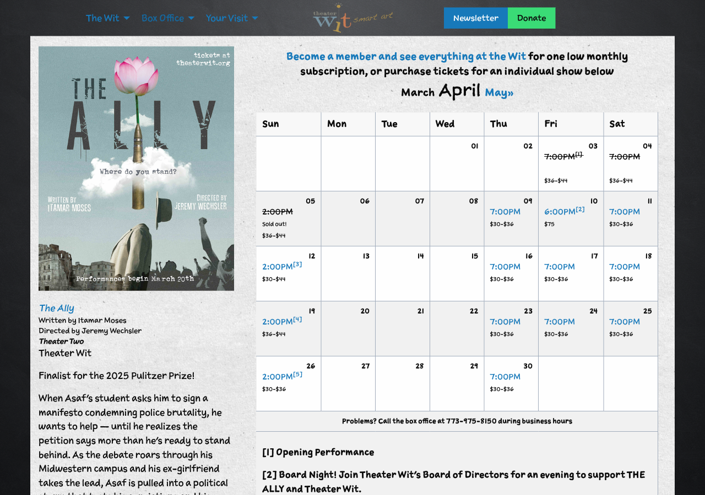

# Overview

## What Is Stagemgr?

Stagemgr is a ticketing platform designed for live theater operations. It manages the complete lifecycle of ticket sales -- from configuring venues and productions to selling tickets, processing payments, managing patrons, and generating reports.

Stagemgr supports:

- **Multiple theaters and venues** -- A single Stagemgr instance can manage ticket sales for many producing companies sharing the same venue spaces.
- **General admission and reserved seating** -- Productions can use either model, controlled by whether a seat map is assigned.
- **Multiple order types** -- Ticket orders, donations, flex passes, and memberships, each with their own workflows.
- **Dynamic pricing** -- Ticket prices can shift automatically based on capacity thresholds or proximity to show date.
- **Box office and online sales** -- Orders can be created by box office staff through the admin interface, or by patrons through the public-facing website.
- **Comprehensive reporting** -- Sales reports, attendance exports, house management reports, and data mining tools.

## Who This Manual Is For

This manual is written for the people who operate Stagemgr, not for patrons buying tickets online. There are three primary audiences:

| Role | Typical Tasks |
|------|---------------|
| **Implementer** | Setting up a new theater in Stagemgr: creating the theater, venues, seat maps, payment types, user accounts, and system-wide configuration. |
| **Administrator** | Ongoing management: creating productions and performances, configuring ticket classes and pricing, setting up special offers and promotions, managing imports and exports. |
| **Box Office Staff** | Daily operations: creating and managing ticket orders, processing payments, handling exchanges and refunds, fulfilling orders, running house management reports, and assisting patrons. |

Some users wear multiple hats -- a small theater's administrator may also handle box office duties. The manual is organized by function rather than strict role boundaries, so you can find what you need regardless of your title.

## Navigating the Admin Interface

After logging in, you'll see the main navigation bar across the top of every page:

The navigation bar contains these menus:

| Menu | Purpose |
|------|---------|
| **Theaters** | Browse and manage theaters, their productions, and performances |
| **Orders** | Search and manage all order types (ticket, donation, flex pass, membership) |
| **Customers** | Search, create, and manage patron records |
| **Passes** | Manage flex pass and membership offers |
| **Reports** | Generate sales, attendance, financial, and export reports |
| **Options** | System configuration: special offers, imports, users, payment types, venues, service items, performance features, default ticket classes |
| **My Account** | Your dashboard with rate of sale, house counts, and account settings |

The **New Ticket Order** button in the upper right provides quick access to the most common operation.

### The Dashboard

When you log in, your dashboard (**My Account**) displays three key summaries:

1. **Rate of Sale: Past Seven Days** -- Daily ticket sales and revenue for your theater's active productions, with a trend chart.
2. **Rate of Sale by Theater** -- Aggregate sales across all theaters you have access to, showing total tickets, comps, gross revenue, and fees.
3. **Upcoming House Counts** -- A table of upcoming performances showing sold tickets, held tickets, remaining seats, and booking percentage. This is your at-a-glance view of how upcoming shows are selling.

### Breadcrumb Navigation

Most pages display a breadcrumb trail showing your current location in the hierarchy. For example, when viewing a production's performances:

**Theaters > Theater Wit > The Ally > Performances**

Click any breadcrumb to navigate back to that level.

## How This Manual Is Organized

The manual follows the natural workflow of setting up and operating Stagemgr:

1. **Getting Started** (this section) -- Foundational concepts and orientation
2. **Setup & Configuration** -- One-time setup tasks for new theaters
3. **Productions** -- Creating and configuring shows
4. **Offers & Pricing** -- Promotions, passes, and fee configuration
5. **Ticketing** -- Day-to-day order operations
6. **Customers** -- Patron management
7. **House Management** -- Day-of-show operations
8. **Reports** -- Generating and understanding reports
9. **Imports** -- Bulk data import procedures
10. **Advanced** -- Power-user topics
11. **Reference** -- Glossary, permissions, and FAQ

Each page includes:

- **Navigation path** showing how to reach the relevant screen in Stagemgr
- **Required role** indicating which user roles can access the feature
- **Step-by-step instructions** for completing the task
- **Field descriptions** explaining each option on a form
- **Tips and warnings** for important operational notes

## The Public Website

Patrons interact with Stagemgr through the public-facing ticket purchasing pages. The box office page shows current productions with images and descriptions.

Clicking a production displays its performance calendar with dates, times, prices, and availability.

