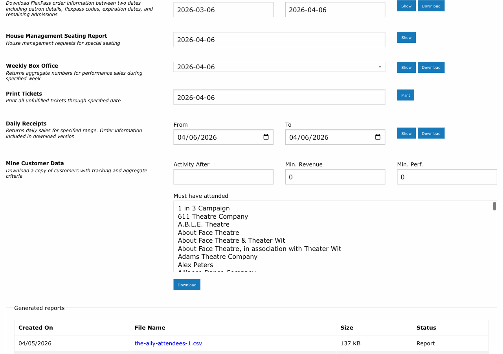

# Printing Tickets

!!! info "Role: Box Office Staff, House Managers"
    Stagemgr's batch printing system allows you to queue and print tickets for multiple orders at once. This is typically used to prepare will-call tickets before a performance.

**Navigation:** Admin > House Management > Batch Print

---

## Overview

The batch printing system generates physical tickets for orders that have been processed but not yet printed. Tickets are sent to a connected ticket printer as a print job. The system supports printing tickets for all performances up through a selected date, making it easy to prepare for upcoming shows.

---

## How Batch Printing Works

The batch printing workflow follows these steps:

1. **Select a date** using the print date selector.
2. **Queue the print job** -- Stagemgr identifies all unfulfilled orders for performances through that date.
3. **Tickets are generated** and sent to the ticket printer.
4. **Orders are marked** as having been printed.

| Step | What Happens |
|------|-------------|
| Date selection | Choose the cutoff date; all performances on or before this date are included |
| Job queuing | The system identifies eligible orders (Processed status, not yet printed) |
| Print generation | Ticket data is formatted and sent to the printer service |
| Completion | Print job status is tracked; tickets are produced at the physical printer |

---

## Using the Print Date Selector

The print date selector determines which performances are included in the batch print job:

- **Today's date**: Prints tickets only for today's performances.
- **Future date**: Prints tickets for all performances from now through the selected date.
- **Multiple performances**: If several performances fall within the date range, tickets for all of them are included in a single print job.

!!! tip
    For a typical day-of-show workflow, set the print date to today to print only tickets for tonight's performance. If you want to prepare for the entire weekend, set the date to Sunday to print tickets for Friday, Saturday, and Sunday shows in one batch.

---

## What Gets Printed

The batch print system includes orders that meet all of the following criteria:

| Criteria | Detail |
|----------|--------|
| Order status | Processed (payment complete) |
| Print status | Not previously printed in a batch job |
| Performance date | On or before the selected print date |
| Order type | Ticket orders (not donations, memberships, or flex pass purchases) |

!!! warning
    Orders in Hold status are not included in batch printing because payment has not been completed. If a held order needs tickets printed, it must first be converted to a paid order.

---

## Fulfill-Then-Print Workflow

A common workflow combines batch printing with batch fulfillment:

1. **Print tickets**: Run a batch print job for today's performance.
2. **Organize tickets**: Sort printed tickets alphabetically by patron last name.
3. **Set up will-call**: Arrange tickets at the will-call station.
4. **Fulfill as patrons arrive**: Mark each order as Fulfilled when the patron picks up their tickets. See [Fulfilling Orders](fulfilling-orders.md).

This workflow ensures that:

- All tickets are ready before doors open.
- Will-call is organized and efficient.
- Fulfillment tracking is accurate.

---

## Reprinting Tickets

If tickets need to be reprinted (e.g., printer jam, lost tickets), you can:

1. Navigate to the specific order.
2. Initiate a print for that individual order.
3. The system sends the ticket data to the printer again.

!!! tip
    If a patron reports lost tickets at the door, you can reprint from their order record rather than running a new batch job. This avoids reprinting tickets for all orders.

---

## Printer Setup

The ticket printing system requires a connected thermal ticket printer. Configuration details:

| Setting | Description |
|---------|-------------|
| Printer service | Stagemgr communicates with the tktprint service for print job management |
| Printer connection | The physical printer connects to the tktprint service |
| Print format | Tickets are formatted for standard thermal ticket stock |

!!! warning
    If the printer is offline or disconnected, print jobs will queue but not produce physical tickets. Check the printer connection if tickets are not appearing. The tktprint service status can be verified at its service URL.

---

## Troubleshooting

| Issue | Solution |
|-------|----------|
| No tickets printing | Verify the printer is powered on and connected to the tktprint service |
| Missing orders in print batch | Check that orders are in Processed status and have not already been printed |
| Wrong performance's tickets printed | Verify the print date selector was set to the correct date |
| Partial print job | Check the tktprint service logs for errors; requeue the failed tickets |
| Duplicate tickets | Review whether the batch job was accidentally triggered twice |

---

## Related Pages

- [Fulfilling Orders](fulfilling-orders.md) -- Marking orders as delivered after printing
- [Daily Operations](daily-operations.md) -- Where printing fits in the day-of-show workflow
- [House Counts](house-counts.md) -- Understanding inventory before printing
