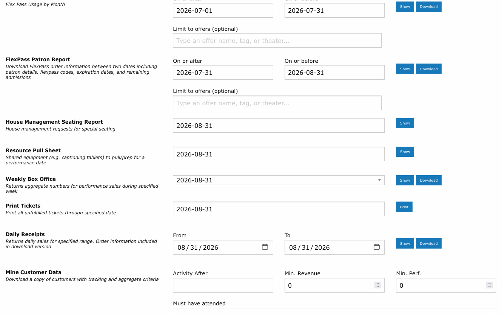
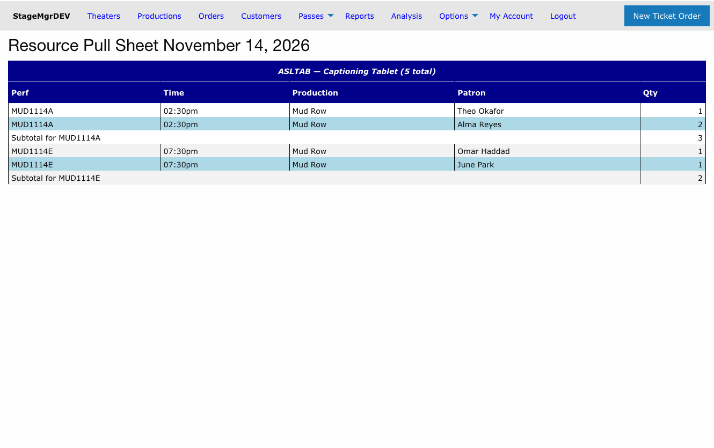

# Resource Pull Sheet

!!! info "Role: House Managers, Front-of-House Staff"
    The Resource Pull Sheet lists every reservation of shared equipment (captioning tablets, audio-description receivers, and other [resourced ticket classes](../productions/resourced-ticket-classes.md)) for a single performance date, so staff can pull and stage the right devices at the right venues.

**Navigation:** Admin > Reports > Resource Pull Sheet

---

## What the Report Shows

For the selected date, the report prints one section per resourced ticket class with equipment reserved that day. Within each section:

| Column | Content |
|--------|---------|
| Performance | The performance code and curtain time |
| Production | The production name |
| Patron | The reserving patron, sorted by last name, first name within each performance |
| Devices | The net number of devices reserved on that order (refunds are already netted out) |

Rows are grouped by performance in performance-code order, with a **subtotal per performance** -- the number of devices to stage at that venue -- and a **total per resource** for the day.

Orders count when they are live: box office holds, in-progress checkouts, processed, fulfilled, and mid-exchange orders all appear. Refunded and canceled orders do not.

---

## Generating the Report

1. Navigate to **Admin > Reports**.
2. Find the **Resource Pull Sheet** card.
3. Select the **performance date**.
4. Click the report button to render it on screen; print as needed.

!!! tip
    Run the pull sheet in the early afternoon before an evening of overlapping performances. The per-performance subtotals tell you how many devices to deliver to each space; the patron names let will-call hand the right equipment to the right person.

!!! note "Same-day changes"
    The report reflects orders at the moment it is generated. If a patron books a device after you printed the sheet, the order still passes the pool check -- regenerate the sheet close to doors if same-day sales of resourced classes are common.

---

## Related Pages

- [Resourced Ticket Classes](../productions/resourced-ticket-classes.md) -- Setting up shared equipment pools
- [House Management Report](house-management-report.md) -- Seating, accessibility, and VIP overview for the same date
- [Daily Operations](daily-operations.md) -- Where this report fits in the day-of-show workflow
