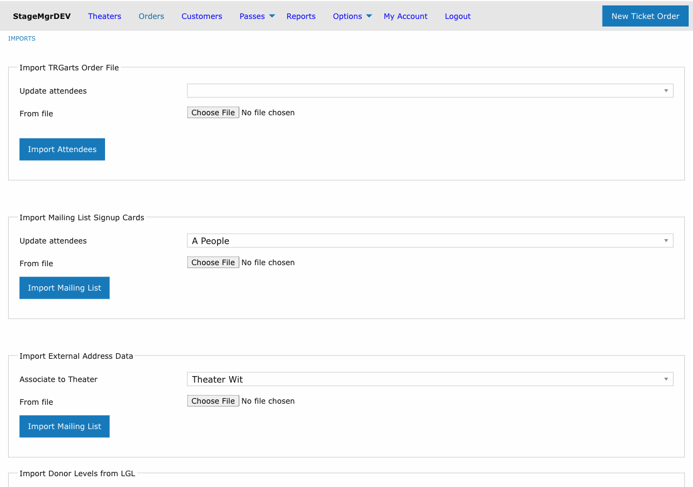

# Imports Overview

!!! info "Required Role"
    **Administrator** or **Box Office** can access the imports page. Some import types may have additional role requirements.

**Navigation:** Options > Imports

## What Are Imports?

Imports allow you to load bulk data into Stagemgr from CSV files. Instead of entering records one at a time through the admin interface, you can prepare a spreadsheet, export it as CSV, and upload it to create or update hundreds of records at once.

The imports page is available at **Options > Imports** and provides access to all import types described in this section.

## Available Import Types

| Import Type | Purpose | Key Association |
|-------------|---------|-----------------|
| [TRG Arts Order File](trg-arts-import.md) | Update addresses with NCOA corrections; optionally mark attendees | Production (optional) |
| [Mailing List Signup Cards](mailing-cards-import.md) | Import physical signup card data and add to email lists | Production (required) |
| [External Contact Data](external-contacts-import.md) | Import contacts from external systems with household support | Theater (required) |
| [Bulk Orders](bulk-orders-import.md) | Create complete ticket orders with seating and payments | Theater (required) |
| [Flex Pass Orders](flex-pass-orders-import.md) | Create and process flex pass orders in bulk | Theater (required) |
| [Donor Levels (LGL)](donor-levels-import.md) | Update donor tier information from Little Green Light | None |

## How Imports Work

### Background Processing

All imports run as **background jobs**. When you upload a CSV file and submit the form, the import is queued and processed behind the scenes. This means:

- You do not need to keep the page open while the import runs
- Large files may take several minutes to complete
- Import progress and results are displayed on the imports page when you return to it

See [Background Jobs](../advanced/background-jobs.md) for more about how background processing works in Stagemgr.

### Result File

Every import that supports per-row error reporting (Bulk Orders, Flex Pass Orders, Donor Levels) produces a **result file** when it finishes. The result file mirrors your original upload row-for-row and adds a single `Error` column:

- Successful rows have a blank `Error` cell.
- Failed rows have a description of what went wrong (for example, `ActiveRecord::RecordInvalid: Validation failed: There are only 0 reservations remaining for the 2026-05-08 performance at 07:00pm.`).

The result file is named after your upload, with a prefix that identifies the importer:

| Importer | Result filename pattern |
|----------|-------------------------|
| Bulk Orders | `order_import_results_<your-file-name>.csv` |
| Flex Pass Orders | `flex_pass_import_results_<your-file-name>.csv` |
| Donor Levels | `donor_import_results_<your-file-name>.csv` |

The `<your-file-name>` portion is your original upload's name with the extension stripped and any spaces, parentheses, ampersands, or other special characters collapsed to a single underscore. Two users (or repeated runs) uploading the same filename produce separate result files — nothing is overwritten.

If at least one row failed, Stagemgr also emails the result file to the user who initiated the import.

### Re-importing Corrected Rows

Failed rows are rolled back entirely — no partial order, customer, or flex pass remains in the database. To retry:

1. Open the result file.
2. Delete the rows that succeeded (blank `Error`).
3. Fix the data in the remaining rows.
4. Re-upload the edited file using the same importer.

The `Error` column itself can be left in place when you re-upload; importers ignore columns they don't recognize.

!!! tip "Check Your Email"
    Always check your email after an import completes. Even if most rows succeed, a few may fail due to data issues. The result file tells you exactly what to fix.

## CSV File Requirements

All import files must meet these requirements:

| Requirement | Details |
|-------------|---------|
| **Format** | Comma-separated values (CSV) |
| **Headers** | First row must contain column headers matching the expected names for that import type |
| **Encoding** | UTF-8 preferred. Character encoding issues are automatically handled where possible. |
| **File size** | No hard limit, but very large files will take longer to process |

### Preparing Your CSV

1. **Use the exact header names** listed in each import type's documentation. Headers are case-sensitive.
2. **Include all required headers** even if some cells are empty. The import checks for the presence of the header row.
3. **Save as CSV** from Excel or Google Sheets using "Save As" or "Download as" CSV format.
4. **Remove formatting** -- CSV files should not contain merged cells, formulas, or special formatting.

## Duplicate Detection and Merging

All imports that create or update customer records include **automatic duplicate detection**. When an imported row matches an existing customer, Stagemgr merges the records rather than creating a duplicate. Matching criteria vary by import type but typically include:

- Email address matching
- Name matching
- External ID matching (where applicable)

This helps maintain data quality across repeated imports from different sources.

!!! warning "Review After Large Imports"
    After importing a large dataset from a new source, spot-check a sample of records in the Customers section to verify that merging worked as expected.

## Common Workflow

1. Export data from your source system (TRG Arts, LGL, a spreadsheet) as CSV
2. Open the CSV and verify the headers match what Stagemgr expects
3. Navigate to **Options > Imports**
4. Select the appropriate import type
5. Choose any required associations (theater, production) and options
6. Upload the CSV file
7. Submit the import
8. Check your email for the completion notification and the result file (if any rows failed)
9. Verify a sample of imported records in Stagemgr
