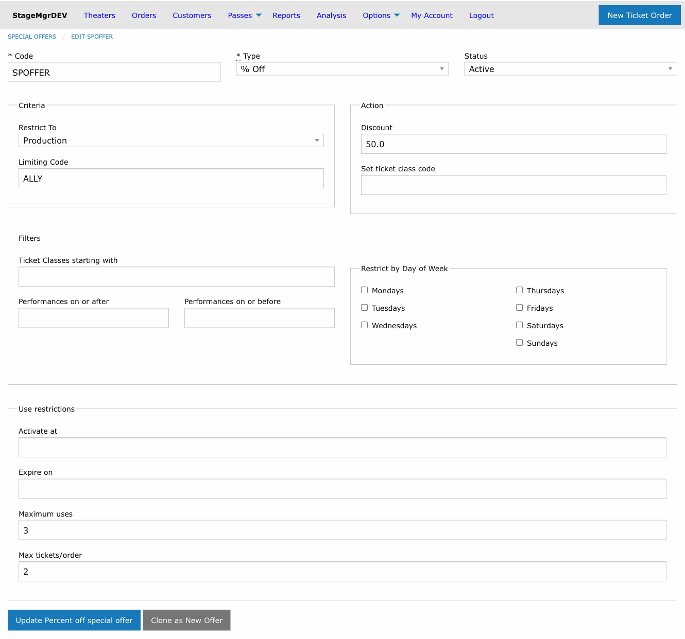
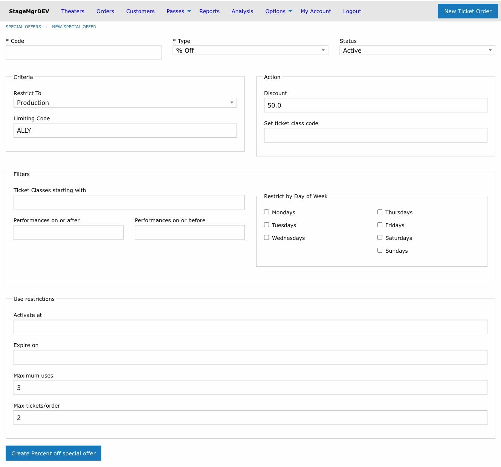

# Duplicating Special Offers

!!! info "Access"
    **Box Office Managers** and **Marketing Staff** can duplicate special offers.

**Navigation:** Options > Special Offers > Edit an offer > Clone as New Offer

---

## Overview

The Clone feature creates a new unsaved special offer pre-populated with all settings from an existing one -- except the code, which must be unique and must be entered before saving. This is the fastest way to create a series of similar offers (e.g., the same discount applied to multiple productions, or the same promo code structure for multiple seasons).

## How to Clone a Special Offer

1. Navigate to **Options > Special Offers**
2. Click **Edit** on the offer you want to clone
3. Make any changes to the original offer if needed
4. Click **Clone as New Offer** at the bottom of the form

!!! tip "Changes are saved first"
    Clicking **Clone as New Offer** saves any edits you have made to the original offer before creating the copy. You do not need to click Update separately.

The new offer form opens pre-populated with all settings from the original:

5. Enter a unique **Code** for the new offer
6. Adjust any fields that should differ from the original (e.g., scope, discount amount, expiration)
7. Click **Create [type] special offer** to save

## What Gets Copied

All fields from the original offer are copied to the new one:

| Copied | Details |
|--------|---------|
| **Type** | $ Off, % Off, or TktClass |
| **Status** | Active, Inactive, or Expired |
| **Scope** | Restrict To (Theater, Production, or Performance) and Limiting Code |
| **Discount / Class** | Amount, percentage, or target ticket class code |
| **Ticket Class filter** | Ticket class code prefix restriction |
| **Performance date range** | Start and end range filters |
| **Day-of-week restrictions** | All checked days carry over |
| **Use restrictions** | Auto Start, Auto Expire, Maximum Uses, Max Tickets/Order |

## What Does Not Get Copied

| Not Copied | Reason |
|------------|--------|
| **Code** | Codes must be unique -- you must supply a new one |
| **Usage history** | The clone starts with zero redemptions |

## Common Use Cases

| Scenario | Approach |
|----------|----------|
| Same discount for a new production | Clone the existing production-scoped offer, update the Limiting Code to the new production |
| Seasonal variant with a different code | Clone last season's offer, enter the new code, adjust Auto Start/Expire dates |
| Same offer with a tighter usage limit | Clone, enter a new code, reduce the Maximum Uses value |
| Testing a discount at a different percentage | Clone, enter a test code, change the Amount field |

!!! warning "The clone is not saved until you submit"
    After clicking **Clone as New Offer**, you are on an unsaved new offer form. Nothing is created in the database until you enter a code and click **Create [type] special offer**. If you navigate away, the clone is discarded.
