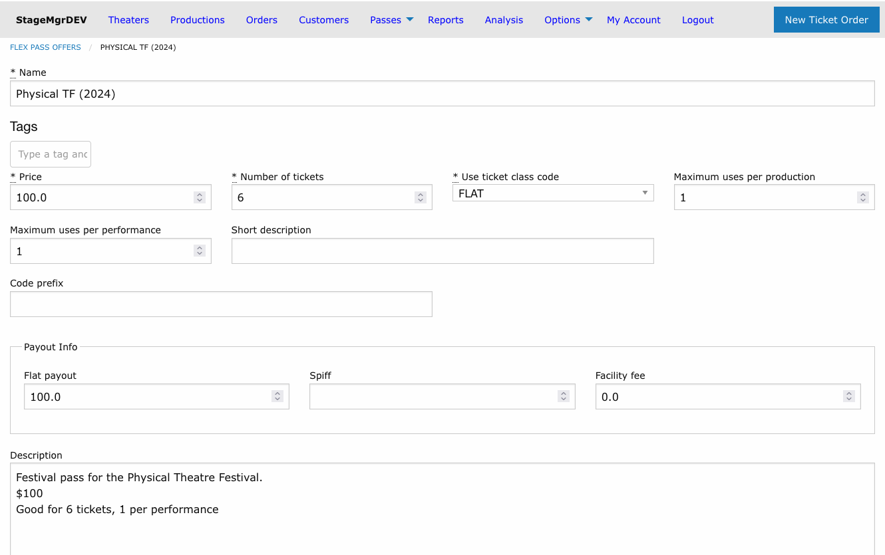
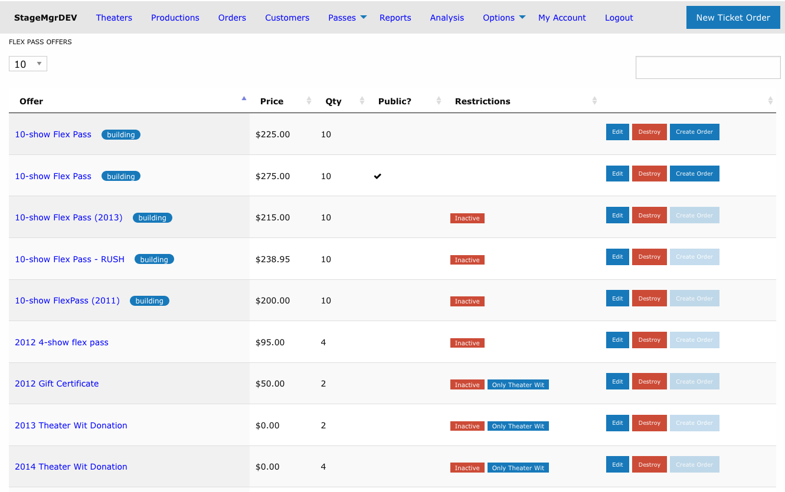
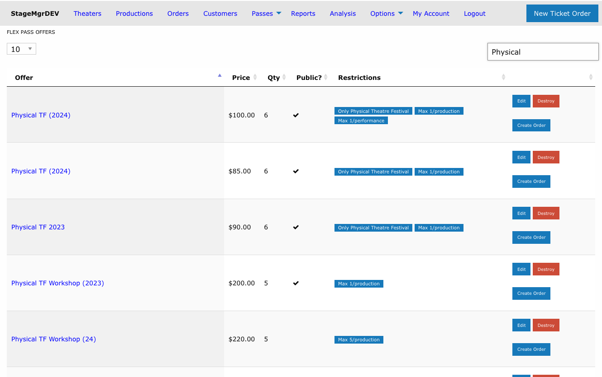

# Flex Pass Offers

!!! info "Who uses this?"
    **Box Office Managers** configure flex pass offers to sell multi-ticket packages that patrons can redeem across multiple productions over time.

**Navigation:** Admin > Offers > Flex Pass Offers

---

## Overview

A flex pass is a prepaid ticket package. The patron purchases a set number of tickets at a fixed price and then redeems them for individual performances over a defined period. Flex passes encourage repeat attendance and provide upfront revenue.

## Creating a Flex Pass Offer

### Required Fields

| Field | Description |
|-------|-------------|
| **Name** | Display name shown to customers (e.g., "6-Show Season Pass"). |
| **Price** | Total purchase price for the flex pass. |
| **Number of Tickets** | How many individual tickets are included in the pass. |
| **Months Till Expiration** | Number of months from purchase date until the pass expires. |

### Ticket Redemption Settings

| Field | Description |
|-------|-------------|
| **Use Ticket Class Code** | The ticket class assigned when a flex pass ticket is redeemed. Selected from the list of Default Ticket Classes. |
| **Maximum Uses Per Production** | Limits how many pass tickets can be redeemed for a single production, across all of its performances. Leave blank (or 0) for no limit. |
| **Maximum Uses Per Performance** | Limits how many pass tickets can be redeemed for any single performance. Leave blank (or 0) for no limit. |
| **Code Prefix** | Optional prefix added to generated flex pass codes for easy identification (e.g., `FP2026-`). |

!!! tip "Controlling redemption spread"
    The two limits are independent and can be combined. Set **Maximum Uses Per Production** to encourage patrons to attend a variety of shows rather than using all tickets on a single production -- for example, a limit of 2 lets a pair attend any one show together. Set **Maximum Uses Per Performance** for festival-style passes where each ticket should cover a different performance -- for example, a 6-ticket festival pass limited to 1 ticket per performance.

### Visibility and Status

| Field | Description |
|-------|-------------|
| **Active** | Whether the offer can be purchased and redeemed. |
| **On Sale to Public** | Whether the offer appears on the public-facing website. When unchecked, the pass can only be sold through the box office. |

### Theater Restrictions

| Field | Description |
|-------|-------------|
| **Theater** | Optionally restrict redemption to a specific theater. |
| **Exclude Theater** | When checked with a theater selected, the pass is valid everywhere *except* that theater. |

### Financial Fields

| Field | Description |
|-------|-------------|
| **Flat Payout** | Fixed dollar amount paid to the producing company per redeemed ticket. |
| **Spiff** | Additional per-ticket incentive amount. |
| **Facility Fee** | Per-ticket facility fee applied on redemption. |

!!! warning "Financial fields affect settlement"
    Flat Payout, Spiff, and Facility Fee values are used in financial settlement calculations between the venue and producing companies. Coordinate with your finance team before changing these.

### Special Modes

| Field | Description |
|-------|-------------|
| **Redeem Immediately** | When enabled, the system prompts the patron to select performances and redeem tickets immediately at the time of purchase. |

!!! note "Festival passes"
    To create a festival pass, use the **Restrict to festival** dropdown in the Use Restrictions fieldset (see [Festival Passes & Membership Caps](../festivals/passes-and-membership-caps.md)). The former **Treat as Festival Pass** checkbox has been removed.

### Descriptions

| Field | Description |
|-------|-------------|
| **Short Description** | Brief summary displayed in offer listings and checkout. |
| **Long Description** | Full description displayed on the flex pass detail page. |

### Tags

Tags are free-form labels you can attach to a flex pass offer to group it for analysis and reporting -- for example by season, package family, partner, or any attribute you want to slice by later. Tags are arbitrary text you define and can change at any time.

A flex pass offer can have any number of tags. They appear as rounded pill labels in the **Tags** field on the offer form, next to the offer name in the Flex Pass Offers list, and on the offer detail page.

#### Adding a tag

1. Click into the **Tags** field on the flex pass offer form.
2. Begin typing. As you type, a dropdown suggests existing tag names already used on other flex pass offers -- click one to apply it, or keep typing to create a brand-new tag.
3. Press **Enter** (or type a comma) to commit the tag as a pill.
4. Repeat to add as many tags as you need, then save the form.

Click the **x** on any pill to remove that tag. Tags are matched case-insensitively, and removing a tag from one offer leaves it available on any others that use it.

!!! tip "Search by tag"
    The search box on the Flex Pass Offers list matches tag names as well as offer names, so you can quickly filter the list down to every offer sharing a tag.

---

## How Redemption Works

1. A patron purchases a flex pass and receives a pass code.
2. When attending a show, the patron provides their pass code at the box office or enters it online.
3. The system verifies the pass is active, not expired, and has remaining tickets.
4. A ticket is issued using the **Use Ticket Class Code** defined on the offer.
5. The remaining ticket count on the pass decreases by one.

If **Maximum Uses Per Production** or **Maximum Uses Per Performance** is set, the system enforces those limits across all of the pass's redemptions -- an order that would exceed a limit is refused with a message stating how many tickets the pass allows per production or per performance. Refunded and cancelled orders do not count toward either limit.

!!! tip "Festival pass redemption"
    For multi-show festivals, combine **Restrict to festival** with **Maximum Uses Per Performance** (typically 1) so each pass ticket covers a different festival performance.

---

## Expiration

Flex passes expire based on the **Months Till Expiration** value, counted from the date of purchase. Once expired:

- The pass can no longer be used to redeem tickets.
- Any unredeemed tickets are forfeited.

!!! warning "Expired passes cannot be extended"
    Once a flex pass has expired, it cannot be reactivated through the offer settings. Contact a system administrator if an exception is needed.

---

## The Flex Pass Offers List

Each row on the Flex Pass Offers list has an actions column with **Edit**, **Destroy**, and **Create Order** buttons. The **Create Order** button is shown greyed out and disabled for offers that are not active, since inactive offers cannot be sold.

The **Restrictions** column summarizes an offer's status and scope using small labels:

| Label | Meaning |
|-------|---------|
| Red **Inactive** | The offer's **Active** checkbox is unchecked -- it cannot be purchased or redeemed. |
| Blue **Only [Theater]** | Redemption is restricted to the named theater (the **Theater** field with **Exclude Theater** unchecked). |
| Blue **All but [Theater]** | Redemption is allowed everywhere except the named theater (the **Theater** field with **Exclude Theater** checked). |
| Blue **Max N/production** | At most *N* pass tickets can be redeemed per production (**Maximum Uses Per Production**). |
| Blue **Max N/performance** | At most *N* pass tickets can be redeemed per performance (**Maximum Uses Per Performance**). |

An offer can show several labels at once -- for example, a festival pass restricted to one theater with both redemption caps set:

---

## Managing Flex Pass Offers

- **Deactivate** an offer by unchecking the **Active** checkbox. Existing purchased passes remain valid until they expire.
- **Remove from public sale** by unchecking **On Sale to Public** while keeping the offer active for box office sales.
- Changes to an offer (price, number of tickets) apply only to future purchases and do not affect already-sold passes.
