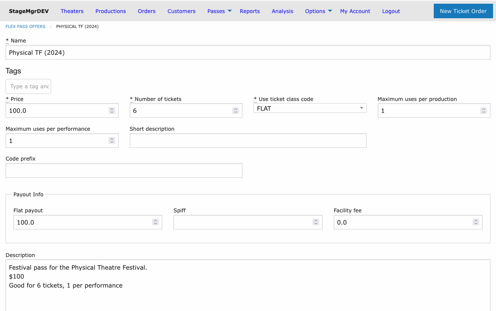
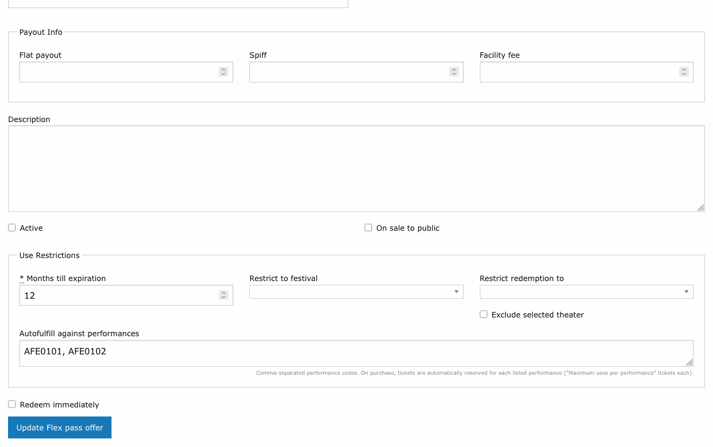
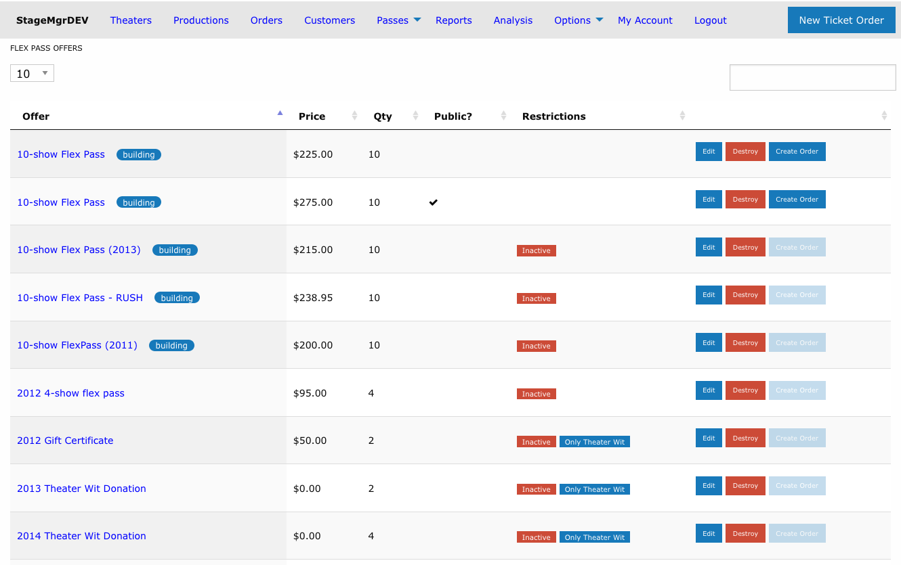
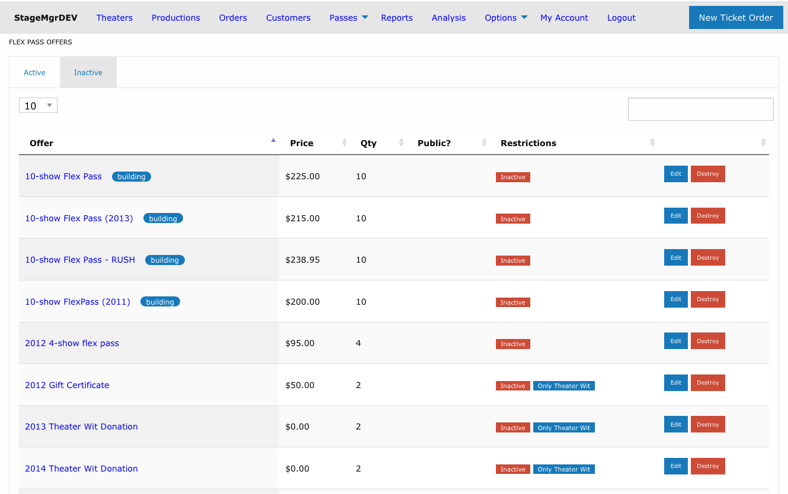
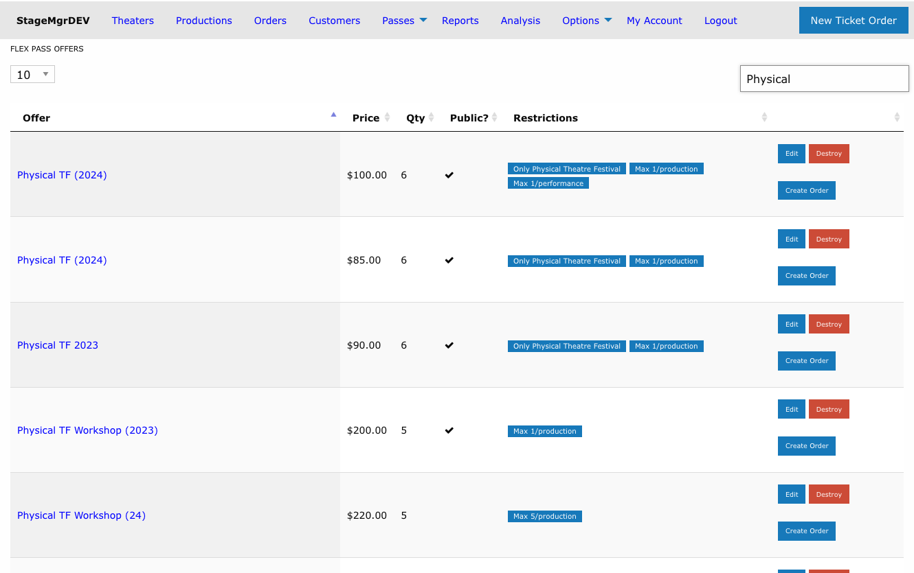
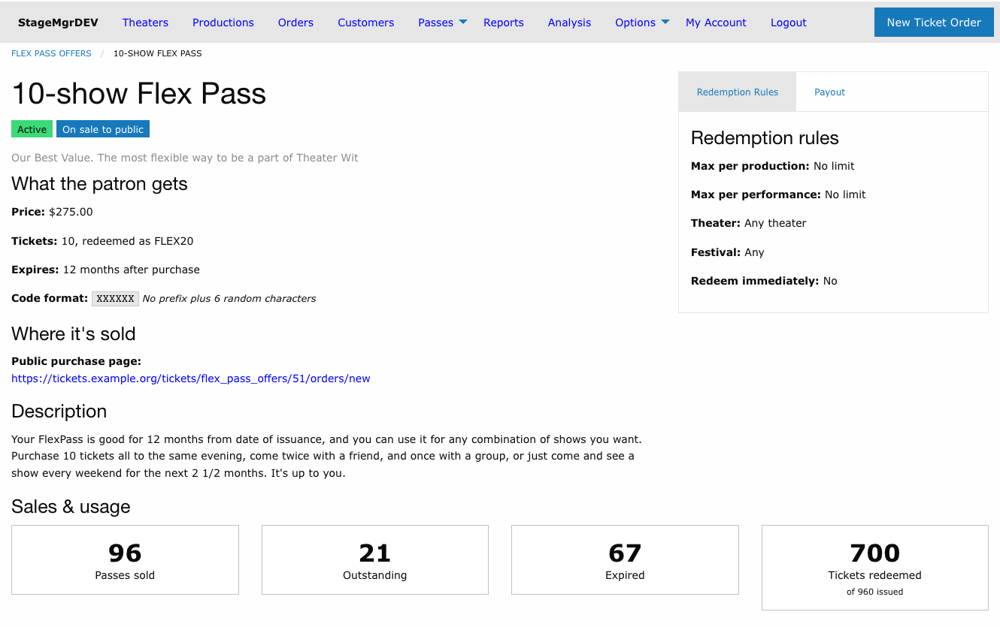
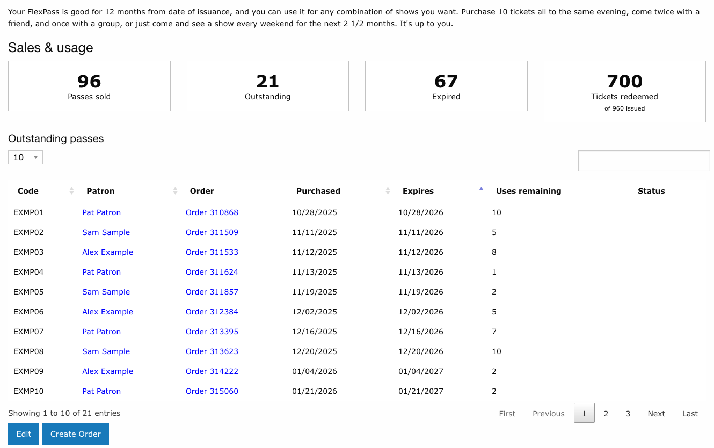

# Flex Pass Offers

!!! info "Who uses this?"
    **Box Office Managers** configure flex pass offers to sell multi-ticket packages that patrons can redeem across multiple productions over time.

**Navigation:** Admin > Offers > Flex Pass Offers

---

## Overview

A flex pass is a prepaid ticket package. The patron purchases a set number of tickets at a fixed price and then redeems them for individual performances over a defined period. Flex passes encourage repeat attendance and provide upfront revenue.

## Creating a Flex Pass Offer

### Required Fields

| Field | Description |
|-------|-------------|
| **Name** | Display name shown to customers (e.g., "6-Show Season Pass"). |
| **Price** | Total purchase price for the flex pass. |
| **Number of Tickets** | How many individual tickets are included in the pass. |
| **Months Till Expiration** | Number of months from purchase date until the pass expires. |

### Ticket Redemption Settings

| Field | Description |
|-------|-------------|
| **Use Ticket Class Code** | The ticket class assigned when a flex pass ticket is redeemed. Selected from the list of Default Ticket Classes. |
| **Maximum Uses Per Production** | Limits how many pass tickets can be redeemed for a single production, across all of its performances. Leave blank (or 0) for no limit. |
| **Maximum Uses Per Performance** | Limits how many pass tickets can be redeemed for any single performance. Leave blank (or 0) for no limit. |
| **Code Prefix** | Optional prefix added to generated flex pass codes for easy identification (e.g., `FP2026-`). |

!!! tip "Controlling redemption spread"
    The two limits are independent and can be combined. Set **Maximum Uses Per Production** to encourage patrons to attend a variety of shows rather than using all tickets on a single production -- for example, a limit of 2 lets a pair attend any one show together. Set **Maximum Uses Per Performance** for festival-style passes where each ticket should cover a different performance -- for example, a 6-ticket festival pass limited to 1 ticket per performance.

### Visibility and Status

| Field | Description |
|-------|-------------|
| **Active** | Whether the offer can be purchased and redeemed. |
| **On Sale to Public** | Whether the offer appears on the public-facing website. When unchecked, the pass can only be sold through the box office. Checking it also makes the offer active. |

### Theater Restrictions

| Field | Description |
|-------|-------------|
| **Theater** | Optionally restrict redemption to a specific theater. |
| **Exclude Theater** | When checked with a theater selected, the pass is valid everywhere *except* that theater. |

### Financial Fields

| Field | Description |
|-------|-------------|
| **Flat Payout** | Per pass sold: the part of the price owed to the producing company whether or not the pass is used. Reported for information and excluded from what can be recovered when the pass expires. |
| **Spiff** | Per pass sold: an incentive amount added to the total due to the facility. |
| **Facility Fee** | Per pass sold: the facility's share, counted as due to the facility in the month of sale and excluded from what can be recovered at expiry. |

None of these change what the patron pays or what a redemption records. Redemptions pay out the
lower of the performance ticket price and the pass ticket class price; whatever remains of the
price after facility fee, flat payout and redemptions is recovered when the pass expires. See the
[FlexPass Usage Report](../reports/flex-pass-reports.md#flexpass-sales).

!!! warning "Financial fields affect settlement"
    Flat Payout, Spiff, and Facility Fee values are used in financial settlement calculations between the venue and producing companies. Coordinate with your finance team before changing these.

### Special Modes

| Field | Description |
|-------|-------------|
| **Redeem Immediately** | When enabled, the system prompts the patron to select performances and redeem tickets immediately at the time of purchase. |
| **Autofulfill Against Performances** | Comma-separated performance codes. When set, purchasing the pass automatically reserves tickets for every listed performance -- see [Autofulfill Against Performances](#autofulfill-against-performances) below. |

!!! note "Festival passes"
    To create a festival pass, use the **Restrict to festival** dropdown in the Use Restrictions fieldset (see [Festival Passes & Membership Caps](../festivals/passes-and-membership-caps.md)). The former **Treat as Festival Pass** checkbox has been removed.

### Autofulfill Against Performances

An autofulfilling pass turns checkout into a one-step package purchase: the patron buys the pass and immediately holds tickets for every performance on the list, with no separate redemption step. Enter the performance codes (e.g., `POUT0717, POUT0718`) in the **Autofulfill against performances** field, separated by commas.

When a patron purchases the pass, the system creates one ticket order per listed performance -- each for **Maximum Uses Per Performance** tickets of the **Use Ticket Class Code** class -- paid from the newly purchased pass. The credit card is charged only after every reservation succeeds. If any performance cannot be reserved (sold out, already occurred, or its production has closed), the entire purchase is declined: nothing is charged, nothing is reserved, and the patron is told which performance failed and why.

The patron receives the usual flex pass confirmation plus the standard ticket confirmation email for each auto-reserved performance.

!!! note "Performances in a Season Seating production"
    If a listed performance belongs to a production in **Season Seating** status, its reservation is placed on hold instead of processed, and no ticket confirmation is sent for it. The patron still gets the flex pass purchase confirmation immediately. The held reservations -- and their confirmation emails -- are released when the production leaves Season Seating status. See [Season Seating](../productions/season-seating.md).

The following requirements are checked when you save the offer:

- Every code must match an existing performance, with no duplicates.
- All listed performances must be **general admission**. Reserved-seating performances cannot be autofulfilled, because seats cannot be chosen automatically.
- **Maximum Uses Per Performance** must be set to a non-zero value -- it determines how many tickets are reserved per performance.
- The list must fit the pass: *(number of codes) x (Maximum Uses Per Performance)* cannot exceed **Number of Tickets**.
- If **Maximum Uses Per Production** is set, the auto-reserved tickets for each production must fit within it.

!!! warning "Keep the code list current"
    A purchase fails outright if any listed performance has already occurred or can no longer be reserved. As a festival or season progresses, remove past performance codes from the list (adjusting **Number of Tickets** or price as appropriate) or deactivate the offer.

!!! tip "Instant festival package"
    Combine autofulfill with **Restrict to festival** to sell an opening-weekend package: list the code of each opening-weekend performance, set **Maximum Uses Per Performance** to 2, and set **Number of Tickets** to 2 x the number of performances. A patron buying the pass instantly holds a pair of tickets for every show.

### Descriptions

| Field | Description |
|-------|-------------|
| **Short Description** | Brief summary displayed in offer listings and checkout. |
| **Long Description** | Full description displayed on the flex pass detail page. |

### Tags

Tags are free-form labels you can attach to a flex pass offer to group it for analysis and reporting -- for example by season, package family, partner, or any attribute you want to slice by later. Tags are arbitrary text you define and can change at any time.

A flex pass offer can have any number of tags. They appear as rounded pill labels in the **Tags** field on the offer form, next to the offer name in the Flex Pass Offers list, and on the offer detail page.

#### Adding a tag

1. Click into the **Tags** field on the flex pass offer form.
2. Begin typing. As you type, a dropdown suggests existing tag names already used on other flex pass offers -- click one to apply it, or keep typing to create a brand-new tag.
3. Press **Enter** (or type a comma) to commit the tag as a pill.
4. Repeat to add as many tags as you need, then save the form.

Click the **x** on any pill to remove that tag. Tags are matched case-insensitively, and removing a tag from one offer leaves it available on any others that use it.

!!! tip "Search by tag"
    The search box on the Flex Pass Offers list matches tag names as well as offer names, so you can quickly filter the list down to every offer sharing a tag.

---

## How Redemption Works

1. A patron purchases a flex pass and receives a pass code.
2. When attending a show, the patron provides their pass code at the box office or enters it online.
3. The system verifies the pass is active, not expired, and has remaining tickets.
4. A ticket is issued using the **Use Ticket Class Code** defined on the offer.
5. The remaining ticket count on the pass decreases by one.

If **Maximum Uses Per Production** or **Maximum Uses Per Performance** is set, the system enforces those limits across all of the pass's redemptions -- an order that would exceed a limit is refused with a message stating how many tickets the pass allows per production or per performance. Refunded and cancelled orders do not count toward either limit.

!!! tip "Festival pass redemption"
    For multi-show festivals, combine **Restrict to festival** with **Maximum Uses Per Performance** (typically 1) so each pass ticket covers a different festival performance.

For autofulfilling passes, steps 2-5 happen automatically at purchase time for every performance listed in **Autofulfill against performances** -- the pass arrives with those redemptions already made, and any remaining tickets can be redeemed normally.

---

## Expiration

Flex passes expire based on the **Months Till Expiration** value, counted from the date of purchase. Once expired:

- The pass can no longer be used to redeem tickets.
- Any unredeemed tickets are forfeited.

!!! warning "Expired passes cannot be extended"
    Once a flex pass has expired, it cannot be reactivated through the offer settings. Contact a system administrator if an exception is needed.

---

## The Flex Pass Offers List

### Active and Inactive Tabs

The offers list is divided into two tabs:

| Tab | Shows |
|-----|-------|
| **Active** | Offers whose **Active** checkbox is checked -- the passes patrons can currently purchase. This tab opens by default. |
| **Inactive** | Deactivated offers, kept for reference or later reactivation. |

Each tab has its own search box, column sorting, and paging, so you can filter one list without affecting the other. The searches and sort order you set are remembered separately per tab, and the tab you last viewed stays selected when you return to the page during the same browser session.

### Row Actions

Each row on the **Active** tab has an actions column with **Edit**, **Destroy**, and **Create Order** buttons. Rows on the **Inactive** tab show only **Edit** and **Destroy** -- inactive offers cannot be sold, so no **Create Order** button appears.

### Restriction Labels

The **Restrictions** column summarizes an offer's status and scope using small labels:

| Label | Meaning |
|-------|---------|
| Red **Inactive** | The offer's **Active** checkbox is unchecked -- it cannot be purchased or redeemed. |
| Blue **Only [Theater]** | Redemption is restricted to the named theater (the **Theater** field with **Exclude Theater** unchecked). |
| Blue **All but [Theater]** | Redemption is allowed everywhere except the named theater (the **Theater** field with **Exclude Theater** checked). |
| Blue **Max N/production** | At most *N* pass tickets can be redeemed per production (**Maximum Uses Per Production**). |
| Blue **Max N/performance** | At most *N* pass tickets can be redeemed per performance (**Maximum Uses Per Performance**). |

An offer can show several labels at once -- for example, a festival pass restricted to one theater with both redemption caps set:

---

## The Offer Detail Page

Click an offer's name in the Flex Pass Offers list to open its detail page. It gathers everything about the offer in one place: what the patron gets, how the pass may be redeemed, how its price splits for settlement, where it is sold, and how many passes are out there.

### Status Labels

Labels under the offer name summarize its state at a glance:

| Label | Meaning |
|-------|---------|
| Green **Active** / Red **Inactive** | Whether the offer can currently be purchased and redeemed. |
| Blue **On sale to public** | Patrons can buy the pass themselves on the public website. |
| Grey **Box office only** | The pass can only be sold through the box office. |
| **Festival pass** | Redemption is restricted to a festival (**Restrict to festival**). |
| **Autofulfill** | Purchases automatically reserve tickets for listed performances. |

The short description and any tags appear beneath the labels.

### Page Sections

| Section | Shows |
|---------|-------|
| **What the patron gets** | Price; number of tickets and the ticket class they are redeemed as; how long after purchase the pass expires; and the pass code format -- the **Code Prefix** followed by six random characters (shown as `X`s). |
| **Redemption rules** | Maximum tickets per production and per performance ("No limit" when blank or 0); which theaters accept the pass ("Any theater", "Only [Theater]" or "All but [Theater]"); the festival it is restricted to, linked to the festival, or "Any"; and whether it is redeemed immediately at purchase. Autofulfilling offers also list each performance, linked to the performance page, with how many tickets each purchase reserves. A code that no longer matches a performance is flagged **Unknown code**. |
| **Payout per pass sold** | Flat payout, spiff and facility fee, each with a reminder of what it means, plus the amount recoverable at expiry and a link to the reports page for the FlexPass Usage Report. |
| **Where it's sold** | The public purchase page link when the offer is on sale to the public, or **Box office only**. |
| **Description** | The offer's long description, as patrons see it. |

**Recoverable at expiry if unused** is the price less the flat payout and facility fee (never below zero): the most that can be recovered if a pass expires without any tickets redeemed. Each redemption reduces what is recovered for that pass. See the [FlexPass Usage Report](../reports/flex-pass-reports.md#flexpass-sales).

!!! note "Unknown codes"
    An **Unknown code** label means a performance listed under **Autofulfill against performances** has been deleted or recoded since the offer was saved. Purchases will fail until the code is corrected or removed -- edit the offer to fix the list.

### Sales & Usage

Four tiles count the offer's passes:

| Tile | Counts |
|------|--------|
| **Passes sold** | Every pass ever issued under this offer. |
| **Outstanding** | Passes still usable: active, not yet expired, and with tickets left. A pass expiring today is still outstanding. |
| **Expired** | Passes whose expiration date has passed. |
| **Tickets redeemed** | Tickets redeemed across all passes, out of the total issued (passes sold x tickets per pass). |

When no passes have been sold, the tiles show zero, a note reads "No passes have been sold yet.", and the table below is empty.

The **Outstanding passes** table lists the same passes the **Outstanding** tile counts, soonest-expiring first:

| Column | Shows |
|--------|-------|
| **Code** | The pass code. |
| **Patron** | The pass holder, linked to their address record. |
| **Order** | The purchase order, linked to the flex pass order. |
| **Purchased** | Date the pass was issued. |
| **Expires** | Expiration date. |
| **Uses remaining** | Tickets still available on the pass. |
| **Status** | An **Unfulfilled** label when the purchase order has not yet been marked Fulfilled; blank once it has. |

Use the search box to find a pass by code or patron name. Click a column heading to re-sort (Order, Uses remaining and Status cannot be sorted). The patron shown is the one on the purchase order; older passes with no order on record show a dash.

!!! tip "Fully used and cancelled passes"
    Passes with no tickets left, and cancelled (inactive) passes, are not outstanding and do not appear in the table. They are still counted under **Passes sold**.

The **Edit** button at the bottom opens the offer form; **Create Order** starts a box office sale of the pass and appears only for active offers.

---

## Managing Flex Pass Offers

- **Deactivate** an offer by unchecking the **Active** checkbox. It moves to the **Inactive** tab, **On Sale to Public** is unchecked along with it, and existing purchased passes remain valid until they expire.
- **Remove from public sale** by unchecking **On Sale to Public** while keeping the offer active for box office sales.
- Changes to an offer (price, number of tickets) apply only to future purchases and do not affect already-sold passes.
