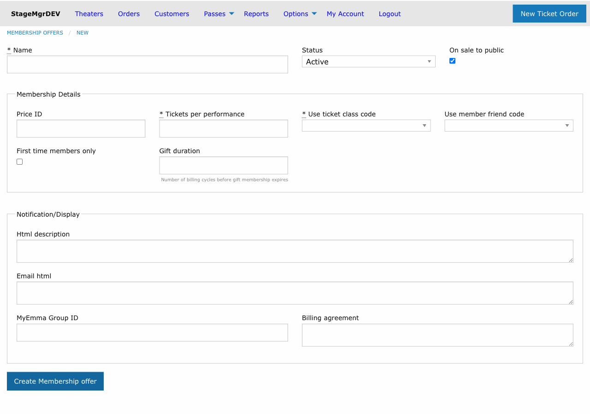

# Membership Offers

!!! info "Who uses this?"
    **Box Office Managers** and **Development Staff** configure membership offers to provide recurring ticket benefits, guest privileges, and subscriber management.

**Navigation:** Admin > Offers > Membership Offers

---

## Overview

Memberships are recurring subscription plans that grant patrons a set number of tickets per performance, optional guest tickets, and other benefits. Memberships are billed on a recurring cycle through the payment processor and can include trial periods and gift options.

## Creating a Membership Offer

### Core Fields

| Field | Description |
|-------|-------------|
| **Name** | Display name for the membership tier (e.g., "Gold Membership"). |
| **Status** | `Active` or `Inactive`. Only active memberships can be purchased. |
| **On Sale** | Whether the membership is available for purchase on the public website. |
| **Price ID** | The recurring price identifier from the payment processor (Stripe). This controls the billing amount and cycle. |

!!! warning "Price ID must be configured in Stripe first"
    Create the recurring price in your Stripe dashboard before setting up the membership offer. The Price ID links the membership to the correct billing plan.

### Ticket Allocations

| Field | Description |
|-------|-------------|
| **Tickets Per Performance** | Number of tickets the member receives for each performance they attend. |
| **Use Ticket Class Code** | The ticket class assigned to the member's own tickets on redemption. |
| **Use Member Friend Code** | The ticket class assigned to guest tickets. This allows different pricing or seating for the member's companions. |

!!! tip "Member vs. guest ticket classes"
    Use different ticket class codes for members and their guests to track attendance patterns and generate accurate settlement reports.

### Restrictions

| Field | Description |
|-------|-------------|
| **Restricted to First Time** | When checked, only patrons who have never held a membership before can purchase this offer. Useful for introductory or trial-rate memberships. |

### Trial Period

| Field | Description |
|-------|-------------|
| **Trial Period** | Number of days the member enjoys a reduced trial price before full billing begins. |
| **Trial Price** | The discounted price charged during the trial period. |

Leave both fields blank to skip the trial period and begin full-price billing immediately.

### Gift Memberships

| Field | Description |
|-------|-------------|
| **Max Cycles if Gift** | Maximum number of billing cycles when the membership is purchased as a gift. After this many cycles, billing stops automatically. |

!!! tip "Setting gift duration"
    For a 1-year gift membership billed monthly, set **Max Cycles if Gift** to `12`. The gift recipient enjoys full benefits for 12 months without further charges.

### Email Integration

| Field | Description |
|-------|-------------|
| **MyEmma Group** | The email list group ID in MyEmma. Active members are automatically added to this group for targeted email campaigns. |

### Content and Legal

| Field | Description |
|-------|-------------|
| **Billing Agreement** | Legal text displayed to the customer before purchase, describing the recurring billing terms. |
| **HTML Description** | Rich HTML content displayed on the membership detail/sales page. |
| **Email HTML** | HTML content included in the membership confirmation email sent after purchase. |

---

## How Membership Billing Works

1. The patron selects a membership offer and completes checkout.
2. If a **Trial Period** is configured, the patron is charged the **Trial Price** and the trial countdown begins.
3. After the trial period ends (or immediately if no trial), recurring billing at the full price begins based on the Stripe price configuration.
4. Each billing cycle, the payment processor charges the patron automatically.
5. If the membership was purchased as a gift, billing stops after **Max Cycles if Gift** cycles.

---

## How Ticket Redemption Works

1. A member visits the box office or logs in online to claim tickets for a performance.
2. The system issues up to **Tickets Per Performance** tickets using the **Use Ticket Class Code**.
3. If guest tickets are configured via **Use Member Friend Code**, additional tickets are issued under that class.
4. Members can redeem tickets for each performance independently -- there is no total cap across the membership period.

---

## Managing Memberships

- **Deactivate** an offer by setting Status to `Inactive`. Existing members continue their subscriptions until cancelled.
- **Remove from public sale** by unchecking **On Sale** while keeping the offer active for box office staff.
- Changes to an offer do not retroactively affect existing subscribers.

!!! warning "Cancellation is handled through the payment processor"
    To cancel an individual member's subscription, the cancellation must be processed through Stripe. Changing the offer status to Inactive only prevents new sign-ups.
