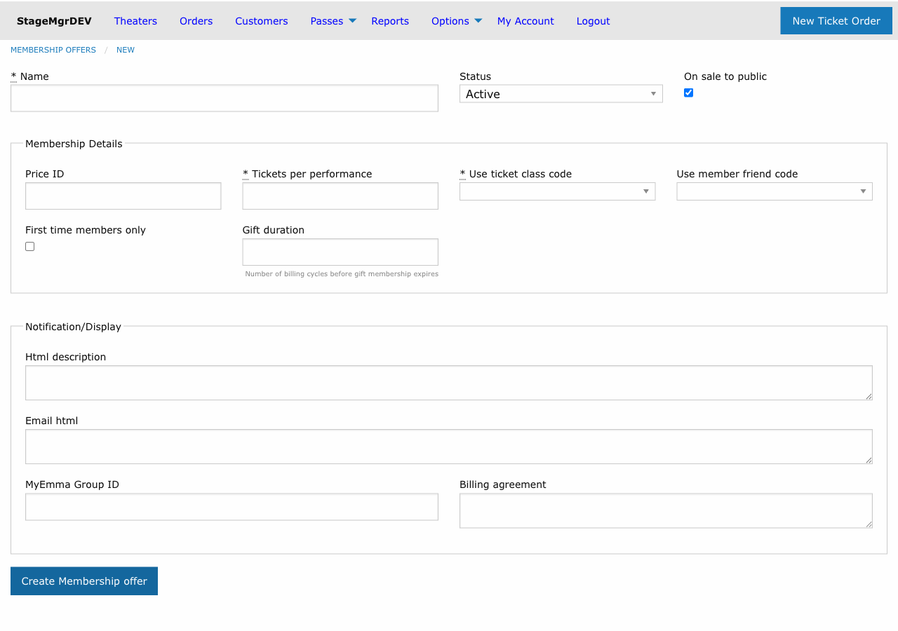
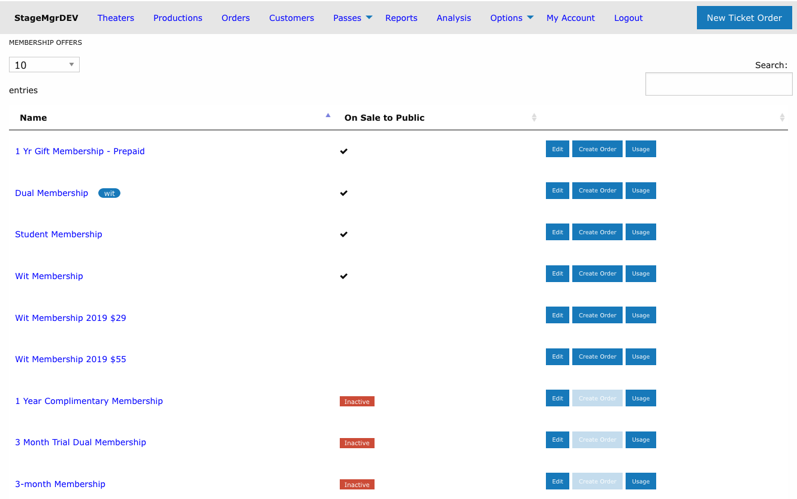
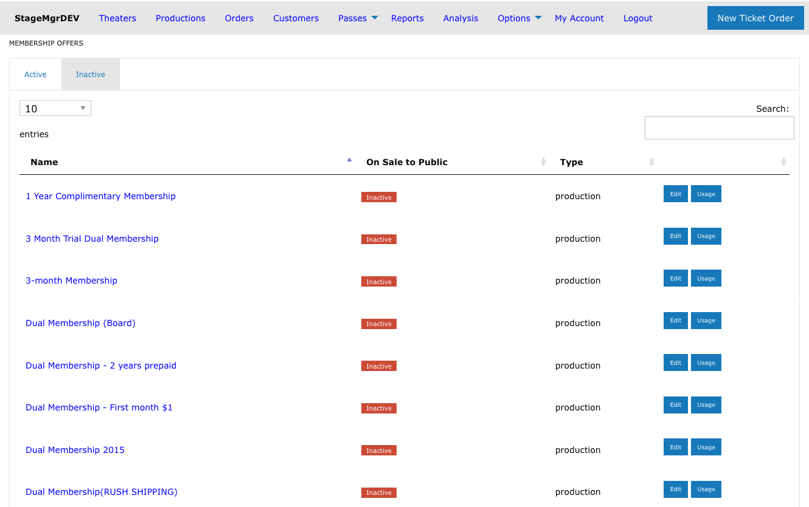
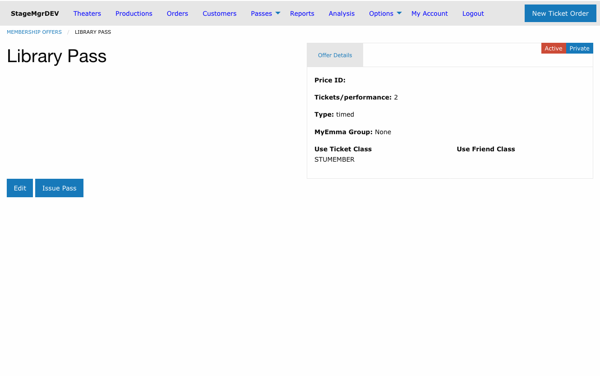

# Membership Offers

!!! info "Who uses this?"
    **Box Office Managers** and **Development Staff** configure membership offers to provide recurring ticket benefits, guest privileges, and subscriber management.

**Navigation:** Admin > Offers > Membership Offers

---

## Overview

Memberships are recurring subscription plans that grant patrons a set number of tickets per performance, optional guest tickets, and other benefits. Memberships are billed on a recurring cycle through the payment processor and can include trial periods and gift options.

## Creating a Membership Offer

### Core Fields

| Field | Description |
|-------|-------------|
| **Name** | Display name for the membership tier (e.g., "Gold Membership"). |
| **Status** | `Active` or `Inactive`. Only active memberships can be purchased. |
| **On Sale** | Whether the membership is available for purchase on the public website. |
| **Price ID** | The recurring price identifier from the payment processor (Stripe). This controls the billing amount and cycle. |

!!! warning "Price ID must be configured in Stripe first"
    Create the recurring price in your Stripe dashboard before setting up the membership offer. The Price ID links the membership to the correct billing plan.

### Ticket Allocations

| Field | Description |
|-------|-------------|
| **Tickets Per Performance** | Number of tickets the member receives for each performance they attend. |
| **Use Ticket Class Code** | The ticket class assigned to the member's own tickets on redemption. |
| **Use Member Friend Code** | The ticket class assigned to guest tickets. This allows different pricing or seating for the member's companions. |

!!! tip "Member vs. guest ticket classes"
    Use different ticket class codes for members and their guests to track attendance patterns and generate accurate settlement reports.

### Restrictions

| Field | Description |
|-------|-------------|
| **Restricted to First Time** | When checked, only patrons who have never held a membership before can purchase this offer. Useful for introductory or trial-rate memberships. |

### Trial Period

| Field | Description |
|-------|-------------|
| **Trial Period** | Number of days the member enjoys a reduced trial price before full billing begins. |
| **Trial Price** | The discounted price charged during the trial period. |

Leave both fields blank to skip the trial period and begin full-price billing immediately.

### Gift Memberships

| Field | Description |
|-------|-------------|
| **Max Cycles if Gift** | Maximum number of billing cycles when the membership is purchased as a gift. After this many cycles, billing stops automatically. |

!!! tip "Setting gift duration"
    For a 1-year gift membership billed monthly, set **Max Cycles if Gift** to `12`. The gift recipient enjoys full benefits for 12 months without further charges.

### Email Integration

| Field | Description |
|-------|-------------|
| **MyEmma Group ID** | The email list group ID in MyEmma. Members are automatically kept in sync with this group for targeted email campaigns. |

How the sync works:

- When a membership on this offer becomes **Active**, the member's address is added to the group.
- When a membership is **Canceled** or **Suspended**, the address is removed -- unless the patron still holds another current membership.
- If you **change the group ID** on the offer, every active membership's address is added to the new group automatically. Addresses are not removed from the old group.

All sync work runs as background jobs, so saving the form returns immediately and any email-service hiccup is retried without affecting the membership itself.

!!! note "Only shown when MyEmma is configured"
    The MyEmma Group ID field (and the matching row on the offer detail page) appears only when the MyEmma integration is enabled for this installation.

### Content and Legal

| Field | Description |
|-------|-------------|
| **Billing Agreement** | Legal text displayed to the customer before purchase, describing the recurring billing terms. |
| **HTML Description** | Rich HTML content displayed on the membership detail/sales page. |
| **Email HTML** | HTML content included in the membership confirmation email sent after purchase. |

### Member ID Card Artwork

The **Member ID Card** section holds the artwork staff need to print a physical
membership card for any membership on this offer. Nothing is drawn per offer at
print time: the background you upload is the finished card face for this offer,
and the renderer adds only the member's photo, name, member number and since
year.

| Upload | Required? | What it is |
|--------|-----------|------------|
| **Background** | Yes | The whole card except the four variable fields. A 1011 x 638 px PNG (85.6 x 54 mm at 300 dpi). Until one is uploaded, memberships on this offer show no card button. |
| **Front overlay** | No | A 1011 x 638 px PNG with transparency, layered over the photo and background: a tint over the photo, a frame around it, a logo. Anything opaque here hides what is underneath. |
| **Name font** | No | An `.otf` or `.ttf` file for the member's name. Falls back to Helvetica Bold. |
| **Label font** | No | An `.otf` or `.ttf` file for the member number and since year. Falls back to Helvetica. |

!!! warning "Backgrounds and overlays must be exactly 1011 x 638 pixels"
    A file of any other size is rejected when you save the offer. A resized export
    would misplace every field on the printed card, so regenerate the artwork at
    the card size instead of scaling it.

Fonts live on the offer rather than in the software because a house's typefaces
are usually commercially licensed. Upload the same two font files to every offer
that should print in them.

Once a background is uploaded, the offer detail page shows a thumbnail of it
under **Member ID Card** in the Offer Details panel. The edit form shows a
preview of every upload above its file field, with `Not uploaded` in any empty
slot, so you can see what a new upload will replace.

The exact geometry of the card is documented for developers in
[Membership card rendering specification](../developer/membership-card-spec.md).

### Tags

Tags are free-form labels you can attach to a membership offer to group it for analysis and reporting -- for example by campaign, tier family, season, or any attribute you want to slice by later. Tags are arbitrary text you define and can change at any time.

A membership offer can have any number of tags. They appear as rounded pill labels in the **Tags** field on the offer form, next to the offer name in the Membership Offers list, and on the offer detail page.

#### Adding a tag

1. Click into the **Tags** field on the membership offer form.
2. Begin typing. As you type, a dropdown suggests existing tag names already used on other membership offers -- click one to apply it, or keep typing to create a brand-new tag.
3. Press **Enter** (or type a comma) to commit the tag as a pill.
4. Repeat to add as many tags as you need, then save the form.

!!! tip "Reuse existing tags when possible"
    The autocomplete suggestions help you converge on a consistent vocabulary. Tags are matched case-insensitively, so "Gift" and "gift" are treated as the same tag, with the casing of the first one preserved.

#### Removing a tag

Click the **x** on the right side of any pill to remove that tag, then save the form. The tag is removed from this offer only; it remains available on any other offer that uses it.

!!! tip "Search by tag"
    The search box on the Membership Offers list matches tag names as well as offer names, so you can quickly filter the list down to every offer sharing a tag.

---

## How Membership Billing Works

1. The patron selects a membership offer and completes checkout.
2. If a **Trial Period** is configured, the patron is charged the **Trial Price** and the trial countdown begins.
3. After the trial period ends (or immediately if no trial), recurring billing at the full price begins based on the Stripe price configuration.
4. Each billing cycle, the payment processor charges the patron automatically.
5. If the membership was purchased as a gift, billing stops after **Max Cycles if Gift** cycles.

---

## How Ticket Redemption Works

1. A member visits the box office or logs in online to claim tickets for a performance.
2. The system issues up to **Tickets Per Performance** tickets using the **Use Ticket Class Code**.
3. If guest tickets are configured via **Use Member Friend Code**, additional tickets are issued under that class.
4. Members can redeem tickets for each performance independently -- there is no total cap across the membership period.

---

## The Membership Offers List

### Active and Inactive Tabs

The offers list is divided into two tabs:

| Tab | Shows |
|-----|-------|
| **Active** | Offers with `Active` status -- the memberships patrons can currently purchase or be issued. This tab opens by default. |
| **Inactive** | Offers with `Inactive` status, kept for reference or later reactivation. |

Each tab has its own search box, column sorting, and paging, so you can filter one list without affecting the other. The searches and sort order you set are remembered separately per tab, and the tab you last viewed stays selected when you return to the page during the same browser session.

### Row Actions

Each row on the **Active** tab has an actions column with three buttons; the last one is the offer's **primary sales action** and depends on its type:

| Button | What it does |
|--------|--------------|
| **Edit** | Opens the offer's edit form. |
| **Usage** | Opens the [Membership Usage report](../reports/membership-reports.md#membership-usage) for this offer alone, covering its entire history. |
| **Create Order** | (Production offers) Starts a new membership order for this offer. |
| **Issue Pass** | (Timed offers) Creates a staff-issued membership directly, with no purchase order -- the library pass workflow. |

Each active offer shows exactly one of **Create Order** or **Issue Pass**. Rows on the **Inactive** tab show only **Edit** and **Usage** -- inactive offers cannot be sold or issued, so no sales action appears.

The **On Sale to Public** column shows a checkmark when the offer is publicly purchasable. Offers on the Inactive tab show a red **Inactive** label in this column instead.

!!! tip "Usage over the offer's full history"
    The **Usage** button runs the report from the offer's first membership payment through the end of last month -- you don't need to pick a date range. See [Membership Reports](../reports/membership-reports.md#running-the-report-for-a-single-offer) for what the per-offer report contains.

---

## The Offer Detail Page

Clicking an offer's name opens its detail page.

- The offer name appears as a heading above the offer's public description.
- The **Offer Details** panel summarizes the Price ID, tickets per performance, type, MyEmma group (when MyEmma is enabled), and ticket classes; a **Notification** tab shows the confirmation email content when one is configured.
- Status labels in the top-right corner show whether the offer is Active/Inactive and On Sale/Private.
- Below the description sit **Edit** and the offer's primary sales action: **Create Order** for production offers or **Issue Pass** for timed offers. Unlike the list -- where inactive offers show no sales action at all -- the detail page always shows the button, greyed out and disabled while the offer is Inactive.

---

## Managing Memberships

Individual membership records (who holds each membership, its status, start, and end) are managed on the [Memberships list](../ticketing/managing-memberships.md) under **Passes > Memberships**.

- **Deactivate** an offer by setting Status to `Inactive`. It moves to the **Inactive** tab, and existing members continue their subscriptions until cancelled.
- **Remove from public sale** by unchecking **On Sale** while keeping the offer active for box office staff.
- Changes to an offer do not retroactively affect existing subscribers.

!!! warning "Cancellation is handled through the payment processor"
    To cancel an individual member's subscription, the cancellation must be processed through Stripe. Changing the offer status to Inactive only prevents new sign-ups.
