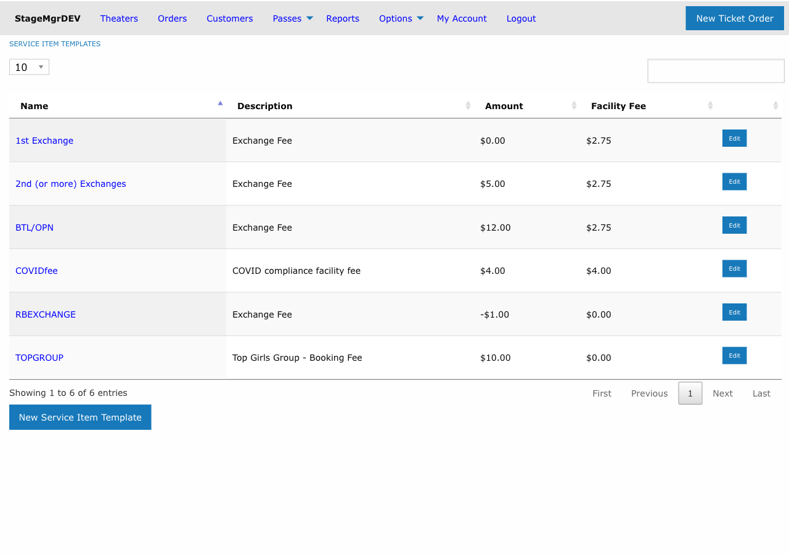

# Service Item Templates

!!! info "Who uses this?"
    **System Administrators** define service item templates at the system level. **Theater Managers** and **Production Managers** can override defaults at their respective levels to customize fees for their needs.

**Navigation:** Admin > Offers > Service Item Templates

---

## Overview

Service item templates define additional fees and charges that can be applied to orders -- such as processing fees, ticket exchange fees, or donation add-ons. These templates follow an inheritance chain that allows system-wide defaults to be overridden at the theater or production level.

## The Fee Inheritance Chain

Service item configuration follows a three-tier inheritance model:

```
System (Service Item Templates)
  └── Theater Defaults (override system values)
       └── Production Overrides (override theater values)
```

1. **System level:** Service Item Templates define the base configuration and default amounts for all theaters and productions.
2. **Theater level:** A theater can override the system default amounts for its own events. If no theater override exists, the system value is used.
3. **Production level:** A production can further override the theater (or system) default. If no production override exists, the theater value is used. If no theater override exists either, the system value is used.

!!! tip "Start broad, override where needed"
    Define sensible defaults at the system level. Only create theater or production overrides when a specific venue or show requires different fee amounts.

---

## Creating a Service Item Template



### Fields

| Field | Description |
|-------|-------------|
| **Name** | Display name for the service item (e.g., "Processing Fee"). Must be unique. Required. |
| **Description** | Customer-facing text explaining the charge, displayed during checkout. Required. |
| **Internal Description** | Staff-facing description for reporting and back-office reference. If left blank, automatically set to match the Description field. |
| **Amount** | The dollar amount of the fee. Required. See below for how negative values work. |
| **Facility Fee** | An optional additional facility fee amount associated with this service item. |
| **User Selectable** | When checked, the customer can choose to add or remove this item during checkout. When unchecked, the item is applied automatically. |
| **Suppress for Pass Payments** | When checked, this service item is not applied when the order is paid using a flex pass or membership redemption. |

### How Negative Amounts Work

Setting a **negative amount** on a service item template has a special behavior:

- The template defines a maximum credit or discount amount.
- When the service item is applied at the **box office backend**, staff can modify the actual amount charged (up to the absolute value of the template amount).
- This is useful for discretionary discounts or variable adjustments where the staff determines the final value per order.

!!! warning "Negative amounts require backend modification"
    Negative-amount service items are designed for box office use. They are not available for customer self-service online. Staff must manually set the actual amount during order processing.

---

## Configuring Theater Defaults

To override a system-level service item for a specific theater:

1. Navigate to the theater's settings page.
2. Locate the Service Items section.
3. Adjust the **Amount** or **Facility Fee** values for any service item template.
4. Save the theater settings.

All productions at that theater will inherit the theater-level values unless further overridden at the production level.

---

## Configuring Production Overrides

To override service item values for a specific production:

1. Navigate to the production's edit page.
2. Locate the Service Items section.
3. Adjust the **Amount** or **Facility Fee** values for any service item template.
4. Save the production.

These values take highest priority and are used for all orders associated with that production.

!!! tip "Checking effective values"
    To determine which fee amount will actually be charged for a given production, check the production's service item settings first. If no override exists there, check the theater settings. The system template is the final fallback.

---

## Suppressing Fees for Pass Payments

The **Suppress for Pass Payments** option is important for flex pass and membership redemptions. When a patron redeems a prepaid pass, it is typically inappropriate to charge additional processing or service fees since those were already accounted for in the pass purchase price.

When this box is checked:

- The service item is **skipped** when the payment method is a flex pass or membership redemption.
- The service item is **applied normally** for all other payment methods (credit card, cash, etc.).

---

## Examples

| Template Name | Amount | User Selectable | Suppress for Passes | Use Case |
|--------------|--------|-----------------|---------------------|----------|
| Processing Fee | $3.50 | No | Yes | Automatic per-order online processing fee, waived for pass holders. |
| Ticket Exchange Fee | $5.00 | No | No | Charged when a patron exchanges tickets for a different performance. |
| Voluntary Donation | $2.00 | Yes | Yes | Optional add-on donation the customer can include at checkout. |
| Staff Discount | -$10.00 | No | No | Box office discretionary discount, staff sets actual amount at time of sale. |
