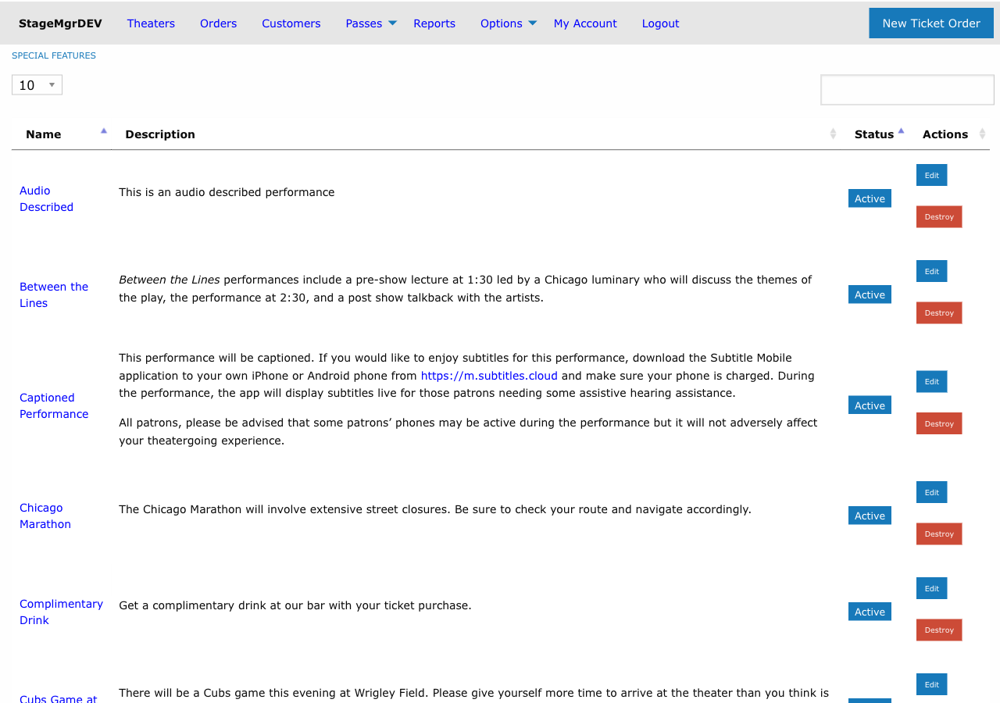

# Special Features

!!! info "Who uses this?"
    **Production Managers** and **Marketing Staff** create special features to tag performances with notable attributes that are displayed to customers on the website and in confirmation emails.

**Navigation:** Admin > Offers > Special Features

---

## Overview

Special features are descriptive tags that can be assigned to individual performances to communicate unique attributes -- such as "ASL Interpreted," "Post-Show Talkback," or "Pay-What-You-Can." When assigned, these features are displayed prominently on the public website calendar and in order confirmation emails.

## Creating a Special Feature

### Fields

| Field | Description |
|-------|-------------|
| **Short Name** | A concise label displayed in listings and email subject lines (e.g., "ASL Interpreted"). Must be unique across all special features. Required. |
| **Description** | A longer explanation of the feature shown on the website and, unless **Custom Email** is filled in, in patron emails. Supports Markdown formatting for links, bold text, and lists. Required. |
| **Custom Email** | Optional. Text shown in confirmation and reminder emails **instead of** the description. Markdown enabled. Leave it blank to use the description in emails too. |
| **Status** | `Active` or `Inactive`. Only active features can be assigned to performances and are visible to customers. |

!!! tip "Use Markdown in descriptions"
    The Description field supports Markdown. Use it to include links to additional information, format text for readability, or add structured details about the feature.

---

## Assigning Features to Performances

Special features are assigned at the **performance level**, not the production level. This allows different performances of the same production to have different features.

To assign features:

1. Navigate to the production's performance list.
2. Edit a specific performance.
3. In the Special Features section, check the boxes next to each feature that applies.
4. Save the performance.

A single performance can have multiple features assigned simultaneously (e.g., both "ASL Interpreted" and "Post-Show Talkback").

!!! tip "Bulk assignment"
    When multiple performances share the same feature, edit each performance individually. There is no bulk assignment tool, so plan feature assignments when scheduling performances.

---

## Where Features Are Displayed

### Public Website

- **Calendar/listing view:** The short name appears as a badge or tag next to the performance date and time.
- **Performance detail page:** The full description is displayed, rendered with Markdown formatting.

### Confirmation and Reminder Emails

- Each feature on the performance appears in a highlighted box in the confirmation and reminder emails, for every patron with an order for that performance.
- The box shows the feature's **Custom Email** text when it has one, otherwise its **Description**. This is the same rule the performance's own [custom feature texts](../productions/performances.md#special-feature-email-markdown) follow.
- Every patron gets it, whatever they bought, including virtual (streaming) ticket holders. Keep the email text suitable for everyone, or put instructions for one kind of ticket in that ticket class's [Purchase Email Annotation](../productions/ticket-classes.md#purchase-email-annotation).

!!! tip "Different wording for the website and emails"
    Use **Custom Email** when the web description doesn't suit an email. For example, "Reserve a captioning tablet when you buy your tickets" makes sense on the purchase page, but after purchase the email might instead say "Captioning tablets can be requested at the box office."

!!! warning "Inactive features and emails"
    Setting a feature to `Inactive` removes it from confirmation and reminder emails sent from then on, even for performances that still have it checked. It does not change emails already sent. The performance's own custom feature text is unaffected and still appears.

---

## Examples of Common Special Features

| Short Name | Description |
|------------|-------------|
| ASL Interpreted | This performance includes American Sign Language interpretation. |
| Audio Described | A live audio description is provided for patrons who are blind or have low vision. |
| Post-Show Talkback | Stay after the show for a Q&A session with the cast and creative team. |
| Pay-What-You-Can | Ticket prices are flexible -- pay what you can afford. |
| Preview Performance | This is a preview performance. The production is still in final rehearsals. |
| Relaxed Performance | A sensory-friendly performance with adjusted lighting and sound levels. |

---

## Managing Special Features

- **Deactivate** a feature by setting its status to `Inactive`. It no longer appears in patron emails, and it can't be assigned to more performances.
- **Reactivate** by switching back to `Active`. Any performances that still have the feature checked include it in their emails again.
- **Delete** a feature only if it is no longer assigned to any performances. If it is still assigned, deleting it copies its Description into each performance's custom feature text (and its Custom Email into the performance's custom email text), so those performances keep displaying the same information.
