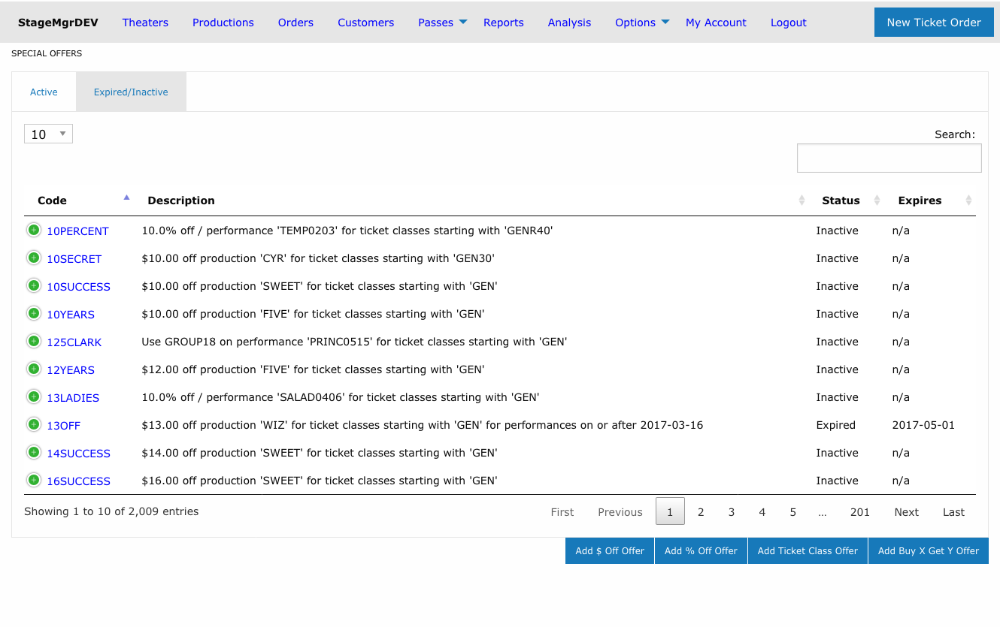

# Special Offers

!!! info "Who uses this?"
    **Box Office Managers** and **Marketing Staff** create special offers (promo codes) to provide discounts or ticket class changes for customers during checkout.

**Navigation:** Admin > Offers > Special Offers

---

## Overview

Special offers are promo codes that customers enter at checkout to receive a discount or ticket class change. Stagemgr supports four types of special offers, each with distinct behavior:

| Type | Label | Behavior |
|------|-------|----------|
| **AmountOffSpecialOffer** | $ Off | Deducts a flat dollar amount per qualifying ticket |
| **PercentOffSpecialOffer** | % Off | Deducts a percentage from the total of qualifying tickets |
| **TicketClassSpecialOffer** | TktClass | Replaces the ticket class with a different class at checkout |
| **BuyXGetYSpecialOffer** | Buy X Get Y | Frees the cheapest tickets for every full group bought (e.g. buy 2, get 1 free) |

### Active and Expired/Inactive Tabs

The offers list is divided into two tabs:

| Tab | Shows |
|-----|-------|
| **Active** | Offers with `Active` status -- the codes customers can currently redeem. This tab opens by default. |
| **Expired/Inactive** | Offers with `Inactive` or `Expired` status, kept for reference or later reactivation. |

Each tab has its own search box, column sorting, and paging, so you can filter one list without affecting the other. The searches and sort order you set are remembered separately per tab, and the tab you last viewed stays selected when you return to the page during the same browser session.

!!! tip "Where did my offer go?"
    Changing an offer's status moves it between tabs. If a code you expect to see is missing from the Active tab, check the Expired/Inactive tab -- it may have been deactivated or passed its Auto Expire date.

## Creating a Special Offer

### Required Fields

| Field | Description |
|-------|-------------|
| **Code** | The promo code customers will enter. Automatically uppercased (e.g., `spring25`becomes `SPRING25`). Must be unique. |
| **Type** | Choose one of: `$ Off`, `% Off`, or `TktClass`. Cannot be changed after creation. |
| **Status** | `Active` (usable now), `Inactive` (disabled), or `Expired` (no longer valid). |

### Amount and Class Fields

| Field | Applies To | Description |
|-------|-----------|-------------|
| **Amount** | $ Off | Dollar amount to deduct per ticket (e.g., `5.00` takes $5 off each ticket). |
| **Amount** | % Off | Percentage to deduct from the qualifying ticket total (e.g., `20` for 20% off). |
| **Change Ticket Class Code** | TktClass | The target ticket class code that replaces the customer's original class. |
| **Buy quantity (X)** | Buy X Get Y | Number of tickets that must be purchased to earn free tickets. |
| **Get free quantity (Y)** | Buy X Get Y | Number of tickets made free for each full group of X + Y qualifying tickets. |

### Scoping the Offer

Every offer can be scoped to limit where it applies:

| Scope | Effect |
|-------|--------|
| **Theater** | Offer applies to all productions at the selected theater. |
| **Production** | Offer applies to all performances of the selected production. |
| **Performance** | Offer applies to a single specific performance only. |

Leave the scope blank to make the offer available system-wide.

### Ticket Class Restriction

| Field | Description |
|-------|-------------|
| **Ticket Class Code** | If set, the offer only applies to tickets whose class code starts with this value. For example, entering `REG` would match `REGULAR`, `REG-ADULT`, etc. |

### How "Buy X Get Y" Offers Work

Buy X Get Y offers reward customers with free tickets once they buy enough. For every full group of **X + Y** qualifying tickets in the order, the **Y cheapest** of those tickets become free.

- **Groups repeat.** With Buy 2 Get 1 (a group of 3), an order of 6 qualifying tickets frees 2; an order of 9 frees 3.
- **The cheapest tickets are freed.** Within each order, Stagemgr frees the lowest-priced qualifying tickets, so the customer keeps the highest value.
- **The ticket class restriction covers both sides.** The **Ticket Class Code** filter determines which tickets both count toward the buy quantity *and* are eligible to be freed. If it is blank, every ticket in the order participates. There is no separate class for the qualifying versus the free tickets.
- **Already-free tickets are ignored.** Tickets that cost $0 (such as comps) never count toward the buy quantity and are never "freed" again — the discount only ever applies to tickets that cost more than $0.

!!! warning "Discount and Set-ticket-class fields don't apply"
    Leave **Discount** and **Set ticket class code** blank for a Buy X Get Y offer. The free tickets are calculated from the buy/get quantities, not from a dollar amount.

### Usage Limits

| Field | Description |
|-------|-------------|
| **Max Tickets Per Order** | Maximum number of tickets the code can discount in a single order. Leave blank for no limit. |
| **Number of Uses** | Total number of times this code can be redeemed across all orders. Leave blank for unlimited uses. |

### Scheduling

| Field | Description |
|-------|-------------|
| **Auto Start** | Date and time when the offer automatically becomes Active. |
| **Auto Expire** | Date and time when the offer automatically becomes Expired. |

!!! tip "Timed promotions"
    Use Auto Start and Auto Expire together for flash sales or limited-time promotions. Create the offer with Inactive status and let the auto-start activate it on schedule.

### Performance Date Restrictions

| Field | Description |
|-------|-------------|
| **Performance Start Range** | Only apply the offer to performances on or after this date. |
| **Performance End Range** | Only apply the offer to performances on or before this date. |

These filters restrict which performances the code is valid for, regardless of when the customer places the order.

### Day-of-Week Restrictions

Check any combination of **Sunday** through **Saturday** to restrict the offer to performances occurring on those days only. If no days are checked, the offer applies to all days.

!!! warning "Day restrictions filter by performance date"
    The day-of-week checkboxes restrict based on the **performance date**, not the date the order is placed.

---

## Examples

### Example 1: $5 Off for a Production

- **Type:** $ Off
- **Code:** `SAVE5`
- **Amount:** `5.00`
- **Scope:** Production > "Our Town"
- **Result:** Every qualifying ticket for any "Our Town" performance is $5 cheaper.

### Example 2: 20% Off Weekend Performances

- **Type:** % Off
- **Code:** `WEEKEND20`
- **Amount:** `20`
- **Scope:** Theater > "Main Stage"
- **Restricted Days:** Saturday, Sunday
- **Result:** 20% off the ticket total for any Saturday or Sunday performance at Main Stage.

### Example 3: Ticket Class Swap for Industry Night

- **Type:** TktClass
- **Code:** `INDUSTRY`
- **Change Ticket Class Code:** `COMP`
- **Scope:** Performance > specific performance
- **Ticket Class Code:** `REG`
- **Result:** Customers with regular tickets receive complimentary tickets for that one performance.

### Example 4: Buy 2 Get 1 Free on General Admission

- **Type:** Buy X Get Y
- **Code:** `GROUP3`
- **Buy quantity (X):** `2`
- **Get free quantity (Y):** `1`
- **Scope:** Production > "Our Town"
- **Ticket Class Code:** `GEN`
- **Result:** For every three GEN tickets in the order, the cheapest one is free. An order of six GEN tickets frees the two cheapest. Non-GEN tickets and any $0 comps are ignored.

---

## Managing Existing Offers

- **Deactivate** an offer by setting its status to `Inactive`. It moves to the **Expired/Inactive** tab and can no longer be redeemed.
- **Reactivate** an offer from the Expired/Inactive tab by setting its status back to `Active`.
- **Track usage** by reviewing the Number of Uses counter on the offer detail page.
- Offers that pass their Auto Expire datetime are automatically marked `Expired`.

!!! note "Automatic weekly cleanup"
    Once a week, Stagemgr automatically marks an `Active` offer `Inactive` when everything it targets is well in the past -- its performance, production, expiration date, or performance date range ended more than a month ago. These offers appear on the Expired/Inactive tab afterward. Reactivate an offer manually if it was cleaned up but you still need it.
