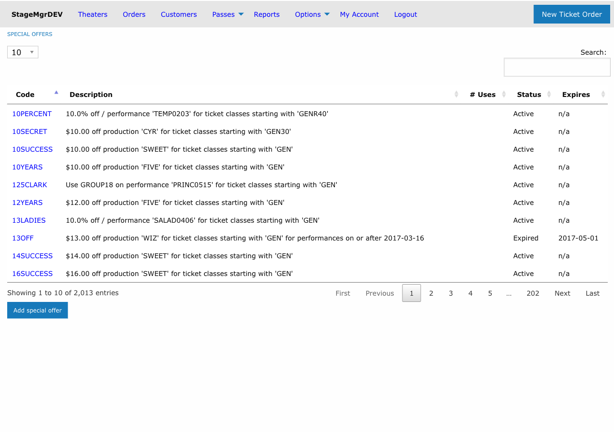
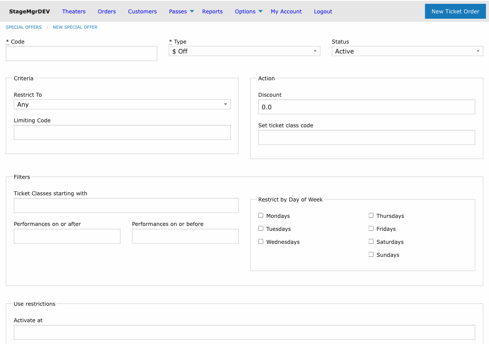

# Special Offers

!!! info "Who uses this?"
    **Box Office Managers** and **Marketing Staff** create special offers (promo codes) to provide discounts or ticket class changes for customers during checkout.

**Navigation:** Admin > Offers > Special Offers

---

## Overview

Special offers are promo codes that customers enter at checkout to receive a discount or ticket class change. Stagemgr supports three types of special offers, each with distinct behavior:

| Type | Label | Behavior |
|------|-------|----------|
| **AmountOffSpecialOffer** | $ Off | Deducts a flat dollar amount per qualifying ticket |
| **PercentOffSpecialOffer** | % Off | Deducts a percentage from the total of qualifying tickets |
| **TicketClassSpecialOffer** | TktClass | Replaces the ticket class with a different class at checkout |

## Creating a Special Offer

### Required Fields

| Field | Description |
|-------|-------------|
| **Code** | The promo code customers will enter. Automatically uppercased (e.g., `spring25`becomes `SPRING25`). Must be unique. |
| **Type** | Choose one of: `$ Off`, `% Off`, or `TktClass`. Cannot be changed after creation. |
| **Status** | `Active` (usable now), `Inactive` (disabled), or `Expired` (no longer valid). |

### Amount and Class Fields

| Field | Applies To | Description |
|-------|-----------|-------------|
| **Amount** | $ Off | Dollar amount to deduct per ticket (e.g., `5.00` takes $5 off each ticket). |
| **Amount** | % Off | Percentage to deduct from the qualifying ticket total (e.g., `20` for 20% off). |
| **Change Ticket Class Code** | TktClass | The target ticket class code that replaces the customer's original class. |

### Scoping the Offer

Every offer can be scoped to limit where it applies:

| Scope | Effect |
|-------|--------|
| **Theater** | Offer applies to all productions at the selected theater. |
| **Production** | Offer applies to all performances of the selected production. |
| **Performance** | Offer applies to a single specific performance only. |

Leave the scope blank to make the offer available system-wide.

### Ticket Class Restriction

| Field | Description |
|-------|-------------|
| **Ticket Class Code** | If set, the offer only applies to tickets whose class code starts with this value. For example, entering `REG` would match `REGULAR`, `REG-ADULT`, etc. |

### Usage Limits

| Field | Description |
|-------|-------------|
| **Max Tickets Per Order** | Maximum number of tickets the code can discount in a single order. Leave blank for no limit. |
| **Number of Uses** | Total number of times this code can be redeemed across all orders. Leave blank for unlimited uses. |

### Scheduling

| Field | Description |
|-------|-------------|
| **Auto Start** | Date and time when the offer automatically becomes Active. |
| **Auto Expire** | Date and time when the offer automatically becomes Expired. |

!!! tip "Timed promotions"
    Use Auto Start and Auto Expire together for flash sales or limited-time promotions. Create the offer with Inactive status and let the auto-start activate it on schedule.

### Performance Date Restrictions

| Field | Description |
|-------|-------------|
| **Performance Start Range** | Only apply the offer to performances on or after this date. |
| **Performance End Range** | Only apply the offer to performances on or before this date. |

These filters restrict which performances the code is valid for, regardless of when the customer places the order.

### Day-of-Week Restrictions

Check any combination of **Sunday** through **Saturday** to restrict the offer to performances occurring on those days only. If no days are checked, the offer applies to all days.

!!! warning "Day restrictions filter by performance date"
    The day-of-week checkboxes restrict based on the **performance date**, not the date the order is placed.

---

## Examples

### Example 1: $5 Off for a Production

- **Type:** $ Off
- **Code:** `SAVE5`
- **Amount:** `5.00`
- **Scope:** Production > "Our Town"
- **Result:** Every qualifying ticket for any "Our Town" performance is $5 cheaper.

### Example 2: 20% Off Weekend Performances

- **Type:** % Off
- **Code:** `WEEKEND20`
- **Amount:** `20`
- **Scope:** Theater > "Main Stage"
- **Restricted Days:** Saturday, Sunday
- **Result:** 20% off the ticket total for any Saturday or Sunday performance at Main Stage.

### Example 3: Ticket Class Swap for Industry Night

- **Type:** TktClass
- **Code:** `INDUSTRY`
- **Change Ticket Class Code:** `COMP`
- **Scope:** Performance > specific performance
- **Ticket Class Code:** `REG`
- **Result:** Customers with regular tickets receive complimentary tickets for that one performance.

---

## Managing Existing Offers

- **Deactivate** an offer by setting its status to `Inactive`.
- **Track usage** by reviewing the Number of Uses counter on the offer detail page.
- Offers that pass their Auto Expire datetime are automatically marked `Expired`.
