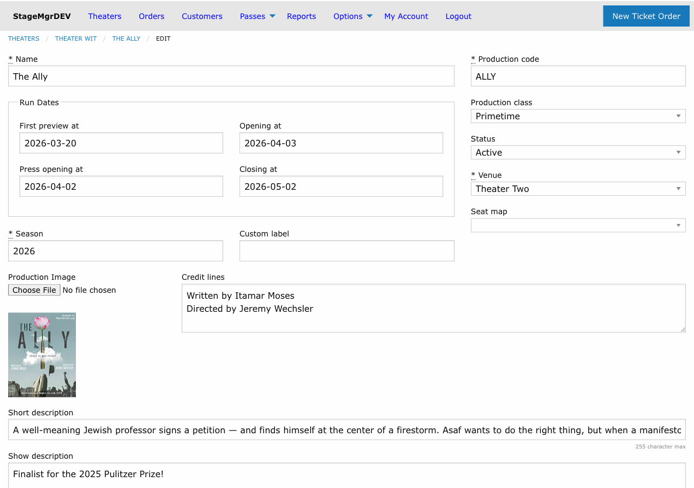
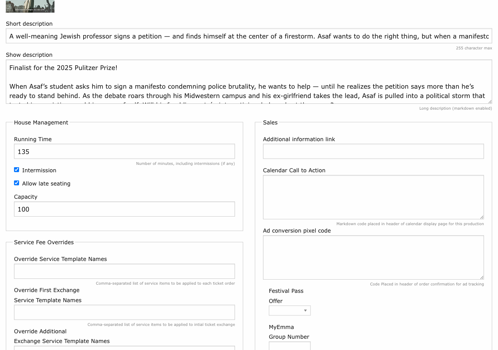
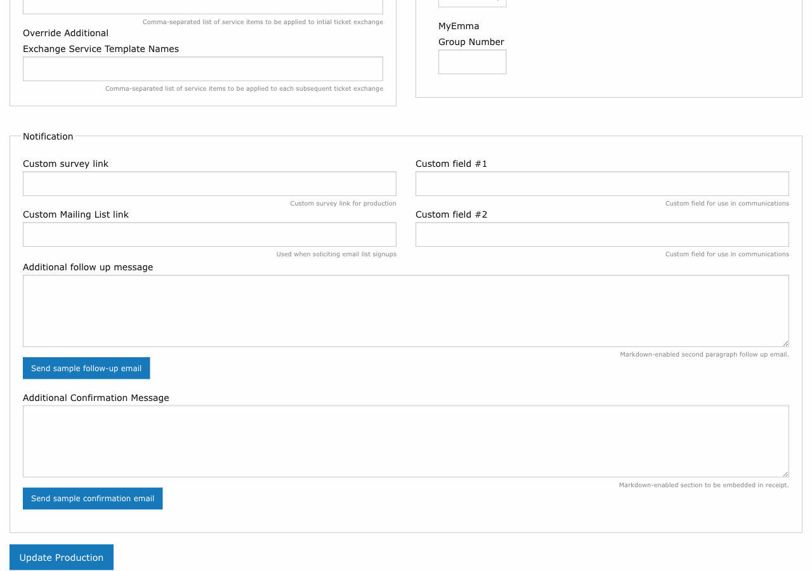
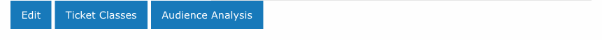

# Creating a Production

!!! info "Required Role"
    **Administrator** or **Box Office** can create and edit productions. Only **Administrators** can delete productions or change certain advanced settings.

**Navigation:** Productions (main menu) > New production *or* Theaters > [Theater Name] > Add Production

## What Is a Production?

A production represents a single show, event, or engagement in Stagemgr. Each production belongs to a theater and a venue, contains one or more performances, and defines the ticket classes, pricing, descriptions, and communications used for that run.

## Creating a Production

1. Go to **Productions** in the main navigation
2. Click **New production**
3. Fill in the form fields described below (organized by form section)
4. Click **Create Production**

When a production is created, Stagemgr automatically assigns the theater's [default ticket classes](default-ticket-classes.md) to it.

## Form Fields: Basic Information

### Name

The production's title as it appears on the website, in orders, and on all patron communications. This is the primary display name -- make it match your marketing materials.

### Season

The season label this production belongs to (e.g., `2025-2026`). Used for filtering and reporting. Required.

### Venue

The physical venue where this production takes place. Select from the list of venues configured in the system. Required. The venue choice determines which seat maps are available.

### Seat Map

Optional. If the venue has seat maps configured, you can assign one to enable reserved seating for this production. The dropdown only shows seat maps belonging to the selected venue.

When a seat map is assigned, the production's **capacity** is automatically derived from the number of seats in the map. See [General Admission vs. Reserved Seating](general-vs-reserved.md) for details.

### Capacity

For general admission productions (no seat map), enter the maximum number of seats available per performance. For reserved seating productions, this field is read-only and reflects the seat map's seat count.

## Form Fields: Metadata

### Production Code

A short identifier (1--8 characters) that uniquely identifies this production. Auto-uppercased on save. Used as a prefix for performance codes and throughout reporting. Required and must be unique across all productions.

!!! tip "Production Code Conventions"
    Use a meaningful abbreviation. For example, a production of *Romeo and Juliet* might use `RAJ` or `ROMEO`. Performance codes will start with this prefix (e.g., `ROMEO01`).

### Status

Controls the production's visibility and behavior. See [Production Settings](production-settings.md) for a detailed breakdown of each status.

| Status | Summary |
|--------|---------|
| **Active** | Fully visible on the website; tickets on sale |
| **Presale** | Visible on the website with run dates but not yet purchasable |
| **Private** | Hidden from the public website; accessible only via direct link or box office |
| **Inactive** | Completely hidden from public view and most admin lists |
| **Season Seating** | Special workflow for subscriber seating; see [Season Seating](season-seating.md) |

### Production Class

Categorizes the type of event for reporting and display purposes.

| Class | Typical Use |
|-------|------------|
| **Primetime** | Main stage productions |
| **Special Event** | Galas, fundraisers, one-off events |
| **Private Party** | Rentals or private bookings |
| **Conference** | Meetings or conference sessions |
| **Off/Late night** | Late-night or secondary programming |
| **Class** | Workshops, educational events |
| **External** | Events managed outside the venue |

## Form Fields: Run Dates

These dates are **required** when the status is Active or Presale.

| Field | Description |
|-------|-------------|
| **Opening At** | Official opening night date |
| **Closing At** | Final performance date |
| **Press Opening At** | Press opening date (may differ from public opening) |
| **First Preview At** | Date of the first preview performance |

## Form Fields: House Management

| Field | Description |
|-------|-------------|
| **Running Time** | Total running time in minutes, including intermissions |
| **Intermission** | Check if the production has an intermission |
| **Allow Late Seating** | Check to permit seating after the performance has started |

## Form Fields: Promotional

### Promo Image

Upload a promotional image for the production. Recommended size: **250x375 pixels**. This image appears on the website calendar, production listing, and in some email templates.

### Credit Lines

Text block for artistic credits (director, cast, designers). Displayed on the production's public page.

### Additional Information Link

A URL to an external page with more information about the production (e.g., a press page or partner site).

## Form Fields: Descriptions

### Short Description

A brief summary of the production. Used in list views and calendar entries where space is limited.

### Show Description

The full production description displayed on the production's detail page. **Markdown enabled** -- you can use formatting, links, and lists.

### Calendar Callout

Text displayed prominently in the calendar header area for this production. **Markdown enabled.** Use this for special announcements like "Final Week!" or "Added Performance!"

## Form Fields: Service Fee Overrides

These fields override the theater-level default service fees for this production only. Enter comma-separated service item template names.

| Field | Description |
|-------|-------------|
| **Override Service Items** | Service fees applied to new ticket orders |
| **Override First Exchange Items** | Fees applied on the patron's first exchange |
| **Override Addl Exchange Items** | Fees applied on second and subsequent exchanges |

!!! tip "Fee Inheritance"
    If left blank, the production inherits fees from its theater. If the theater's fields are also blank, system defaults apply. See [Service Items](../offers/service-items.md).

## Form Fields: Sales

### Flex Pass Offer

Associate a festival pass offer with this production, allowing flex pass holders to redeem tickets.

### Conversion Pixel Code

Paste ad tracking code (e.g., Facebook Pixel or Google Ads snippet) that fires on the order confirmation page for this production. Used for marketing attribution.

## Form Fields: Notifications and Communications

### Survey Link

A URL to a post-show survey. If set, the survey link is included in follow-up emails to patrons.

### Mailing List Link

A URL to the production's or theater's mailing list signup. Included in patron communications when set.

### Custom Label

A label string (auto-downcased) used to tag this production for custom integrations or filtering.

### Custom1 / Custom2

Free-form text fields available for use in email templates and custom communications. Their purpose varies by theater.

### MyEmma Attendee Group

The numeric MyEmma group ID for this production's attendees. Typically auto-populated when the production is saved -- you do not need to set this manually.

### Confirmation Message

Custom text included in the **order confirmation email** sent immediately after purchase. **Markdown enabled.** Use this for pre-show information, parking directions, or COVID policies.

### Follow-Up Message

Custom text included in the **follow-up email** sent after the performance. **Markdown enabled.** Use this for survey links, upcoming show promotions, or thank-you messages.

!!! tip "Preview Sample Emails"
    After saving the production, the edit page displays **Send sample confirmation email** and **Send sample follow-up email** buttons. Click either button to send a preview of that email to your own address, so you can verify formatting and content before patrons receive it.

## After Creating a Production

Once the production is saved:

1. **Review the default ticket classes** that were automatically assigned. Edit or add classes as needed. See [Ticket Classes](ticket-classes.md).
2. **Create performances** for each show date and time. See [Performances](performances.md).
3. **Set the status to Active** (or Presale) when you are ready for the production to appear on the website.

## Action Buttons on the Production Page

Once a production exists, the admin page (Productions > [Production Name]) shows a row
of action buttons:

- **Edit** -- Open the production form to change settings, status, dates, descriptions,
  and messages. Visible to users with edit permission on Productions.
- **Ticket Classes** -- Manage the price tiers and inventory allocations for this
  production. See [Ticket Classes](ticket-classes.md). Visible to users with read
  permission on Ticket Classes.
- **Audience Analysis** -- Jump directly to [Audience Analysis](../analysis/audience.md)
  with this production pre-selected as the target and the production's own theater
  seeded as the comparison group. Visible to Admin and Theater users (anyone with
  permission to run analyses). Box Office users do not see this button.
