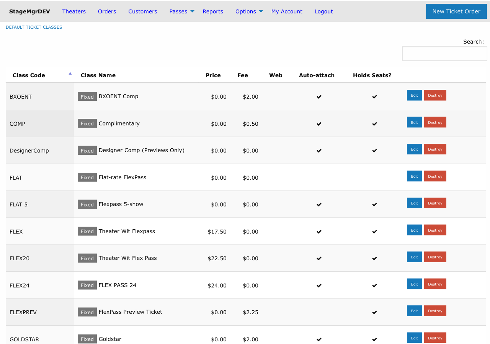

# Default Ticket Classes

!!! info "Required Role"
    Only **Administrators** can create, edit, or delete default ticket classes.

**Navigation:** Options (main menu) > Default Ticket Classes

## What Are Default Ticket Classes?

Default ticket classes are **templates** that are automatically copied to every new production when it is created. They save time by pre-populating the most common ticket types so you do not have to recreate them for each production.

When a new production is saved for the first time, Stagemgr copies all current default ticket classes into the production's own ticket class list. From that point on, the production's ticket classes are independent -- changes to the defaults do not affect existing productions, and changes to a production's classes do not affect the defaults.

## Managing Default Ticket Classes

1. Go to **Options** in the main navigation
2. Click **Default Ticket Classes**
3. From here you can:
    - Click **New default ticket class** to create a new template
    - Click **Edit** next to an existing default to modify it
    - Click **Destroy** to remove a default (does not affect existing productions)

## Form Fields

Default ticket classes have the same fields as production-level ticket classes. See [Ticket Classes](ticket-classes.md) for complete field descriptions. The key fields are:

| Field | Description |
|-------|-------------|
| **Class Code** | Short identifier, auto-uppercased (e.g., `GA`, `SR`, `STU`) |
| **Class Name** | Display name (e.g., "General Admission", "Senior") |
| **Ticket Type** | Fixed, Donation, or Timed |
| **Ticket Price** | Face value in $0.25 increments |
| **Ticketing Fee** | Per-ticket fee in $0.25 increments |
| **Web Visible** | Whether patrons can purchase online |
| **Exchangeable** | Whether tickets can be exchanged |
| **Complimentary** | Whether treated as comp tickets |
| **Holds Seats** | Whether tickets deduct from inventory |
| **Assigns Seats** | Whether box office can manually assign seats |
| **Auto Attach** | Whether automatically added to new performances |
| **Hide Pricing** | Whether to hide the price from patrons |
| **Suppress Receipt** | Whether to suppress confirmation emails |
| **Software Managed** | Whether restricted from box office manual use |
| **Show in Pricing Range** | Whether included in the displayed price range |
| **Minutes Before Show** | For Timed type: when the class becomes visible |
| **Purchase Page Annotation** | Note shown on the purchase page |
| **Purchase Email Annotation** | Note included in confirmation emails (markdown) |

## How the Copy Works

The automatic copy happens during the production creation process (before the first save). The behavior is:

1. All default ticket classes are duplicated into the new production.
2. Each copy inherits every field value from the default template.
3. The copies become independent -- editing one does not affect the other.

!!! tip "Keeping Defaults Current"
    Review your default ticket classes at the start of each season. Update pricing, fee structures, and class names so that new productions start with accurate templates. Remember: changes only affect future productions.

## Common Default Configurations

A typical set of default ticket classes might include:

| Code | Name | Price | Fee | Web Visible | Auto Attach |
|------|------|-------|-----|-------------|-------------|
| `GA` | General Admission | $35.00 | $3.00 | Yes | Yes |
| `SR` | Senior | $25.00 | $3.00 | Yes | Yes |
| `STU` | Student | $15.00 | $3.00 | Yes | Yes |
| `COMP` | Complimentary | $0.00 | $0.00 | No | Yes |

## Relationship to Production Ticket Classes

It is important to understand the boundary between defaults and production-level classes:

- **Defaults are starting points.** They exist to reduce repetitive data entry when creating new productions.
- **Production classes are the real records.** Once copied to a production, the ticket class is a fully independent record. It can be renamed, repriced, or deleted without affecting the default template.
- **New defaults do not backfill.** If you add a new default ticket class, it will only appear on productions created after that change. Existing productions are unaffected.
- **Production classes can diverge freely.** A production's `GA` class might have a different price than the default `GA` class. This is expected and normal.

## Seasonal Updates Checklist

At the start of each season, review your defaults:

1. **Update pricing** -- Adjust ticket prices and fees to reflect the new season's rate structure.
2. **Review class names** -- Ensure names match your current marketing terminology (e.g., "General Admission" vs. "Full Price").
3. **Check visibility settings** -- Confirm that `web_visible`, `auto_attach`, and other flags still match your standard workflow.
4. **Add or remove classes** -- If you have introduced a new pricing tier (e.g., an industry discount) or retired one, update the defaults accordingly.
5. **Verify annotations** -- Update any purchase page or email annotation text that references season-specific information.

!!! warning "Deleting Defaults"
    Deleting a default ticket class removes the template only. It does not remove the corresponding ticket class from any existing production. To clean up an unwanted class across all productions, you must edit each production individually.
