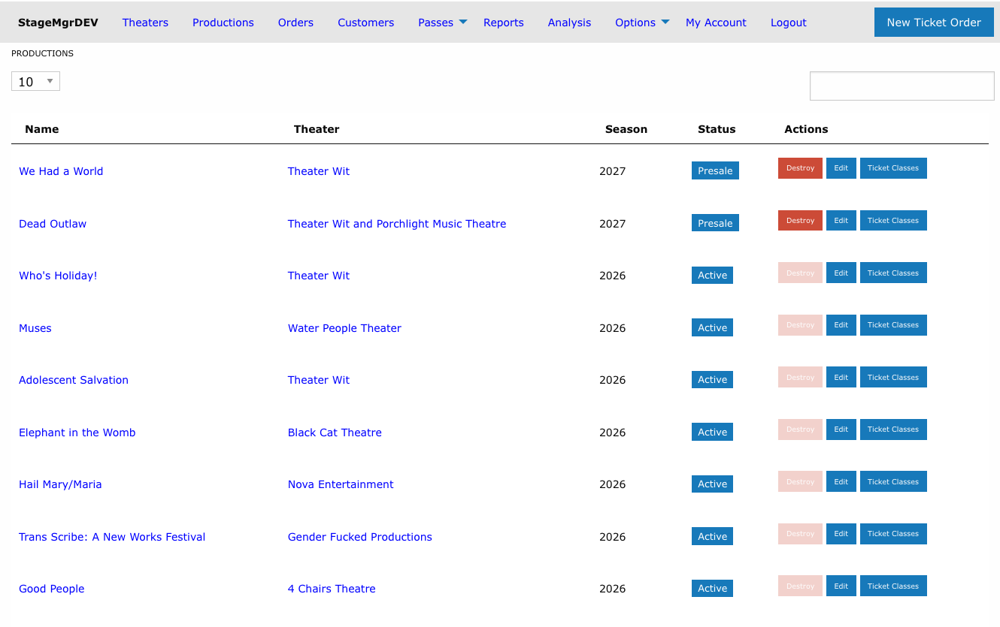
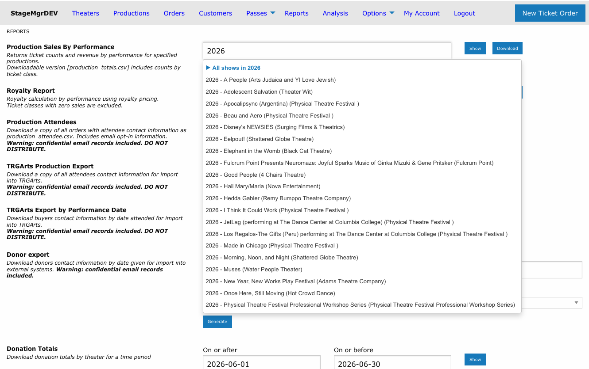
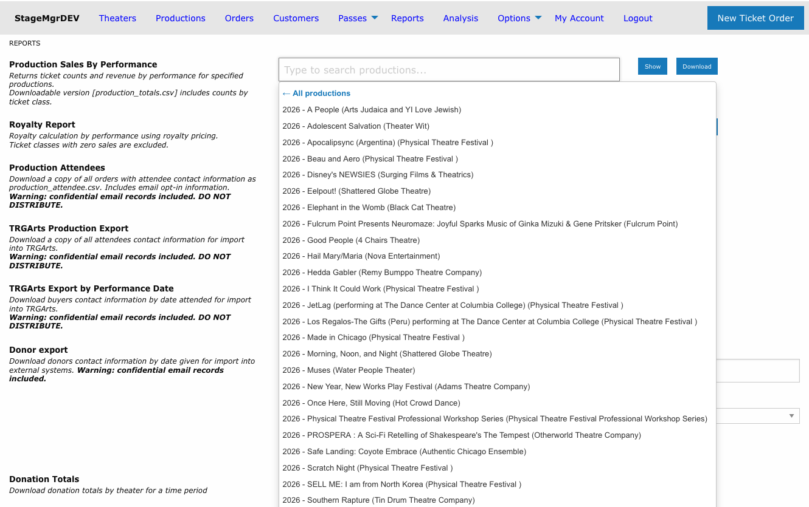
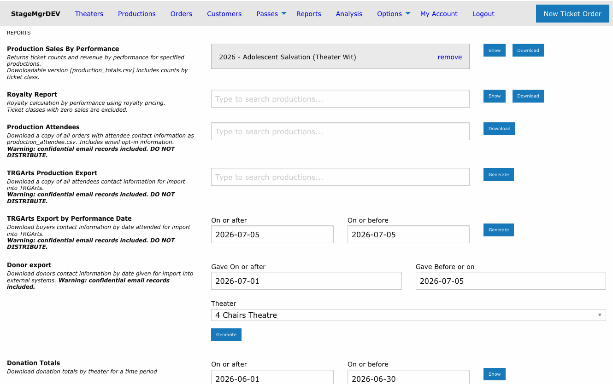

# Finding Productions

!!! info "Access"
    All staff roles can use the Productions list and production search. **Theater** users see
    only productions belonging to their own theaters; **Box Office** and **Admin** users see
    every production in the system.

**Navigation:** Admin Menu > Productions

---

## The Productions List

The **Productions** entry in the top menu (immediately after Theaters) opens a list of every
production you have access to, across all theaters. This is the fastest way to reach a
production when you don't remember which theater it belongs to -- or when you simply have a
lot of productions to wade through.

| Column | Description |
|---|---|
| **Name** | The production name, linked to its detail page. Custom labels appear beneath the name. |
| **Theater** | The producing theater, linked to the theater's page |
| **Season** | The production's season year |
| **Status** | Active, Inactive, Private, Presale, or Season Seating |
| **Actions** | The same Destroy / Edit / Ticket Classes buttons as the per-theater listing, subject to your role's permissions |

Productions are listed newest opening date first.

### Searching the List

The search box filters as you type and matches against **production name**, **status**, and
**theater name**. Searching for a theater's name is an easy way to see just that company's
shows without leaving the page.

!!! tip "Per-theater listings still exist"
    Selecting a theater from the Theaters menu still shows that theater's productions, and
    new productions are still created from the theater page. The Productions list is a
    navigation shortcut, not a replacement.

## The Production Search Picker

Anywhere Stagemgr asks you to choose a single production -- report forms, import forms, and
the Analysis page -- you'll find the same typeahead search field instead of a long dropdown.

Type at least 2 characters to search. Matches are found by:

- Production name
- Season year (e.g., "2026")
- Production code
- Theater name

### Group Shortcuts and Drill-Down

Suggestions beginning with a triangle icon are **group shortcuts**:

- **All shows in [year]** -- every production from that season
- **All shows by [company]** -- every production by that theater
- **All shows tagged [tag]** -- every production whose theater carries that
  [tag](../setup/theaters.md#tags)

In a single-production field, selecting a group **drills down**: the suggestion list narrows
to just that group's productions so you can pick the one you want. Use the
**&larr; All productions** entry at the top of the list to back out of the group, or keep
typing to filter within it.

!!! note "Multi-selection fields expand instead"
    On the Analysis page's **Comparison Shows** field, selecting a group adds *all* of its
    productions to the comparison table at once. Drill-down applies only to fields that
    accept a single production. See
    [Analysis Overview](../analysis/analysis-overview.md#bulk-selection-shortcuts).

### Your Selection

Once you pick a production, the field is replaced by a confirmation box showing the season,
name, and theater. Click **remove** to clear it and search again.

If a form requires a production and you try to submit without one, the form is blocked and
the picker shows **"Please select a production"**.

### What Appears in the Search

The picker only ever offers productions you have access to. Beyond that, each page filters
slightly differently:

| Page | Productions offered |
|---|---|
| **Reports** | Every accessible production, regardless of status |
| **Imports** | All except **Inactive** productions |
| **Analysis** | All except **Presale** productions |

## Related Pages

- [Creating a Production](creating-a-production.md)
- [Reports Overview](../reports/reports-overview.md)
- [Imports Overview](../imports/imports-overview.md)
- [Analysis Overview](../analysis/analysis-overview.md)
