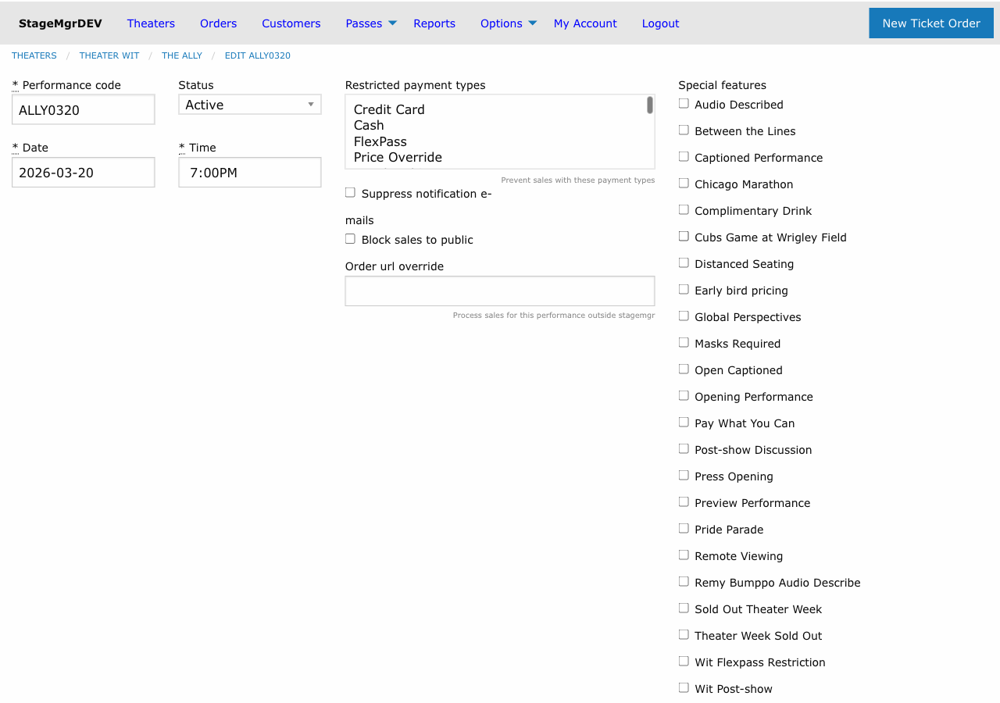
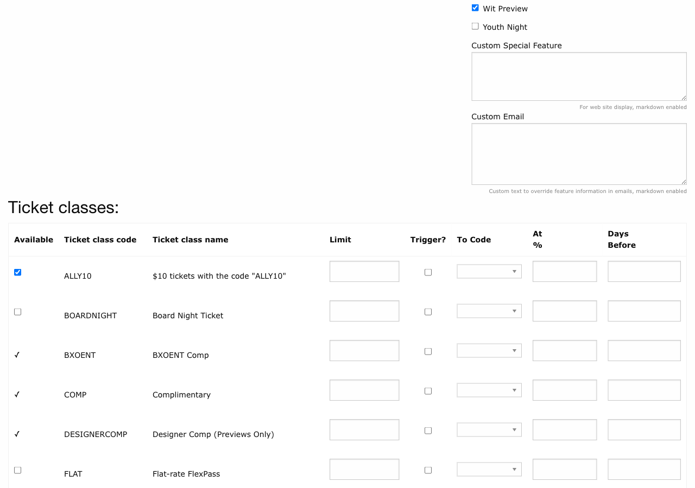
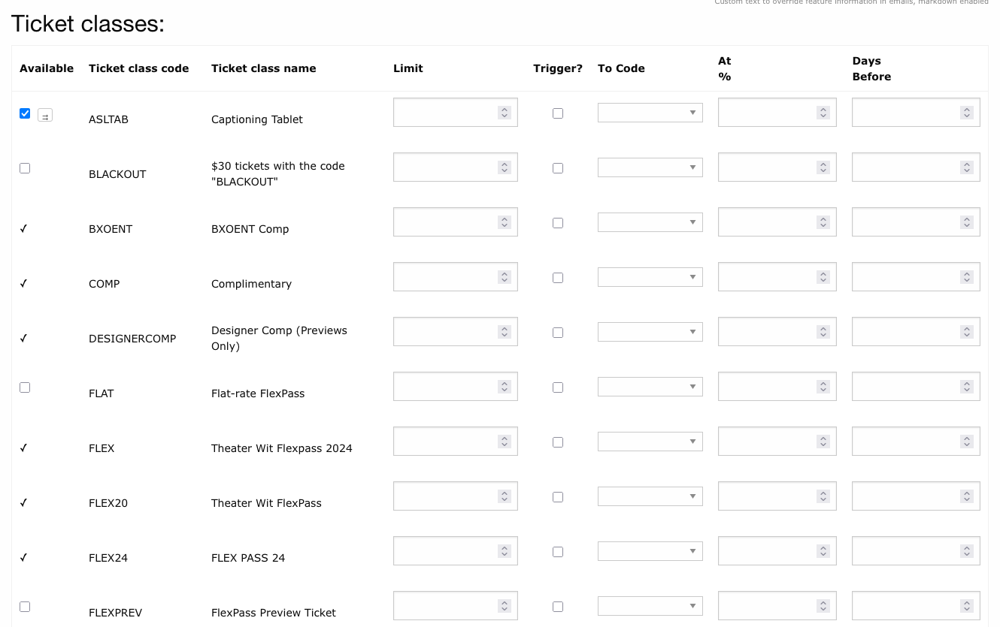
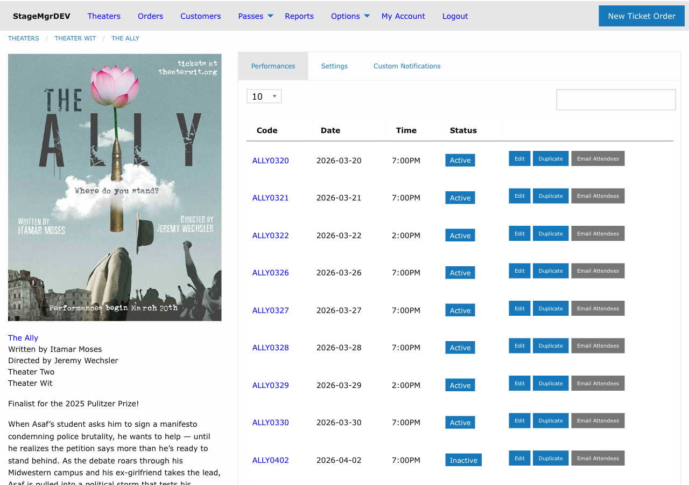

# Performances

!!! info "Required Role"
    **Administrator** or **Box Office** can create, edit, and manage performances. Only **Administrators** can delete performances.

**Navigation:** Productions > [Production Name] > Performances > New performance

## What Is a Performance?

A performance represents a single scheduled showing of a production -- one specific date and time when the audience can attend. Each production has one or more performances, and each performance has its own ticket availability, allocations, restrictions, and special features.

## Creating a Performance

1. Navigate to the production's detail page
2. Click **New performance** in the Performances section
3. Fill in the fields described below
4. Click **Create Performance**

## Core Fields

### Performance Code

A unique identifier for this performance. Must begin with the production's **production code** prefix. Auto-uppercased on save.

!!! tip "Performance Code Conventions"
    If the production code is `ROMEO`, performance codes might be `ROMEO01`, `ROMEO02`, `ROMEOPR` (preview), or `ROMEO0101` (January 1st). Use a consistent numbering scheme across your season.

### Performance Date

The date of the performance. Defaults to today. Required.

### Performance Time

The curtain time for the performance. Required. Times are rounded to the nearest **15-minute interval** (e.g., 7:30 PM, 8:00 PM). Each date/time/production combination must be unique -- you cannot schedule two performances of the same production at the same date and time.

### Status

Controls the performance's visibility and behavior.

| Status | Effect |
|--------|--------|
| **Active** | Performance appears on the public calendar and tickets are available for purchase |
| **Inactive** | Performance is hidden from public view and administrative lists (use to archive past performances) |
| **Private** | Performance is hidden from the public website but accessible to box office staff and via direct link |

## Restrictions

### Withhold from Public

When checked, this performance is blocked from public online sales. The performance does not appear on the website purchase page. Box office staff can still create orders for it.

**Use case:** Hold a performance for group sales, subscriber priority, or internal allocation before opening it to the general public.

### Suppress Notification

When checked, Stagemgr does not send confirmation or notification emails for orders placed on this performance. The orders are processed normally, but patrons do not receive email.

**Use case:** Bulk-imported orders, internal testing, or comps where email notification is unnecessary.

### Order URL Override

Enter a URL to redirect patrons to an external ticketing page instead of processing the sale in Stagemgr. When set, the "Buy Tickets" link for this performance points to the specified URL.

**Use case:** Performances sold through a partner organization's ticketing system, or co-productions where the other company handles sales.

### Restricted Payment Types

A set of checkboxes listing available payment types. Check any payment types that should be **blocked** for this performance. For example, checking "Credit Card" prevents patrons from using credit cards -- they must use another accepted method.

!!! warning "Payment Restrictions"
    Be cautious with payment restrictions. Blocking common payment types may prevent most patrons from completing their purchase. Typically used for special events where only specific payment methods are accepted.

## Special Features

### Special Features Checkboxes

Select from the list of active special features defined in the system. Checked features are associated with this performance and may affect display, pricing, or patron communications.

**Examples of special features:** "Post-Show Talkback", "ASL Interpreted", "Audio Described", "Open Captioned", "Relaxed Performance".

### Special Feature Display Markdown

Custom text displayed on the **website** for this performance, below the date and time. **Markdown enabled.** Use this for performance-specific announcements or details that differ from the standard production description.

**Example:** `**Post-show Q&A with the director**`

### Special Feature Email Markdown

Custom text included in **confirmation emails** for orders on this performance. **Markdown enabled.** Use this for performance-specific instructions or reminders sent to ticket holders.

**Example:** `*This performance includes an ASL interpreter. Interpreted seating is in the first three rows.*`

## Ticket Class Allocations

Below the performance form fields, the **Ticket Class Allocations** table controls which ticket classes are available for this performance and how many tickets of each class can be sold.

Each row in the table represents one ticket class with these fields:

| Field | Description |
|-------|-------------|
| **Available** | Checkbox. When checked, this ticket class is on sale for this performance. |
| **Ticket Limit** | Maximum number of tickets that can be sold for this class. Entered in increments of 5. |
| **Shiftable** | Checkbox. Enables dynamic pricing for this allocation. See [Dynamic Pricing](dynamic-pricing.md). |
| **Shift To Code** | Dropdown. The target ticket class to shift sales into when the trigger is met. |
| **Shift When Capacity Over** | Percentage (0--100). Triggers the shift when overall performance capacity exceeds this threshold. |
| **Shift Days Before Performance** | Number of days. Triggers the shift when the performance is within this many days. |
| **⇉ (propagate toggle)** | Small button next to the Available checkbox on manually-managed classes. When armed, saving the performance also applies this row -- on or off -- to every subsequent performance. See below. |

!!! tip "Setting Ticket Limits"
    Ticket limits per class do not need to add up to the performance capacity. You can oversupply classes (e.g., 100 GA + 100 Senior for a 150-seat venue) if you expect one class to outsell the other. Stagemgr enforces the overall capacity limit regardless of per-class limits.

### Propagating a Row to Later Performances

Enabling (or disabling) the same ticket class one performance at a time is tedious for a long run. The **propagate toggle** -- the small `⇉` button next to the **Available** checkbox -- copies the row forward for you:

1. Check or uncheck **Available** on the class row as you want the rest of the run to be.
2. Set the row's **Ticket Limit** and any dynamic pricing trigger fields the way you want the rest of the run configured.
3. Click `⇉` so it is highlighted (armed).
4. Save the performance.

On save, the row's **availability, ticket limit, and trigger settings** are applied to the same class on **every subsequent performance** of the production -- anchored to *this performance's* date and time, not today's date. Editing a mid-run performance updates the run from that point onward and leaves earlier performances untouched.

Key details:

- **Nothing happens until you save.** Arming the toggle alone changes nothing; if the save fails, nothing propagates.
- **It overwrites later rows.** A later performance whose allocation was already configured differently receives this row's values, so the rest of the run ends up uniform.
- **It fans out the row as-is, on or off.** An unchecked **Available** with the toggle armed switches the class off for the rest of the run.
- **It resets dynamic pricing already in motion.** If a later performance had already shifted this class up its price ladder (this class off, its shift-to class on), the tiers that shift had reached are switched off before the new row lands, and that performance's triggers are then re-run against its own sales and date. The result is exactly the tier the new rule calls for -- never the old and new tiers on sale together. See [Dynamic Pricing](dynamic-pricing.md#editing-triggers-mid-run).
- **The edited performance follows the same rule.** A row you edit (or arm) and leave **Available** is treated as the head of its ladder here too: tiers it had already shifted to are switched off, and this performance's triggers are then evaluated right away rather than waiting for the nightly sweep. Boxes you check or uncheck yourself in the same save are always respected.
- **Auto-attach classes have no toggle.** They are already re-enabled on every performance automatically, so there is nothing to propagate.

!!! tip "Resourced classes"
    The toggle is the recommended way to activate a [resourced ticket class](resourced-ticket-classes.md) (shared equipment such as captioning tablets) for the remainder of a run once the equipment is confirmed ready.

## After Creating a Performance

Once the performance is saved:

1. **Review the allocation table** to confirm the correct ticket classes are available and limits are set appropriately.
2. **Add special features** if this performance has any (talkbacks, accessibility services, etc.).
3. **Test the public view** by checking the production's page on the website to confirm the performance appears correctly.

To quickly create additional performances with the same settings, see [Duplicating Performances](duplicating-performances.md).

## The Performance List

The production detail page shows all performances in a table with columns for:

- **Performance Code** -- Click to view/edit the performance
- **Date and Time** -- Scheduled date and curtain time
- **Status** -- Active, Inactive, or Private
- **Sold / Capacity** -- Current sales count vs. total available
- **Actions** -- Edit, Duplicate, and Destroy links

Use this list to monitor sales progress across the run and quickly identify performances that are selling fast or need attention.
