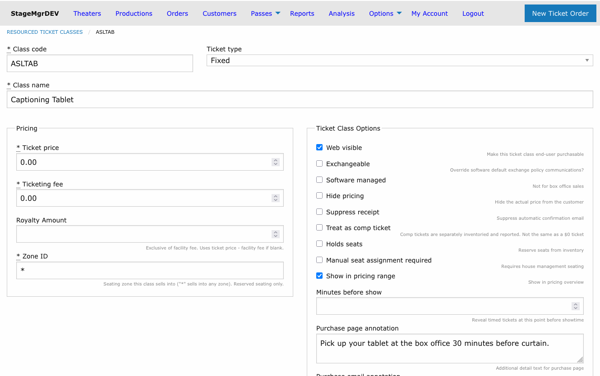
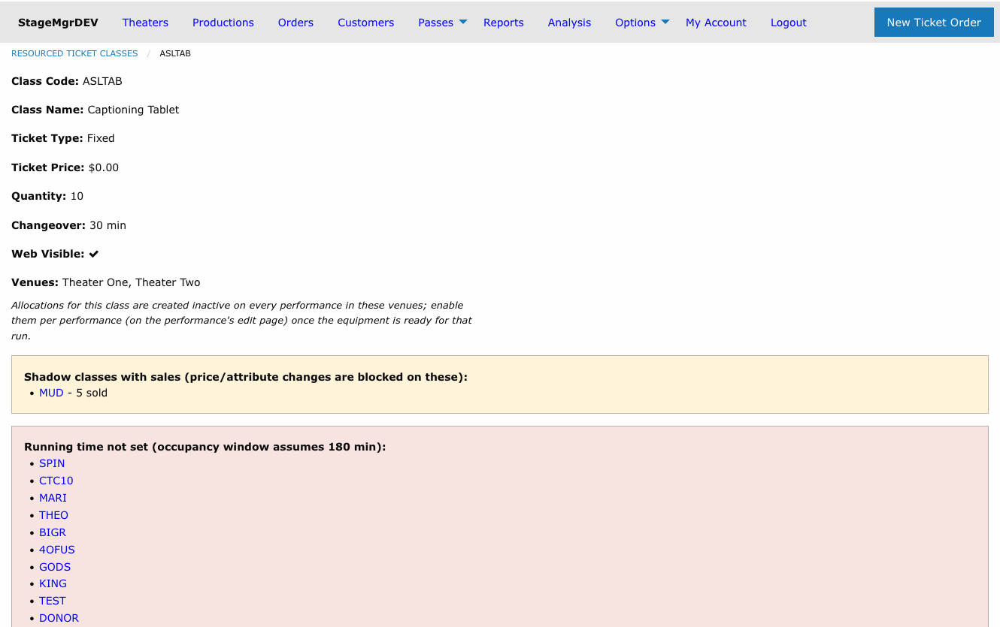

# Resourced Ticket Classes

!!! info "Required Role"
    Only **Administrators** can create, edit, or delete resourced ticket classes. Box office staff interact with them through normal orders and the per-performance allocation grid.

**Navigation:** Options (main menu) > Resourced Ticket Classes

---

## What Are Resourced Ticket Classes?

A resourced ticket class is a **globally managed ticket class backed by a limited pool of physical equipment** that is shared between venues -- for example, ten assistive closed-captioning tablets or a set of audio-description receivers. Each ticket sold from a resourced class claims one physical device for the duration of that performance.

Unlike [default ticket classes](default-ticket-classes.md), a resourced ticket class is **not a template**. It is a single persistent object: its price, fees, visibility flags, and annotations are set once, globally, and every production in the associated venues offers the same class. Editing the resource updates it everywhere.

Stagemgr enforces the pool limit **across venues and across simultaneous performances**. If all ten tablets are committed to a 2:00 PM show in Theater One, an overlapping 3:00 PM show in Theater Two cannot sell an eleventh -- regardless of what its own ticket limit says.

## How the Pool Is Enforced

### The occupancy window

Each device is considered "in use" for a window around the performance it was sold into:

```
(curtain time − changeover) through (curtain + running time + changeover)
```

| Input | Source |
|-------|--------|
| **Curtain time** | The performance's date and time |
| **Running time** | The production's **Running Time** field (minutes) |
| **Changeover** | The resource's **Changeover Minutes** setting -- the time needed to collect, reset, and redeploy a device between venues. Applied both **before curtain and after the performance ends** |

**Example:** A 2:00 PM performance of a 2-hour show, with a 30-minute changeover, occupies its devices from **1:30 PM to 4:30 PM**. A performance whose own window begins at 4:30 PM or later can reuse the same devices.

!!! warning "Set Running Time on your productions"
    When a production has no **Running Time**, Stagemgr assumes the server-configured default (`resourced_default_runtime_minutes`, normally 180 minutes). The resource's detail page lists productions that are missing a running time. The same default also pre-fills the Running Time field on newly created productions.

### What counts against the pool

Every live order consumes devices: box office holds, in-progress checkouts, processed and fulfilled orders, and the incoming side of an exchange. Refunded, exchanged-away, and canceled orders return their devices to the pool immediately.

The limit is a **hard block everywhere**. When the pool is exhausted for a time window:

- The class disappears from public purchase pages and the add-on picker for the affected performances.
- Quantity dropdowns cap at the number of devices actually remaining.
- Any order that would exceed the pool -- including box office orders -- is refused at checkout with a message explaining that the shared equipment is in use at an overlapping performance. There is **no box office override**: the constraint is physical, not policy.

!!! tip "Exchanges work at full capacity"
    A patron exchanging a device ticket to another performance is never blocked by their own device. The ticket being released frees its device to the replacement order, so exchanges succeed even when the pool is exactly full.

## Creating a Resourced Ticket Class



1. Go to **Options** in the main navigation
2. Click **Resourced Ticket Classes**
3. Click **New Resourced Ticket Class**

The form contains the standard ticket class fields (see [Ticket Classes](ticket-classes.md)) plus the pool settings:

| Field | Description |
|-------|-------------|
| **Class Code** | Short identifier, auto-uppercased, globally unique (e.g., `ASLTAB`) |
| **Quantity** | How many physical devices exist in the pool |
| **Changeover Minutes** | Buffer before curtain and after the show ends during which a device cannot serve another performance |
| **Venues** | The venues that share this pool. Performances of productions in these venues draw from -- and count against -- the pool |

!!! tip "Admission type for equipment"
    Resourced classes have the same [Admission type](ticket-classes.md#admission-how-patrons-attend) setting as other ticket classes, and every production copy follows it. The default is **In person**, which prints a ticket for the device. Choose **Other** when the patron doesn't need a ticket to collect the equipment (for example, the house sets the tablet at their seat). The reservation then never prints and never counts toward the patron's ticket total, and its email annotation still tells them it's arranged.

!!! note "No Auto Attach"
    Resourced ticket classes deliberately have **no Auto Attach option**. Allocations are always created **inactive**, and staff enable them per performance -- typically once the equipment is confirmed ready for that run (for example, captioning tablets only after the show has been teched). A global auto-attach switch would re-activate the class on every outstanding performance in the venues, silently undoing that per-performance curation.

## How the Class Reaches Productions

When you save a resourced ticket class, Stagemgr materializes a copy of it onto every current production in the associated venues (and onto new productions automatically as they are created). These per-production copies:

- Appear in each production's ticket class list labeled **Global (resourced)**
- Are **read-only** at the production level -- price, name, and flags can only be changed on the global resource
- Behave like any other ticket class for orders, reports, and exports

The materialization runs in the background. While it is in progress, the resource's detail page shows a *"being synced"* banner and refreshes itself when the sync completes.



### Class code conflicts

If a production already has its own ticket class with the same class code, Stagemgr **never overwrites it**. The production is skipped and listed on the resource's detail page under a *"Not synced"* warning. To resolve the conflict, rename or remove the production's own class (or choose a different code for the resource), then re-save the resource.

## Selling and Activating

For each performance, the resourced class appears in the [ticket class allocation grid](performances.md#ticket-class-allocations) like any other class:

1. Open the performance's edit page.
2. Check **Available** on the resourced class row.
3. Optionally set a per-performance **Ticket Limit** -- the effective availability is always the *smaller* of the ticket limit and the devices remaining in the pool.
4. Save the performance.

To enable the class for the whole rest of a run at once, use the [propagate toggle](performances.md#propagating-a-row-to-later-performances) next to the Available checkbox.

## Editing, Venue Changes, and Deletion

| Action | Effect |
|--------|--------|
| **Edit price/fields** | Changes sync to every production copy. Price changes are blocked once tickets have been sold (same rule as ordinary ticket classes). |
| **Change Quantity** | Takes effect immediately in every availability calculation. Reducing it below current commitments does not cancel existing orders -- but no further sales occur until enough devices free up. |
| **Remove a venue** | The class is *decommissioned* in that venue: hidden from sale and switched off for future performances. Sold history is preserved untouched. |
| **Delete the resource** | Only possible when no tickets were ever sold. Otherwise Stagemgr decommissions the class everywhere instead and keeps the historical records. |

## Day-of Operations

Use the [Resource Pull Sheet](../house-management/resource-pull-sheet.md) report to see, for any performance date, how many devices each performance needs and which patrons reserved them.

## Related Pages

- [Ticket Classes](ticket-classes.md) -- Field-by-field descriptions shared with ordinary classes
- [Performances](performances.md) -- The allocation grid and the propagate toggle
- [Resource Pull Sheet](../house-management/resource-pull-sheet.md) -- Daily equipment prep report
- [Capacity Management](../advanced/capacity-management.md) -- How ticket limits and house capacity interact
