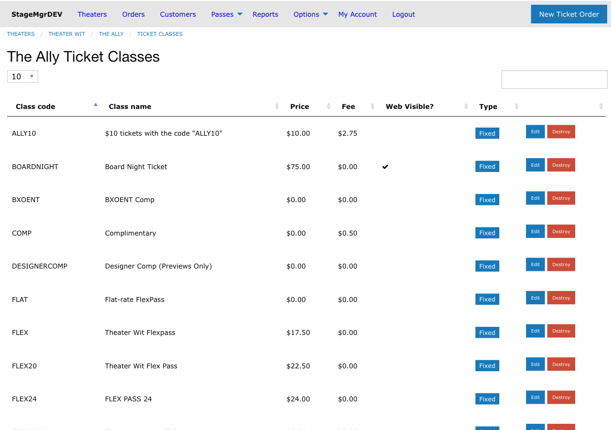
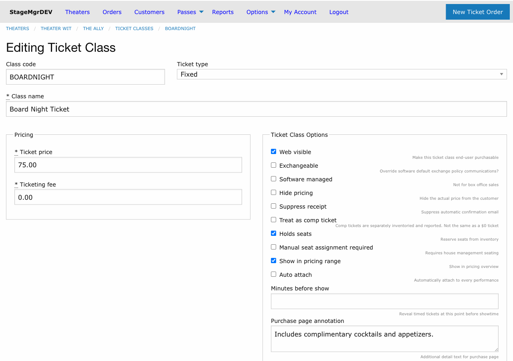

# Ticket Classes

!!! info "Required Role"
    **Administrator** or **Box Office** can create and edit ticket classes. Only **Administrators** can delete ticket classes or modify pricing after sales have occurred.

**Navigation:** Productions > [Production Name] > Ticket Classes > New ticket class

## What Is a Ticket Class?

A ticket class defines a type of ticket available for a production -- its name, price, fees, and behavior. A single production typically has multiple ticket classes (e.g., General Admission, Senior, Student, Comp). Each ticket class can be independently configured for visibility, exchange rules, and special behaviors.

When a new production is created, it automatically receives copies of the theater's [default ticket classes](default-ticket-classes.md). You can then modify, add, or remove classes as needed.

## Creating a Ticket Class

1. Navigate to the production's detail page
2. Click **New ticket class** in the Ticket Classes section
3. Fill in the fields described below
4. Click **Create Ticket class**

## Core Fields

### Class Code

A short identifier that uniquely identifies this ticket class within the production. Minimum 1 character. Auto-uppercased on save. Used in reports, performance allocation tables, and internal references.

!!! tip "Code Conventions"
    Common codes: `GA` (General Admission), `SR` (Senior), `STU` (Student), `COMP` (Complimentary), `VIP` (VIP), `RUSH` (Rush). Keep codes short and consistent across productions.

### Class Name

The display name shown to patrons on the purchase page, in confirmation emails, and on printed tickets. Examples: "General Admission", "Senior (65+)", "Student with ID".

### Ticket Type

Controls how the ticket class behaves in the system.

| Type | Behavior |
|------|----------|
| **Fixed** | Standard ticket with a fixed price. The most common type. |
| **Donation** | Treated as a donation rather than a ticket sale. The price field becomes the suggested donation amount and can be changed after sales begin. |
| **Timed** | Hidden from the purchase page until a specified number of minutes before the performance. Used for rush tickets or day-of sales. |

### Ticket Price

The face value of the ticket in dollars. Required. Entered in increments of $0.25.

!!! warning "Price Lock After Sales"
    Once any ticket of this class has been sold, the price cannot be changed -- except for Donation-type classes, which allow price adjustments at any time.

### Ticketing Fee

The per-ticket fee charged on top of the ticket price. Required. Entered in increments of $0.25. This fee appears as a separate line item on the patron's receipt.

## Visibility and Access

### Web Visible

When checked, this ticket class appears on the public purchase page and patrons can buy it online. When unchecked, the class is available only through the box office interface.

**Example:** An industry comp class might have `web_visible` unchecked so that only box office staff can issue those tickets.

### Software Managed

When checked, this ticket class is managed entirely by the system and is **not available** to box office staff in the manual order interface. Used for ticket classes that are only assigned programmatically (e.g., through automated promotions or integrations).

### Hide Pricing

When checked, the ticket price is hidden from the patron on the purchase page and in email communications. The ticket class name still appears, but no dollar amount is shown. Useful for complimentary or sponsored tickets where displaying "$0.00" would be awkward.

## Email and Receipt Behavior

### Suppress Receipt

When checked, the system does not send a confirmation email when this ticket class is purchased. Use this for internal comps, house seats, or other transactions where patron notification is not desired.

### Purchase Page Annotation

Text that appears below this ticket class on the purchase page. Use it for eligibility notes, restrictions, or instructions. Example: "Valid student ID required at door."

### Purchase Email Annotation

Text included in the confirmation email for orders containing this ticket class. **Markdown enabled.** Use it for class-specific instructions. Example: "Please arrive 15 minutes early for will-call pickup."

## Inventory and Seating

### Holds Seats

**Default: checked.** When checked, each ticket sold deducts from the performance's available inventory. When unchecked, tickets of this class do not reduce availability.

!!! warning "Unchecking Holds Seats"
    Only uncheck this for ticket classes that should not affect capacity -- such as add-on items, parking passes, or program book sales. Selling tickets that don't hold seats can lead to overselling.

### Assigns Seats

**Default: unchecked.** When checked (for reserved seating productions), box office staff can manually assign or reassign specific seats to tickets of this class. When unchecked, seats are assigned through the standard checkout flow.

### Complimentary

When checked, tickets of this class are treated as comps. Complimentary tickets are separately inventoried in house count reports and tracked distinctly from paid sales. Typically paired with `hide_pricing`.

### Show in Pricing Range

**Default: checked.** When checked, this ticket class's price is included in the price range displayed on the production's public listing (e.g., "$25--$45"). Uncheck for comps or special classes that would skew the displayed range.

## Exchange Behavior

### Exchangeable

Controls whether tickets of this class can be exchanged by patrons or box office staff. When unchecked, this ticket class is excluded from the exchange flow regardless of the production's general exchange policy.

## Timed Ticket Settings

### Minutes Before Show

Only applicable when **Ticket Type** is set to **Timed**. Enter the number of minutes before the performance start time when this ticket class becomes visible on the purchase page.

**Example:** Setting this to `60` makes the ticket class appear one hour before showtime. This is commonly used for rush tickets or day-of discounts.

### Auto Attach

When checked, this ticket class is automatically included in the allocation table for **every new performance** created for this production. When unchecked, the class must be manually added to each performance's allocations.

!!! tip "When to Use Auto Attach"
    Enable auto attach for ticket classes that apply to every performance (e.g., General Admission, Senior). Disable it for special one-off classes (e.g., Opening Night VIP) that only apply to specific performances.

## Examples

### Standard Setup

A typical production might have these ticket classes:

| Code | Name | Type | Price | Fee | Web Visible | Notes |
|------|------|------|-------|-----|-------------|-------|
| `GA` | General Admission | Fixed | $35.00 | $3.00 | Yes | Default ticket |
| `SR` | Senior (65+) | Fixed | $25.00 | $3.00 | Yes | |
| `STU` | Student | Fixed | $15.00 | $3.00 | Yes | Purchase page annotation: "Valid ID required" |
| `COMP` | Complimentary | Fixed | $0.00 | $0.00 | No | Complimentary + hide pricing |
| `RUSH` | Rush | Timed | $15.00 | $0.00 | Yes | Minutes before show: 60 |

### Industry Screening

For an invite-only industry event:

| Code | Name | Type | Price | Fee | Web Visible | Notes |
|------|------|------|-------|-----|-------------|-------|
| `IND` | Industry | Fixed | $0.00 | $0.00 | No | Complimentary, hide pricing, suppress receipt |

## Editing and Deleting Ticket Classes

- Click **Edit** next to any ticket class to modify its settings.
- Click **Destroy** to remove a ticket class (Administrator only).
- You cannot delete a ticket class that has sold tickets. Deactivate it by unchecking `web_visible` and removing it from performance allocations instead.
