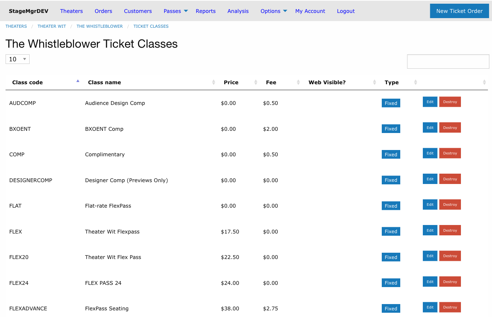
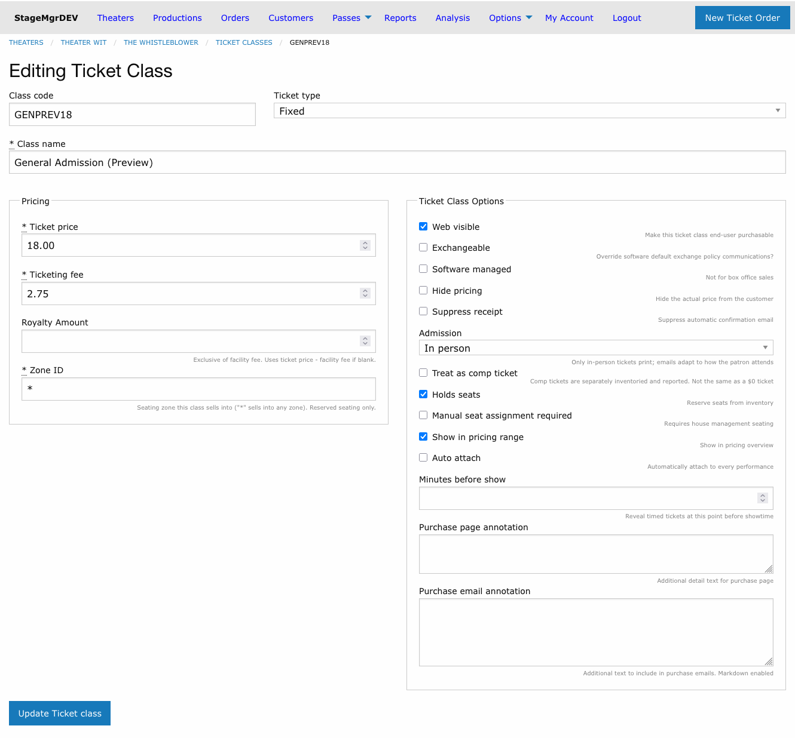

# Ticket Classes

!!! info "Required Role"
    **Administrator** or **Box Office** can create and edit ticket classes. Only **Administrators** can delete ticket classes or modify pricing after sales have occurred.

**Navigation:** Productions > [Production Name] > Ticket Classes > New ticket class

## What Is a Ticket Class?

A ticket class defines a type of ticket available for a production -- its name, price, fees, and behavior. A single production typically has multiple ticket classes (e.g., General Admission, Senior, Student, Comp). Each ticket class can be independently configured for visibility, exchange rules, and special behaviors.

When a new production is created, it automatically receives copies of the theater's [default ticket classes](default-ticket-classes.md). You can then modify, add, or remove classes as needed.

## Creating a Ticket Class

1. Navigate to the production's detail page
2. Click **New ticket class** in the Ticket Classes section
3. Fill in the fields described below
4. Click **Create Ticket class**

## Core Fields

### Class Code

A short identifier that uniquely identifies this ticket class within the production. Minimum 1 character. Auto-uppercased on save. Used in reports, performance allocation tables, and internal references.

!!! tip "Code Conventions"
    Common codes: `GA` (General Admission), `SR` (Senior), `STU` (Student), `COMP` (Complimentary), `VIP` (VIP), `RUSH` (Rush). Keep codes short and consistent across productions.

### Class Name

The display name shown to patrons on the purchase page, in confirmation emails, and on printed tickets. Examples: "General Admission", "Senior (65+)", "Student with ID".

### Ticket Type

Controls how the ticket class behaves in the system.

| Type | Behavior |
|------|----------|
| **Fixed** | Standard ticket with a fixed price. The most common type. |
| **Donation** | Treated as a donation rather than a ticket sale. The price field becomes the suggested donation amount and can be changed after sales begin. |
| **Timed** | Hidden from the purchase page until a specified number of minutes before the performance. Used for rush tickets or day-of sales. |

### Ticket Price

The face value of the ticket in dollars. Required. Entered in increments of $0.25.

!!! warning "Price Lock After Sales"
    Once any ticket of this class has been sold, the price cannot be changed -- except for Donation-type classes, which allow price adjustments at any time.

### Ticketing Fee

The per-ticket fee charged on top of the ticket price. Required. Entered in increments of $0.25. This fee appears as a separate line item on the patron's receipt.

### Royalty Amount

An optional override price used exclusively for [royalty report](../reports/royalty-report.md) calculations. Exclusive of facility fee. Entered in increments of $0.25.

When blank, the royalty report uses `ticket_price - ticketing_fee` as the royalty basis for that ticket class. When set, the royalty amount is used directly.

**Example:** A subscription ticket class might have a ticket price of $0.00 (subscribers pay through their flex pass), but a royalty amount of $25.00 so that the rights holder is compensated as if a $25 ticket was sold.

!!! tip "When to Set Royalty Amount"
    Set this field when the ticket price does not accurately reflect the value that should be used for royalty calculations. Common cases include:

    - **Subscription/flex pass tickets** priced at $0 that should count toward royalties at a standard rate
    - **Supporter tickets** where a portion of the price is a donation -- set the royalty amount to just the ticket portion
    - **Discount classes** where the royalty agreement specifies a fixed per-ticket rate regardless of what patrons pay

## Visibility and Access

### Web Visible

When checked, this ticket class appears on the public purchase page and patrons can buy it online. When unchecked, the class is available only through the box office interface.

**Example:** An industry comp class might have `web_visible` unchecked so that only box office staff can issue those tickets.

### Software Managed

When checked, this ticket class is managed entirely by the system and is **not available** to box office staff in the manual order interface. Used for ticket classes that are only assigned programmatically (e.g., through automated promotions or integrations).

### Hide Pricing

When checked, the ticket price is hidden from the patron on the purchase page and in email communications. The ticket class name still appears, but no dollar amount is shown. Useful for complimentary or sponsored tickets where displaying "$0.00" would be awkward.

## Admission (How Patrons Attend)

**Default: In person.** The **Admission type** setting says how someone holding this ticket takes part in the performance. It decides two things: whether the ticket **prints** at the ticket printer, and which parts of the patron's **emails** they receive.

| Admission type | Prints a ticket? | Counted as a ticket? | Gets visit and pickup copy? | Use for |
|----------------|------------------|----------------------|-----------------------------|---------|
| **In person** | Yes | Only if it holds seats | Yes | Anyone coming to the building (GA, Senior, Comp, and so on), and add-ons that need a printed voucher, such as a drink ticket |
| **Virtual (streaming)** | No | Yes | No | Streaming access to the performance |
| **Other** | No | No | No | Items that aren't a ticket for the patron, such as a captioning tablet reservation the house sets aside for them |

!!! tip "Drink tickets are In person; tablet reservations are Other"
    - **Drink tickets and similar add-ons:** choose **In person** and uncheck [Holds Seats](#holds-seats). The patron needs the printed voucher, so it prints and its email annotation appears. But it doesn't reserve a seat, so it isn't counted in the patron's ticket total.
    - **Reservations the patron doesn't carry,** like a captioning tablet waiting for them: choose **Other**. It never prints and is never counted, even if it holds seats. Its email annotation still appears.

### Printing

Only **In person** tickets print. When you [print tickets](../house-management/printing-tickets.md):

- An order with only Virtual or Other tickets isn't sent to the printer. It is marked **Fulfilled** automatically.
- A mixed order prints only its In person tickets (drink tickets included), and becomes Fulfilled once they print. Its Virtual and Other purchases still appear on the printed receipt.

### Emails

Patron emails follow the order's admission:

- **In-person orders** get the usual confirmation and reminder. That covers "Your tickets will be waiting at the box office", the late-seating note, "About your visit" (getting here, dining, seating, amenities) and "See you at the theater!".
- **Virtual-only orders** get none of that visit and pickup copy. The confirmation says "Your 2 virtual tickets for *Show* on … are confirmed", the reminder says "Just a reminder: the stream is at 7:30 PM this Friday", and both point the patron to the notes about their order for access details. The post-show followup doesn't say they were at the theater.
- **Mixed orders** get both: the in-person copy for the seats and a line about the virtual tickets.
- **Ticket counts:** the ticket total ("We have 3 tickets reserved") counts In person tickets that hold seats plus all Virtual tickets. The box office line ("Your 2 tickets will be waiting") counts only In person tickets that hold seats. In-person add-ons that don't hold seats, and Other items, are never counted. An order of only add-ons says "Your order is confirmed for…" instead of giving a count.
- **Other-only orders** get the order details, the charge and the notes, without a pickup line or visit information.

!!! tip "Put the stream link in the Purchase Email Annotation"
    Stagemgr doesn't generate stream links. Put the link and any viewing instructions in the virtual class's [Purchase Email Annotation](#purchase-email-annotation). It appears under "A few notes about your order" in both the confirmation and the reminder, but only on orders that include that class.

!!! note "Staff-written text goes to everyone"
    A production's confirmation message and follow-up message, and a performance's special feature text, go to every patron regardless of admission. Keep them neutral, or put in-person-only or stream-only details in the relevant class's email annotation.

## Email and Receipt Behavior

### Suppress Receipt

When checked, the system does not send a confirmation email when this ticket class is purchased. Use this for internal comps, house seats, or other transactions where patron notification is not desired.

### Purchase Page Annotation

Text that appears below this ticket class on the purchase page. Use it for eligibility notes, restrictions, or instructions. Example: "Valid student ID required at door."

### Purchase Email Annotation

Text included in the confirmation and reminder emails for orders containing this ticket class, under "A few notes about your order". **Markdown enabled.** Use it for class-specific instructions. Examples:

- "Please arrive 15 minutes early for will-call pickup." (an In person class)
- "Watch at https://stream.example.org/show -- the stream opens 15 minutes before curtain." (a Virtual class)
- "Includes one drink (beer/wine/cocktail) at our bar." (an In person add-on that doesn't hold seats)
- "A captioning tablet will be waiting at your seat." (an Other reservation)

## Inventory and Seating

### Holds Seats

**Default: checked.** When checked, each ticket sold deducts from the performance's available inventory. When unchecked, tickets of this class do not reduce availability.

!!! warning "Unchecking Holds Seats"
    Only uncheck this for ticket classes that should not affect capacity -- such as add-on items, parking passes, program book sales, or streaming tickets. Selling tickets that don't hold seats can lead to overselling.

!!! tip "Streaming classes and capacity"
    For a Virtual class, uncheck Holds Seats so that streams don't use up house seats. Leave it checked only if you deliberately want streaming sales to count against the performance's capacity. Either way, virtual tickets never print and are never counted as waiting at the box office.

### Assigns Seats

**Default: unchecked.** When checked (for reserved seating productions), box office staff can manually assign or reassign specific seats to tickets of this class. When unchecked, seats are assigned through the standard checkout flow.

### Complimentary

When checked, tickets of this class are treated as comps. Complimentary tickets are separately inventoried in house count reports and tracked distinctly from paid sales. Typically paired with `hide_pricing`.

### Show in Pricing Range

**Default: checked.** When checked, this ticket class's price is included in the price range displayed on the production's public listing (e.g., "$25--$45"). Uncheck for comps or special classes that would skew the displayed range.

### Zone ID

**Default: `*` (any zone).** For reserved seating productions, restricts which seats this class can be sold into. A class with Zone ID `*` sells into any seat; a class with a specific zone (1--2 letters/digits, e.g., `B`) sells only into seats whose zone matches. Seat zones are assigned in the [seat map editor](../setup/seat-map-editor.md#seat-zones-and-zoned-pricing).

The match is enforced everywhere -- the public seat selector hides non-matching classes, the server rejects mismatched sales, and reseating cannot move a ticket across zones (use an exchange instead). Multiple classes may share a zone (e.g., `STUDENT`, `GENERAL`, and `SENIOR` classes all with Zone ID `A`), and the class code does not need to mention the zone. General admission productions ignore this field.

!!! tip "Pricing by section"
    To charge more for premium seats, zone those seats (e.g., zone `P`) in the seat map editor and create ticket classes with Zone ID `P` at the premium price. Keep wildcard (`*`) classes for tickets -- like subscriber redemptions -- that should work anywhere in the house.

## Exchange Behavior

### Exchangeable

Controls whether tickets of this class can be exchanged by patrons or box office staff. When unchecked, this ticket class is excluded from the exchange flow regardless of the production's general exchange policy.

## Timed Ticket Settings

### Minutes Before Show

Only applicable when **Ticket Type** is set to **Timed**. Enter the number of minutes before the performance start time when this ticket class becomes visible on the purchase page.

**Example:** Setting this to `60` makes the ticket class appear one hour before showtime. This is commonly used for rush tickets or day-of discounts.

### Auto Attach

When checked, this ticket class is automatically included in the allocation table for **every new performance** created for this production. When unchecked, the class must be manually added to each performance's allocations.

Auto-attaching classes are flagged in the ticket classes list: a blue **＋** marker appears after the type tag in the **Type** column. Hover over the marker to see the tooltip "Added automatically to orders." Classes without the marker must be added to performances manually.

!!! tip "When to Use Auto Attach"
    Enable auto attach for ticket classes that apply to every performance (e.g., General Admission, Senior). Disable it for special one-off classes (e.g., Opening Night VIP) that only apply to specific performances.

## Examples

### Standard Setup

A typical production might have these ticket classes:

| Code | Name | Type | Price | Fee | Web Visible | Notes |
|------|------|------|-------|-----|-------------|-------|
| `GA` | General Admission | Fixed | $35.00 | $3.00 | Yes | Default ticket |
| `SR` | Senior (65+) | Fixed | $25.00 | $3.00 | Yes | |
| `STU` | Student | Fixed | $15.00 | $3.00 | Yes | Purchase page annotation: "Valid ID required" |
| `COMP` | Complimentary | Fixed | $0.00 | $0.00 | No | Complimentary + hide pricing |
| `RUSH` | Rush | Timed | $15.00 | $0.00 | Yes | Minutes before show: 60 |

### Industry Screening

For an invite-only industry event:

| Code | Name | Type | Price | Fee | Web Visible | Notes |
|------|------|------|-------|-----|-------------|-------|
| `IND` | Industry | Fixed | $0.00 | $0.00 | No | Complimentary, hide pricing, suppress receipt |

### Streaming and Add-ons

A production that sells in-person seats, a stream, a drink add-on, and captioning tablet reservations:

| Code | Name | Admission | Holds Seats | Price | Purchase Email Annotation |
|------|------|-----------|-------------|-------|---------------------------|
| `GA` | General Admission | In person | Yes | $35.00 | |
| `STRM` | Livestream | Virtual (streaming) | No | $20.00 | "Watch at https://stream.example.org/show" |
| `DRNK` | Drink Ticket | In person | No | $8.00 | "Includes one drink (beer/wine/cocktail) at our bar" |
| `TABLET` | Captioning Tablet | Other | No | $0.00 | "A captioning tablet will be waiting at your seat" |

An order of 2 `GA`, 1 `STRM`, 1 `DRNK` and 1 `TABLET`:

- prints the two `GA` tickets and the `DRNK` voucher, but not the stream or the tablet reservation
- confirmation email: "We have 3 tickets reserved… Your 2 tickets will be waiting at the box office", a line confirming the virtual ticket, the visit information, and all three annotations

An order of only `STRM` tickets prints nothing, is fulfilled automatically when tickets are printed, and gets the streaming versions of the emails.

## Editing and Deleting Ticket Classes

- Click **Edit** next to any ticket class to modify its settings.
- Click **Destroy** to remove a ticket class (Administrator only).
- You cannot delete a ticket class that has sold tickets. Deactivate it by unchecking `web_visible` and removing it from performance allocations instead.
