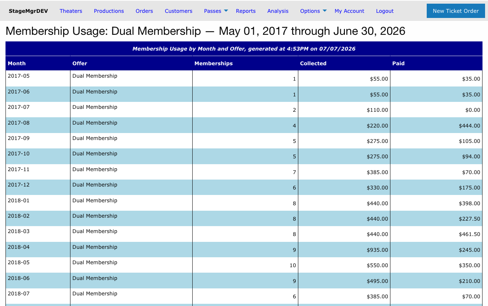

# Membership Reports

!!! info "Roles: Box Office, Admin"
    **Membership Usage** is available under the **Membership Reports** permission group.
    **Membership Orders** is available under the **Box Office Reports** permission group.

**Navigation:** Admin Menu > Reports > Membership Usage / Membership Orders

---

## Overview

Stagemgr provides two membership-related reports. **Membership Usage** gives a month-by-month
summary of membership counts and income. **Membership Orders** generates a detailed
CSV of individual membership orders, with an optional TRG-compatible format.

---

## Membership Usage

### Purpose

The Membership Usage report tracks membership activity over time, showing -- for each month and
each membership offer -- how many memberships were active, how much was collected, and how much
was paid out. It is useful for trend analysis, budgeting, and reporting to management.

### Generating the Report

1. Navigate to **Admin Menu > Reports**.
2. In the **Membership Usage** section, enter a **start date** and **end date**.
3. Click **Show** to display results on screen, or **Download** to export a CSV.

### Input Fields

| Field | Required | Description |
|---|---|---|
| **Start Date** | Yes | The beginning of the reporting period |
| **End Date** | Yes | The end of the reporting period |

!!! note "Full months only"
    The system automatically expands your date range to align with full calendar months. For
    example, if you enter March 10 through May 15, the report covers March 1 through May 31.
    This keeps month-over-month comparisons consistent.

!!! warning "The current month is never included"
    The current month is always excluded, because its payment data is still incomplete. A report
    run at any point in July, for instance, ends at June 30. This applies to every way of running
    the report, including the per-offer **Usage** button.

### Output Format

The report is grouped by month. Within each month there is one **detail row per membership offer**,
followed by an **All Offers** summary row that totals that month across every offer. A single grand
**Total** row at the very bottom sums all of the detail rows across every month in the range.

| Column | Description |
|---|---|
| **Month** | Calendar month (e.g., `2026-05`). The final row reads **Total**. |
| **Offer** | The membership offer name on detail rows; **All Offers** on the monthly summary rows. |
| **Memberships** | Number of memberships active in that month for that offer. |
| **Collected** | Total amount collected on membership orders. |
| **Paid** | Total membership payments applied. |

### Running the Report for a Single Offer

You can run this report for one membership offer over its entire history straight from the
[Membership Offers list](../offers/membership-offers.md#the-membership-offers-list): click the
**Usage** button on the offer's row.

The per-offer report behaves the same as the full report with two differences:

- The date range is set automatically to span from the offer's first membership payment through the end of last month -- you don't choose dates.
- Because only one offer is included, the redundant per-month **All Offers** summary rows are omitted. The grand **Total** row at the bottom still totals every month.

---

## Membership Orders

### Purpose

The Membership Orders produces a detailed CSV of individual membership orders within a
date range, with an optional TRG-compatible format for TRG Arts integration.

### Generating the Report

1. Navigate to **Admin Menu > Reports**.
2. In the **Membership Orders** section, enter a **start date** and **end date**.
3. Optionally, check the **TRG Lists** checkbox to format the export for TRG Arts compatibility.
4. Click **Generate**. The report runs as a background job.
5. When processing completes, you will receive an email with a download link. The report also
   appears in the **Generated Reports** section at the bottom of the Reports page.

### Input Fields

| Field | Required | Description |
|---|---|---|
| **Start Date** | Yes | Include membership orders on or after this date |
| **End Date** | Yes | Include membership orders on or before this date |
| **TRG Lists** | No | When checked, formats the export for TRG Arts data integration |

!!! note "Background Job"
    This report runs as a background job and is delivered via email. Processing time depends on
    the number of membership orders in the selected range.

### Report Contents

| Column | Description |
|---|---|
| **Order ID** | Membership order identifier |
| **Customer Name** | Member's full name |
| **Email** | Email address |
| **Phone** | Phone number |
| **Address** | Mailing address |
| **Membership Type** | The membership level or tier purchased |
| **Order Date** | Date the membership was purchased |
| **Amount** | Payment amount |
| **Status** | Current order status |

### TRG Lists Flag

When the **TRG Lists** checkbox is enabled, the export includes additional fields and formatting
required by TRG Arts for data integration. Column headers, ordering, and data formatting all
conform to TRG Arts import specifications.

---

## Typical Use Cases

- **Monthly board reporting**: Use Membership Usage to show membership growth and income trends.
- **Renewal campaigns**: Export membership orders to identify members approaching renewal dates.
- **Revenue forecasting**: Analyze month-over-month membership income for budget planning.
- **TRG Arts integration**: Enable the TRG Lists flag for direct upload to TRG platforms.

## Related Pages

- [Reports Overview](reports-overview.md)
- [FlexPass Reports](flex-pass-reports.md)
- [TRG Exports](trg-exports.md)
