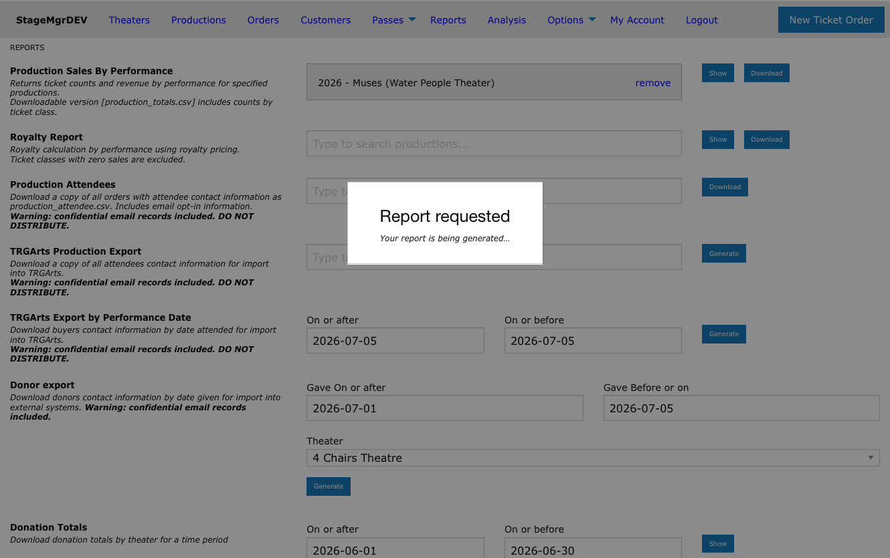

# Reports Overview

!!! info "Access"
    All users can access basic reports. Box Office and Admin users have access to additional
    operational and reconciliation reports. Admin-only reports are noted below.

**Navigation:** Admin Menu > Reports

---

## About Reports

The Reports section provides data exports and summaries for sales analysis, customer management,
financial reconciliation, and marketing. Reports are organized by permission level, so the reports
you see depend on your user role.

## Reports by Permission Group

| Permission Group | Reports | Roles |
|---|---|---|
| **Show Reports** | Production Sales By Performance, Royalty Report, Production Attendees, TRGArts Production Export, Donor export | All users |
| **Box Office Reports** | Daily Receipts, Print Tickets, Donation Totals, Membership Orders, FlexPass Patron Report, TRGArts Export by Performance Date | Box Office, Admin |
| **House Management** | House Management Seating Report | Box Office, Admin |
| **Reconciliation** | FlexPass Sales, Weekly Box Office | Box Office, Admin |
| **Membership** | Membership Usage | Box Office, Admin |
| **Customer Data Mining** | Mine Customer Data | Admin only |

## Selecting a Production

Production-scoped reports use the same typeahead search field found throughout Stagemgr.
Type a production name, season year, production code, or theater name to see matching
productions, or pick a season/theater/tag group shortcut to drill down to its shows. See
[Finding Productions](../productions/finding-productions.md#the-production-search-picker)
for a full walkthrough.

Unlike the old dropdowns, report search offers **every** production you can access,
including Inactive and Presale shows -- useful for historical reporting on shows that are
no longer on sale.

## Report Output Types

Reports deliver results in one of three ways depending on the report and the size of the data.

### Inline Display (Show)

Some reports display results directly on screen. These reports include a **Show** button that
renders a table in the browser. You can review the data immediately without waiting for a file.

### Immediate Download (Download)

Many reports that support inline display also offer a **Download** button. This generates a CSV
file that your browser downloads immediately. The CSV can be opened in Excel or any spreadsheet
application.

### Background Job (Email Delivery)

Larger or more complex reports run as background jobs. When you submit one of these reports:

1. The system queues the report for processing.
2. You see a confirmation message that the report has been queued.
3. When processing completes, the system emails you a download link.
4. The generated report also appears in the **Generated Reports** section at the bottom of the Reports page.

!!! note "Background Job Reports"
    The TRGArts exports, Donor export, Membership Orders, Production Attendees, and Mine
    Customer Data reports all run as background jobs. Processing time depends on the size
    of the dataset.

### Submission Feedback

As soon as you submit any report, a **"Report requested"** overlay appears so you know the
click registered:

- For **Download** and **Generate** buttons, the overlay dismisses itself after a couple of
  seconds while the file downloads or the background job is queued.
- For inline **Show** reports, the overlay stays up until the results page replaces it --
  helpful for larger reports that take a few seconds to compute.

## Generated Reports

The bottom of the Reports page displays a list of previously generated reports. Each entry shows:

- The report name
- The date it was generated
- A download link to retrieve the CSV file

Generated reports remain available for download until they are cleaned up by the system. If you
need a report again after it has been removed, simply re-run it.

## Common Input Fields

Most reports require you to specify a scope before generating:

| Input | Used By | Description |
|---|---|---|
| **Production** | Production Sales By Performance, Royalty Report, Production Attendees, TRGArts Production Export | Search for a production with the [production picker](../productions/finding-productions.md#the-production-search-picker) |
| **Date Range** | Daily Receipts, Donations, Memberships, FlexPass, Weekly Box Office | Start and end dates to filter records |
| **Theater** | Donor export, Donation Totals | Filter by producing theater |
| **Performance Date** | House Management Seating Report | Select a specific performance date |

!!! warning "Date Range Limits"
    Some reports enforce maximum date ranges. Daily Receipts is limited to 31 days. Donation
    Totals is limited to 1 month. Exceeding these limits will display an error.

## Tips

- Use **Production Sales By Performance** for a quick snapshot of ticket revenue by performance.
- Use **Daily Receipts** to reconcile daily credit card and cash transactions.
- Use **Weekly Box Office** for aggregate weekly reporting to management.
- For customer email lists, use **Production Attendees** and review the email opt-in rules
  carefully to understand which addresses are included.
- **Mine Customer Data** is the most flexible report for identifying high-value patrons across
  multiple theaters and date ranges.

## Related Pages

- [Production Sales By Performance](production-sales.md)
- [Royalty Report](royalty-report.md)
- [Production Attendees](production-attendees.md)
- [Weekly Box Office](weekly-box-office.md)
- [Daily Receipts](daily-receipts.md)
- [Donation Reports](donation-reports.md)
- [FlexPass Reports](flex-pass-reports.md)
- [Membership Reports](membership-reports.md)
- [Customer Data Mining](customer-data-mining.md)
- [TRG Exports](trg-exports.md)
