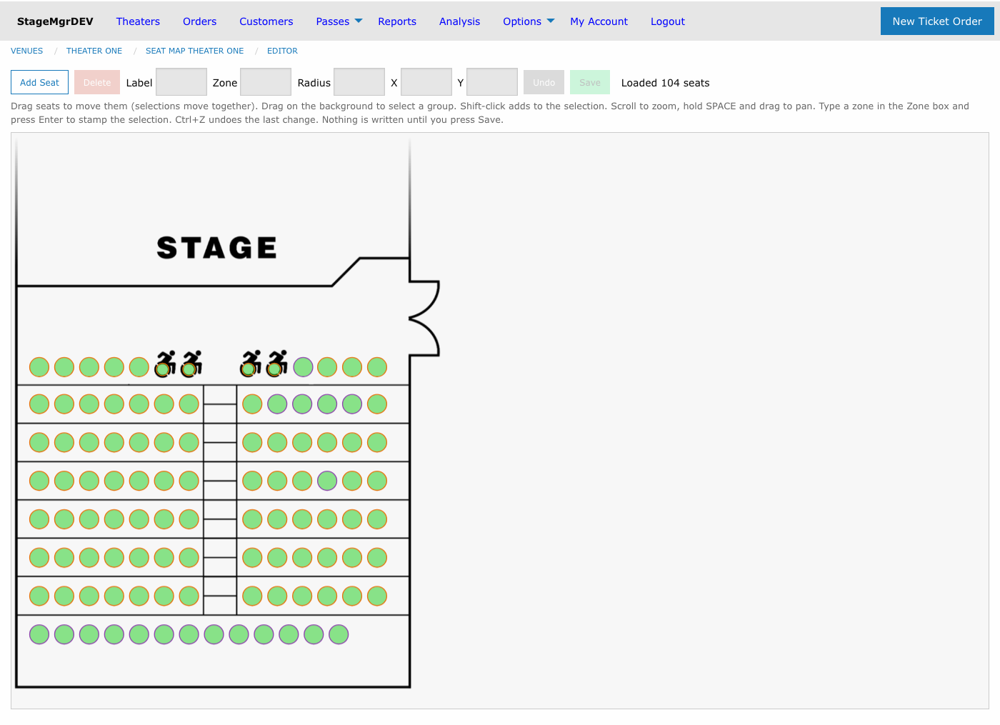
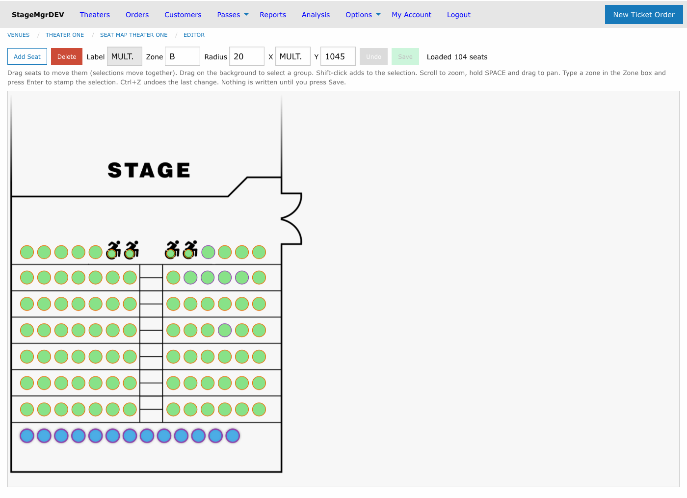
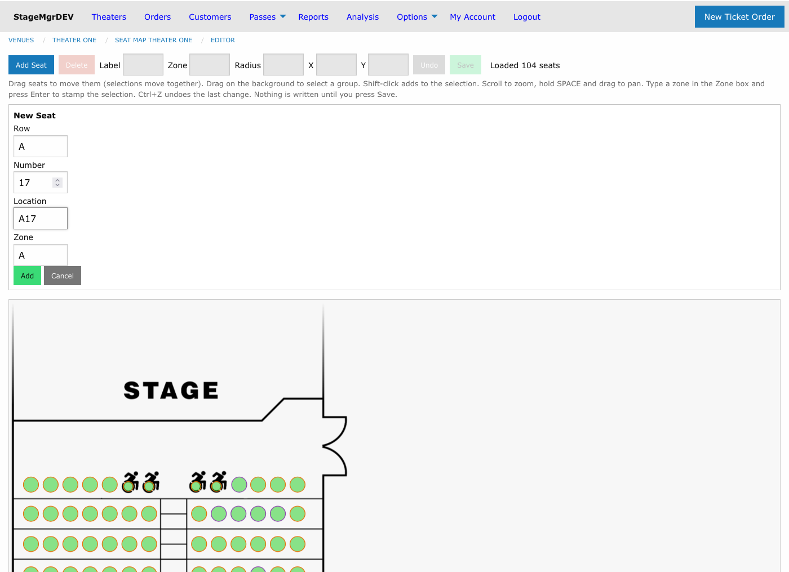
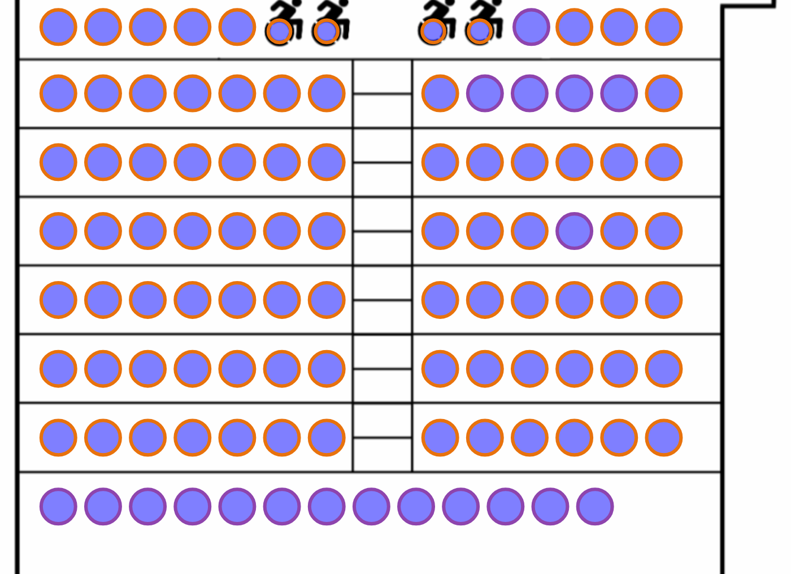

# Seat Map Editor

!!! info "Required Role"
    **Administrator** or **Box Office** can use the seat map editor.

**Navigation:** Options > Venues > [select a venue] > [select a seat map] > **Open Seat Map Editor**

## What Is the Seat Map Editor?

The seat map editor is a graphical tool for editing a seat map directly on top of its base image -- an alternative to re-importing a [geometry CSV file](seat-maps.md#seat-geometry-csv-format). With it you can:

- **Move** seats by dragging them, individually or as a group (e.g., nudge a whole row)
- **Add** new seats by clicking their position on the map
- **Delete** seats that have no sold or held tickets
- **Edit** a seat's label, zone, circle size, and exact X/Y coordinates
- **Paint zones** across many seats at once for [zoned pricing](#seat-zones-and-zoned-pricing)

!!! warning "Nothing is saved until you press Save"
    All edits happen in a working copy in your browser. The **Save** button writes every pending change in a single all-or-nothing batch. If you leave the page without saving, your changes are discarded (the browser warns you first). This means you can always abandon a bad editing session by simply reloading the page.

## The Toolbar

| Control | Purpose |
|---------|---------|
| **Add Seat** | Toggles add-seat mode -- click a spot on the map to place a new seat |
| **Delete** | Deletes the selected seats (enabled only when seats are selected) |
| **Label** | Shows/edits the seat location label -- editable only when exactly **one** seat is selected |
| **Zone** | Shows/edits the zone for the selected seats |
| **Radius** | Shows/edits the circle radius (in pixels) for the selected seats |
| **X** / **Y** | Show/set the coordinates of the selected seats -- ideal for aligning a row |
| **Undo** | Reverts the most recent change (also **Ctrl+Z**) |
| **Save** | Writes all pending changes; enabled only when there is something to save |

A red **● unsaved changes** indicator appears whenever the working copy differs from what is saved, and the status area on the right reports the result of each action.

## Selecting Seats

- **Click** a seat to select it
- **Shift-click** to add or remove individual seats from the selection
- **Drag on the background** to rubber-band select a group (e.g., a whole row)
- **Escape** clears the selection

When multiple seats are selected, each property box shows the value they share, or **mult.** when the values differ. The Label box is the exception -- labels are unique per seat, so it reads **mult.** and locks whenever more than one seat is selected.

## Moving and Aligning Seats

Drag any selected seat and the whole selection moves together, keeping relative positions -- this is the easiest way to shift an entire row or section.

For precise alignment, use the **X** and **Y** boxes: select a group of seats, type a value, and press **Enter**. The value is applied to every selected seat on that axis. To straighten a ragged row, marquee-select it and set **Y** once.

## Editing Seat Properties

Each property box follows the same pattern: type a value and press **Enter** or **Tab** to apply it to the selection; press **Escape** to revert the box without changing anything.

| Property | Rules |
|----------|-------|
| **Label** | One seat at a time; must be unique within the seat map |
| **Zone** | 1--2 characters, letters and digits only (e.g., `A`, `B2`) |
| **Radius** | Whole number of pixels, 2--99 |
| **X / Y** | Whole number of pixels, 0--9999 |

!!! tip "Sold seats can still be edited"
    Seats with sold or held tickets can be moved, resized, relabeled, and re-zoned -- geometry and zone changes are harmless after a sale, since zones are only checked at sale time. Such seats simply cannot be **deleted**.

## Zoom and Pan

- **Scroll** to zoom (50%--400%), centered on the cursor
- Hold **SPACE** and drag to pan around the map
- A plain drag on the background remains marquee-select

## Adding a Seat

1. Click **Add Seat** -- the button highlights and the cursor becomes a crosshair
2. Click the spot on the map where the seat belongs
3. Review the **New Seat** form and click **Add**

The form is pre-filled with suggestions derived from the seat **nearest to where you clicked**:

| Field | Suggested value |
|-------|-----------------|
| **Row** | The nearest seat's row |
| **Number** | The highest seat number in that row, plus one |
| **Location** | Row + number (e.g., `A` + `17` = `A17`) |
| **Zone** | The nearest seat's zone |

The new seat also copies the nearest seat's circle size so it matches its neighbors visually. Every suggestion can be edited before you confirm; the location must be unique within the map.

!!! info "Performance inventory is created automatically"
    When you Save, newly added seats get a seat assignment record in **every existing performance** of productions using this map -- exactly as the CSV geometry import does. The new seat becomes sellable immediately, and the production's capacity (which equals the seat count) rises by one.

## Deleting Seats

Select one or more seats and click **Delete** (or press the Delete/Backspace key). Deletion is blocked -- for the entire selection -- if any selected seat has sold or held tickets; the error message names the seats in the way. Deleting a seat removes its availability from all performances when you Save.

## Undo

**Ctrl+Z** (or the Undo button) reverts the most recent action -- a drag, an add, a delete, or a property change. One level of undo is kept, and it is cleared when you Save.

## Saving

**Save** submits every pending change as one batch. Either all changes are written or none are -- if any change is rejected (for example, a duplicate label), the save fails with a message and nothing is modified. After a successful save the editor reloads the map, and the Undo history resets.

## Seat Zones and Zoned Pricing

Zones connect the seat map to [ticket class](../productions/ticket-classes.md) pricing. Every seat carries a zone (default `A`), and every ticket class carries a **Zone ID**:

- A ticket class with Zone ID `*` (the default) can be sold into **any** seat
- A ticket class with a specific Zone ID (e.g., `B`) can only be sold into seats whose zone matches

The rule is enforced everywhere -- the public seat selector, the box office, and reseating -- with no override. To price a section differently, give its seats a zone in the editor, then create ticket classes with that Zone ID. Legacy maps and classes keep working untouched: all seats default to zone `A` and all classes default to `*`.

**To paint a zone:** select the seats (a marquee drag grabs a whole section), type the zone into the **Zone** box, and press **Enter**. In the editor, each seat's border color reflects its zone so you can see the zone layout at a glance.

### Presenting Zones to Patrons and Staff

By default, seating displays outside the editor draw all seats with plain borders. Enable **Present as zoned** on the [seat map form](seat-maps.md) to color seat borders by zone on the public seat selector, the box office seat picker, and the seat map preview:

Each zone on a map gets a distinct border color (up to ten). The flag is purely visual -- zone matching rules apply whether or not it is enabled. Border colors never interfere with the fill colors that show availability (available, selected, unavailable).
