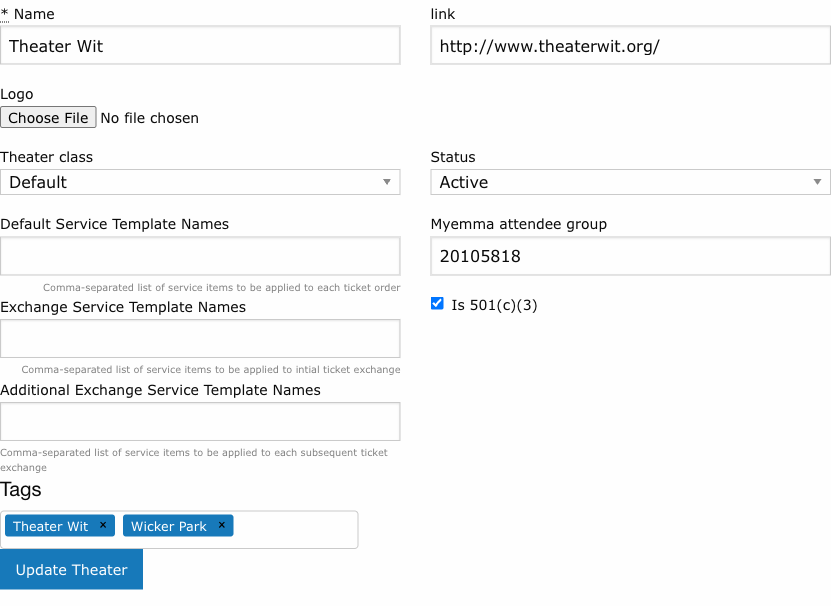
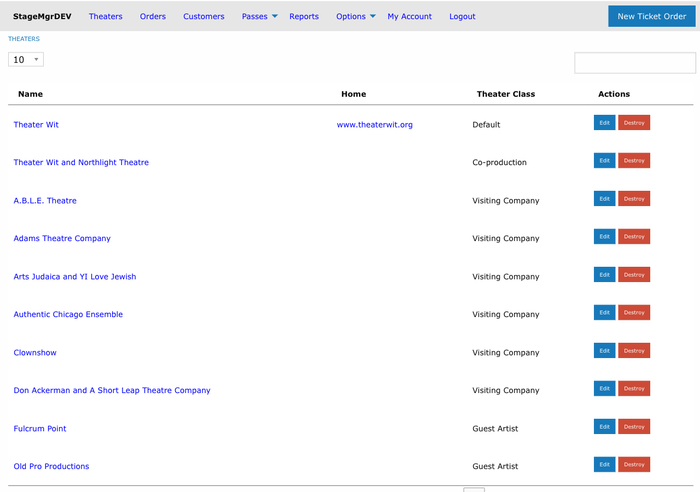

# Setting Up a Theater

!!! info "Required Role"
    **Administrator** or **Box Office** can create and edit theaters. Only **Administrators** can delete theaters.

**Navigation:** Theaters (main menu) > New theater

## What Is a Theater?

In Stagemgr, a "theater" represents a **producing company or organization** -- not a physical building. A single Stagemgr instance manages multiple theaters that may share the same physical venue spaces. For example, you might have:

- **Theater Wit** (Default) -- the primary resident company
- **Shattered Globe Theatre** (Resident Company) -- a company with an ongoing relationship
- **Old Pro Productions** (Guest Artist) -- a visiting artist for one production

Each theater gets its own productions, orders, financial reporting, and staff access controls.

## Creating a Theater

1. Go to **Theaters** in the main navigation
2. Click **New theater** at the bottom of the list
3. Fill in the form fields described below
4. Click **Create Theater**

## Theater Form Fields

### Name

The theater company's name as it will appear throughout Stagemgr -- in order records, reports, the public website, and patron communications. Must be unique across all theaters in the system.

### Link

The theater company's website URL (e.g., `http://www.theaterwit.org/`). Used for linking back to the company's site from the public-facing pages.

### Logo

An image file for the theater's logo. Used in outgoing emails for ticket and pass purchases, and on public-facing pages. Upload a square image -- it will be displayed at 250x250 and 125x125 pixels.

Accepted formats: JPG, JPEG, PNG, GIF.

### Theater Class

Defines the theater's relationship to the venue and affects how its productions appear on the website:

| Class | When to Use | Website Display |
|-------|------------|-----------------|
| **Default** | The primary organization that operates the venue | No special designation |
| **Co-production** | Joint production partnership with the default theater | Identified as co-production; shares customer data access with partner |
| **Resident Company** | A company with an ongoing venue relationship | Designated as resident company below production descriptions |
| **Visiting Company** | A company using the venue for a limited engagement | Designated as visiting company below production descriptions |
| **Guest Artist** | An individual artist or small group | Designated as guest artist below production descriptions |

!!! note "Theater Class and Permissions"
    Theater class affects data access for Theater User accounts. Users assigned to a **Resident Company** theater can view all patron email addresses. Users assigned to other theater classes can only see emails for patrons who have opted into their marketing list. Co-production theaters share customer data access with the default theater.

### Status

| Status | Effect |
|--------|--------|
| **Active** | Theater and its productions are visible in administrative views and (depending on production status) on the public website |
| **Inactive** | Theater and all its productions are removed from public view and most administrative views |

### Default Service Template Names

A comma-separated list of service item template names to automatically attach to **new ticket orders** for this theater's productions. For example: `Processing Fee, Facility Fee`.

These are the default fees charged on every order. Individual productions can override these defaults.

See [Service Items](../offers/service-items.md) for how to create service item templates.

### Exchange Service Template Names

A comma-separated list of service item template names to automatically attach when a patron **exchanges an order for the first time**. For example: `Exchange Fee`.

### Additional Exchange Service Template Names

A comma-separated list of service item template names for **subsequent exchanges** (second exchange and beyond). This allows a different fee structure for repeat exchanges.

!!! tip "Service Item Inheritance"
    The fee chain works as: **Service Item Templates** (system-wide) > **Theater defaults** (set here) > **Production overrides**. If a production specifies its own service items, those override the theater defaults. If neither the production nor theater specifies items, the system default applies.

### MyEmma Attendee Group

The numeric group ID for this theater's attendee group in the MyEmma email marketing platform. When a theater is created, Stagemgr automatically creates a corresponding MyEmma group named "[Theater Name] Attendee" if the MyEmma integration is enabled and configured.

You typically do not need to set this manually -- it is auto-populated on save.

### Is 501(c)(3)

Check this box if the theater is a registered 501(c)(3) nonprofit organization. This enables donation-related features:

- The **Refund to Donation** option becomes available on ticket orders for this theater
- Donation orders can be created for this theater
- Donation receipts include appropriate nonprofit tax language

### Tags

Tags are free-form labels you can attach to a theater to group it for analysis and reporting. Unlike Theater Class -- which is a fixed list with built-in behavior -- tags are arbitrary text you define and can change at any time. Typical uses include grouping by neighborhood, genre, partnership type, or any other attribute you want to slice by later.

A theater can have any number of tags. They appear as rounded pill labels in the **Tags** field on the theater form, in the **Name** column of the Theaters list, and at the top of the theater detail page.

#### Adding a tag

1. Click into the **Tags** field on the theater form.
2. Begin typing. As you type, a dropdown suggests existing tag names already used on other theaters -- click one to apply it, or keep typing to create a brand-new tag.
3. Press **Enter** (or type a comma) to commit the tag as a pill.
4. Repeat to add as many tags as you need.
5. Click **Update Theater** to save.

!!! tip "Reuse existing tags when possible"
    The autocomplete suggestions help you converge on a consistent vocabulary -- if "Storefront" already exists, accept the suggestion rather than typing "storefront" or "store front" as a new tag. Tags are matched case-insensitively, so "Storefront" and "storefront" are treated as the same tag, with the casing of the first one preserved.

#### Removing a tag

Click the **x** on the right side of any pill to remove that tag, then save the form. The tag is removed from this theater only; it remains available on any other theater that uses it.

#### Where tags appear

| Location | What you see |
|----------|--------------|
| Theater edit form | Pills inside the Tags field, with an **x** on each pill |
| Theaters list | Pills displayed inline after each theater's name |
| Theater detail page | Pills displayed next to the theater name heading |

!!! note "Future use in analysis"
    Tags are not yet used as filter criteria in reports, but they are recorded with each theater so future analytical features can group or filter by tag value. Apply tags now in preparation for that work.

## Viewing a Theater

Click any theater name in the Theaters list to view its details page. From here you can:

- See all **productions** associated with this theater
- Click **Add Production** to create a new production
- Click **Edit** to modify the theater settings
- View the theater's website link and logo

## The Theaters List

The Theaters list (**Theaters** menu) shows all theaters in a searchable, paginated table with columns for:

- **Name** -- Click to view the theater's detail page. Any [Tags](#tags) on the theater appear as pills next to the name.
- **Home** -- Link to the theater's website
- **Theater Class** -- Default theaters show blank; others show their class
- **Actions** -- Edit and Destroy links (Destroy is Administrator-only)

Use the search box to filter theaters by name, or change the page size (10, 25, 50, 100).
