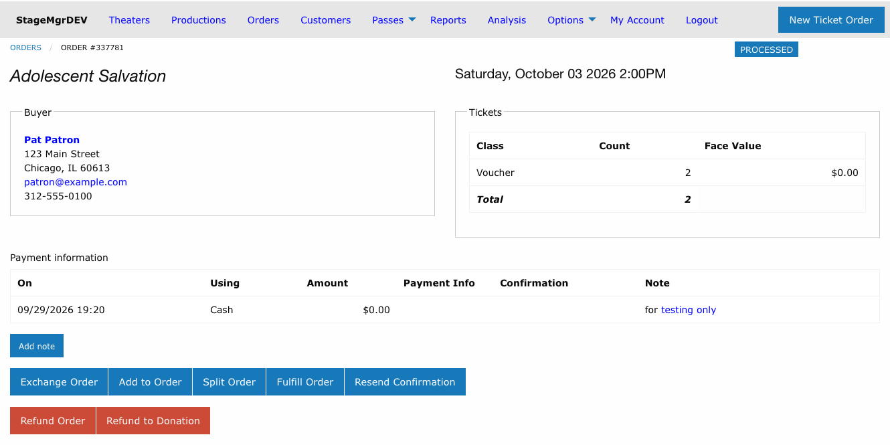
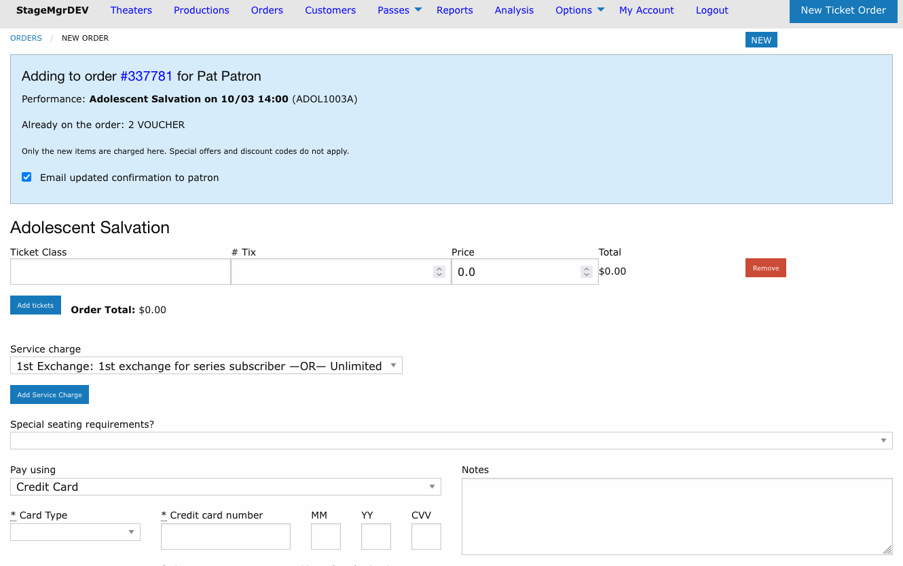

# Add to Order

!!! info "Access"
    Add to Order is available to **Administrator** and **Box Office** users. Theater users do not see the button.

**Navigation:** Stagemgr > Orders > Ticket Orders > [Select Order] > Add to Order

---

## Overview

Add to Order puts extra tickets or add-ons on a patron's existing order after the sale -- a guest's seat, a captioning tablet, a dinner -- without touching what is already there. The patron keeps their original tickets and seats and pays only for the new items. When the addition is placed, the new items become part of the original order, which keeps its order number.

## When Is Add to Order Available?

The **Add to Order** button appears on the order detail page when:

| Condition | Requirement |
|-----------|-------------|
| **Order status** | Must be **Processed**. The performance date does not matter, so the box office can tidy up after the performance too. |
| **Exchange in progress** | The order must not be the original of an exchange that is still being completed |
| **Role** | Administrator or Box Office |

!!! warning "Fulfilled Orders"
    Once an order is **Fulfilled** (or Unclaimed, Refunded, Exchanged, Canceled or Split), it can no longer be added to. If the patron wants more tickets after their order has been fulfilled, create a new order for them.

## Adding Items

### Step 1: Open the Add to Order Page

1. Open the patron's ticket order
2. Click **Add to Order**

The page is the normal box office order page with a blue banner at the top describing the order you are adding to.

| Banner Item | Description |
|-------------|-------------|
| **Adding to order** | The original order's number (a link back to it) and the patron's name |
| **Performance** | The original order's performance. It is fixed: additions are always for the same performance. |
| **Already on the order** | The tickets already on the order, with their seats for reserved seating |
| **Email updated confirmation to patron** | Checked by default. Untick it if the patron should not receive an updated confirmation. |

### Step 2: Add the New Items

The page starts with one blank ticket line, so you can pick a ticket class and quantity straight away. Click **Add tickets** for more lines; a line left blank is ignored.

- **General admission** -- choose the ticket class and quantity for each new item.
- **Reserved seating** -- the order's current seats show as taken on the seat map. Pick the new seats on the map as you would for a new order.

Items sell at **face value**: there is no special offer or discount code field. Any per-ticket fee on the ticket class still applies.

### Step 3: Take Payment

Choose the payment in **Pay using**. Only the new items are charged. The payment types offered are the ones the performance allows, and the addition may be comped.

The patron's name and address, **Hold reservation under** and the **Marketing** questions are not shown -- they belong to the original order, and the addition uses the original order's patron record.

Anything typed in **Notes** is added to the end of the original order's notes.

### Step 4: Place the Addition

Click **Place Order** and confirm. Additions are placed in one step: **Hold** and **Assign Seats** are not used.

On success you return to the original order with the notice *Added to order #...*. The order now shows the new items and payment alongside the original ones, and its **Change history** records an entry reading *Added from order #...*, listing the items added and any card charge reference.

Unless you unticked the box in the banner, the patron receives one updated confirmation for the whole order.

## All or Nothing

An addition is placed completely or not at all:

- Every check runs before the card is charged. If anything fails, nothing is saved, the original order is unchanged and the error is shown on the page.
- If something fails after the card has been charged, the charge is refunded automatically.
- Seats picked on the seat map for a failed addition are released.

## Membership Orders

A membership covers a set number of seats per performance (**Tickets Per Performance** on the membership offer). To give a member more seats than that, add them to the member's order and pay by card or another money payment. Seats paid that way do not count against the membership's per-performance limit.

!!! tip "After a Paid Seat Is Added to a Pass Order"
    An order paid partly with a pass (membership or flex pass) and partly with money can no longer be exchanged or split, because the system cannot tell which seats the pass covered. The order page shows a warning. For reserved seating, **Update seating** (Change Seating) still works; to move the patron to another performance, refund the order and place a new one. See [Exchanges](exchanges.md) and [Refunds](refunds.md).

## Important Rules

1. **Same performance only** -- To move the patron to a different performance, use an [Exchange](exchanges.md) instead
2. **Original items untouched** -- The tickets, seats and payments already on the order are never changed
3. **Face value** -- Special offers and discount codes do not apply to added items. If the original order's special offer would also discount the new tickets, the addition is refused; use Exchange for that order.
4. **Balanced orders only** -- An order that is out of balance cannot be added to
5. **One order number** -- The added items and their payment appear on the original order; no separate order is left behind

## Troubleshooting

| Issue | Resolution |
|-------|------------|
| Add to Order button not shown | The order must be **Processed** and not part of an exchange in progress. Fulfilled orders need a new order. |
| *An addition is placed in one step: use Place Order* | Hold and Assign Seats are not available for additions; click **Place Order** |
| *...special offer ... would also discount these tickets* | The original order's offer applies to that ticket class. Use [Exchange](exchanges.md) instead. |
| *...is out of balance* | Resolve the original order's balance first |
| Card declined | Nothing was saved; take another payment and place the addition again |
| Patron did not receive an updated confirmation | Check that the box was ticked and the order has an email address; use **Resend Confirmation** on the order |
