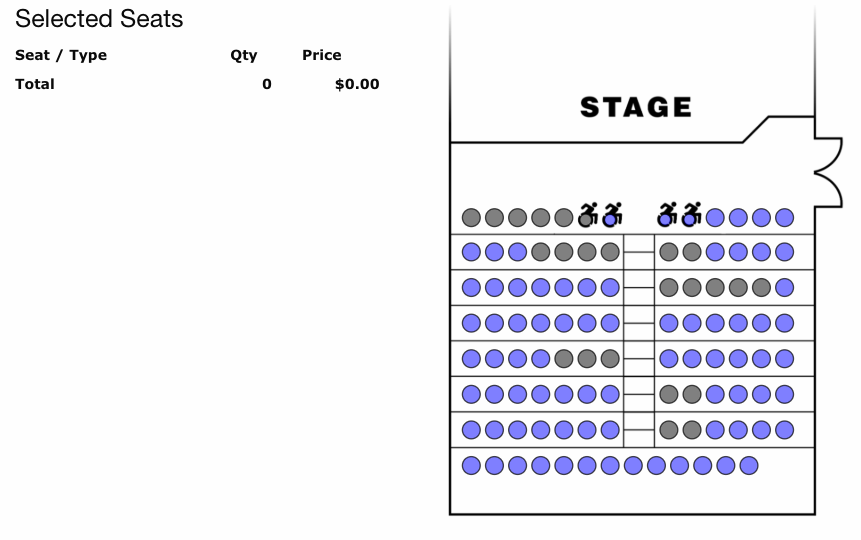

# Creating a Ticket Order: Reserved Seating

!!! info "Role: Box Office Staff, Administrators"
    This page covers creating ticket orders for reserved seating performances. For general admission, see [Creating a Ticket Order: General Admission](creating-ticket-order-ga.md).

**Navigation:** Stagemgr > Orders > Ticket Orders > New Ticket Order

## Overview

Reserved seating ticket orders allow patrons to select specific seats from the venue's seat map. The process is similar to general admission ordering but includes an interactive seat selection step instead of simple quantity entry.

## Step-by-Step Process

### Step 1: Customer Lookup

Begin by finding or creating the patron's record.

1. In the **Address** section, start typing the patron's name in the search field
2. The autocomplete will suggest matching records as you type
3. Select the correct patron, or fill in the fields manually for a new patron

| Field | Required | Description |
|-------|----------|-------------|
| **Full Name** | Yes | Patron's full name |
| **Email** | Yes | Email address for confirmations and receipts |
| **Line 1** | No | Street address |
| **Line 2** | No | Apartment, suite, etc. |
| **City** | No | City |
| **State** | No | State |
| **Zipcode** | No | ZIP code |
| **Phone** | No | Phone number |

### Step 2: Select Performance

1. In the **Performance** field, begin typing the performance code
2. The autocomplete will show matching performances
3. Select the desired performance

When a reserved seating performance is selected, the seat map interface will appear instead of the quantity fields used for general admission.

### Step 3: Select Seats on the Seat Map

The seat map displays the venue layout with available, occupied, and held seats.

1. Click an available seat. A **ticket class popup** opens immediately for that seat.
2. Pick the ticket class to assign. The seat is reserved for this order with that class and the seat appears on the **Selected Seats** list.
3. Repeat for each seat the patron wants. Each click opens the popup again so the next seat can take a different class.
4. To remove a seat from the order, either click it again on the seat map or use the **×** button on its row in the Selected Seats list. The hold is released immediately.

For full details on using the seat map interface, see [Seat Selection](seat-selection.md).

!!! tip "One row per seat"
    The Selected Seats list now shows **one row per seat**, with that seat's label, ticket class, quantity, and price. This is different from older releases where seats of the same class were aggregated into a single row -- the per-seat layout makes it easier to see exactly what each patron is paying for and to remove individual seats without affecting the rest.

#### Donation (Pay-What-You-Can) Ticket Classes

When a ticket class is configured as a **Donation** type, the popup shows a **price input** instead of a fixed price. This lets staff (or the patron, on the public page) enter any amount the buyer wishes to contribute for that seat.

- Type the donation amount in the price field, then click **Select**.
- Each seat keeps its own override, so two seats sharing the same donation class can be priced independently (for example, $25 for one seat and $50 for another).
- Non-donation classes display the standard fixed price and cannot be edited from the popup.

After selecting seats, the Selected Seats list updates live with the per-seat prices and a running total:

### Step 4: Special Requests vs. Seat Selection

For reserved seating, accessibility needs are handled differently than general admission:

| GA Approach | Reserved Seating Approach |
|-------------|--------------------------|
| Select a special request option (Wheelchair, No Stairs) from a dropdown | Select appropriate accessible seats directly on the seat map |
| System assigns accessible seating | Staff chooses specific wheelchair or accessible locations |

!!! warning "Accessibility"
    Accessible seats are marked on the seat map. When a patron requires wheelchair seating, select the designated wheelchair locations rather than using the special request dropdown. The seat map visually identifies accessible positions.

### Step 5: Apply Special Offer (Optional)

If the patron has a promotional code:

1. Enter the code in the **Special Offer Code** field
2. Select the matching offer from the autocomplete
3. The discount applies to the order total

### Step 6: Hold Under (Optional)

If placing this order on hold rather than processing immediately:

1. Enter the name the reservation should be held under in the **Hold Under** field
2. This is typically the patron's last name but can differ for group or corporate reservations
3. See [Hold Orders](hold-orders.md) for more details

### Step 7: Marketing Source and Options

| Field | Description |
|-------|-------------|
| **Marketing Source** | How the patron heard about the show (Email, Mail, Facebook, Word of Mouth, etc.) |
| **Add to Email List** | Check to subscribe the patron to the theater's mailing list |
| **Notes** | Special instructions or information about the order |

### Step 8: Payment

Select and process payment. See [Payment Processing](payment-processing.md) for details.

1. Choose the payment method
2. Enter payment details
3. Submit the order

### Step 9: Confirmation

After successful submission:

1. The order is created with status **Processed**
2. Selected seats are permanently assigned to this order
3. A confirmation email is sent to the patron
4. You are redirected to the order detail page

## Key Differences from General Admission

| Feature | General Admission | Reserved Seating |
|---------|-------------------|------------------|
| Seat selection | Not applicable | Interactive seat map |
| Quantity entry | Dropdown + number field | Click individual seats |
| Line items | One row per ticket class with a quantity | One row per seat |
| Donation pricing | Fixed price per ticket class | Editable per seat in the class popup |
| Special requests | Dropdown menu (Wheelchair, No Stairs) | Select accessible seats directly |
| Capacity source | Manual capacity setting | Seat map determines capacity |
| Temporary holds | Not applicable | Seats held during order creation |

## Common Scenarios

### Phone Order with Seat Preferences
The patron calls wanting specific seats. Open the seat map, find the requested section/row, select the seats, and complete the order over the phone.

### Best Available
The patron has no seat preference. Select the best available seats based on house conventions (center first, then fill outward). Complete the order as normal.

### Wheelchair Seating
Identify the designated wheelchair positions on the seat map. Select those seats. Assign the appropriate ticket class.

### Season Ticket Holder
For patrons with season subscriptions, their preferred seats may already be on hold. Convert the hold to a sale by processing payment. See [Hold Orders](hold-orders.md).

!!! tip "Seat Map Familiarity"
    Take time to learn the venue's seat map layout. Knowing where accessible seats, premium sections, and obstructed views are located helps you serve patrons more efficiently.
