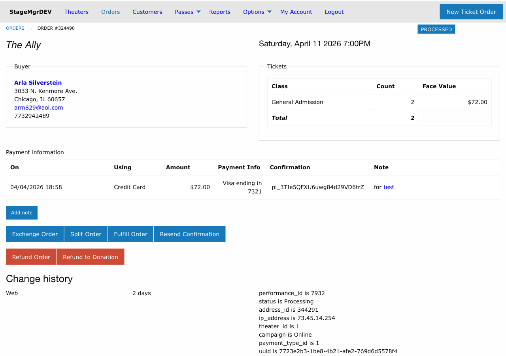

# Exchanges

!!! info "Role: Box Office Staff, Administrators"
    Exchanges allow patrons to move their tickets from one performance to another, or change their seats within the same performance. This page covers the complete exchange workflow.

**Navigation:** Stagemgr > Orders > Ticket Orders > [Select Order] > Exchange Order

## Overview

An exchange replaces an existing ticket order with a new one. The original order is marked as **Exchanged** (a terminal state), and a new order is created as **Processed**. Seats from the original order are released, and new seats or tickets are assigned on the new order.

## When to Use an Exchange

Common exchange scenarios:

- Patron wants to attend a different performance date or time
- Patron wants to change seats for the same performance (reserved seating)
- Patron needs to switch ticket classes (e.g., upgrading from Student to Adult)
- Group needs to move to a performance with more availability

## Exchange Workflow

### Step 1: Initiate the Exchange

1. Navigate to the existing ticket order
2. Click **Exchange Order**
3. The original order status changes to **Exchanging**

!!! warning "Point of No Return"
    Once you click Exchange Order, the original order enters the **Exchanging** state. Complete the exchange or the order will remain in this transitional state.

### Step 2: Create the New Order

A new order form appears, pre-populated with the patron's information:

1. **Performance** -- Select the new performance using the autocomplete field
2. **Tickets/Seats** -- For general admission, select ticket class and quantity. For reserved seating, select new seats on the seat map.
3. **Special Offer Code** -- A new special offer code can be applied to the exchange order if applicable
4. **Notes** -- Add any exchange-related notes

### Step 3: Review Price Differential

The system calculates the difference between the original and new order:

| Scenario | What Happens |
|----------|-------------|
| **New order costs more** | Patron pays the difference |
| **New order costs less** | Credit may be applied or the difference noted |
| **Same price** | No additional payment required |

### Step 4: Exchange Service Fees

Exchange service fees may be applied depending on theater policy:

- The fee amount is configured at the theater or production level
- The fee is added to the new order total
- The patron is responsible for the service fee in addition to any price differential

### Step 5: Payment

The allowed payment types for the exchange depend on the original order's payment method:

| Original Payment | Allowed Exchange Payment Types |
|-----------------|-------------------------------|
| Credit Card | Credit card (same or different card) |
| Cash | Cash, credit card |
| Check | Check, cash, credit card |
| External | External, credit card |
| Comp | Comp |

!!! tip "Payment Flexibility"
    When the new order costs more, the patron can pay the difference using any allowed payment type. When the original was a comp, the exchange must also be a comp.

### Step 6: Submit the Exchange

1. Review all details on the new order
2. Process payment for any amount due
3. Submit the exchange

On successful submission:

- The **original order** status changes to **Exchanged** (terminal)
- The **new order** is created with status **Processed**
- Seats from the original order are released back to inventory
- New seats are assigned to the new order
- Confirmation email is sent to the patron

## Exchanging General Admission Orders

For GA performances, the exchange process involves:

1. Selecting the new performance
2. Choosing ticket classes and quantities for the new order
3. The original ticket allocations are released
4. New allocations are made against the new performance's inventory

No seat map interaction is required.

## Exchanging Reserved Seating Orders

For reserved seating performances, the exchange process additionally involves:

1. The original seats are released from the seat map
2. The new performance's seat map is displayed
3. Staff selects new seats for the patron
4. New seat assignments are created on the new order

!!! tip "Preferred Seats"
    When exchanging to a new performance, check if the patron's original seat locations are available in the new performance. Patrons often prefer comparable seats.

## Important Rules

1. **Only one exchange at a time** -- You cannot exchange an order that is already in the Exchanging state
2. **Terminal status** -- The original order becomes **Exchanged** and cannot be modified further
3. **New order is independent** -- The new order can be subsequently exchanged, refunded, or split like any other Processed order
4. **Audit trail** -- Both orders retain references to each other for tracking purposes
5. **Inventory updates** -- Seat releases and new assignments happen atomically during the exchange

## Troubleshooting

| Issue | Resolution |
|-------|------------|
| Exchange button not available | Verify the order is in Processed or Fulfilled status |
| Price differential seems wrong | Check ticket class pricing for both the original and new performances |
| Cannot select seats on new performance | Verify the new performance has available seats and a valid seat map |
| Order stuck in Exchanging status | Contact an administrator to resolve the transitional state |
| Patron wants to undo the exchange | The Exchanged status is terminal; create a new exchange from the new order if needed |

!!! warning "No Undo"
    Exchanges cannot be reversed. If the patron changes their mind after an exchange, you must perform another exchange on the new order or process a refund.
