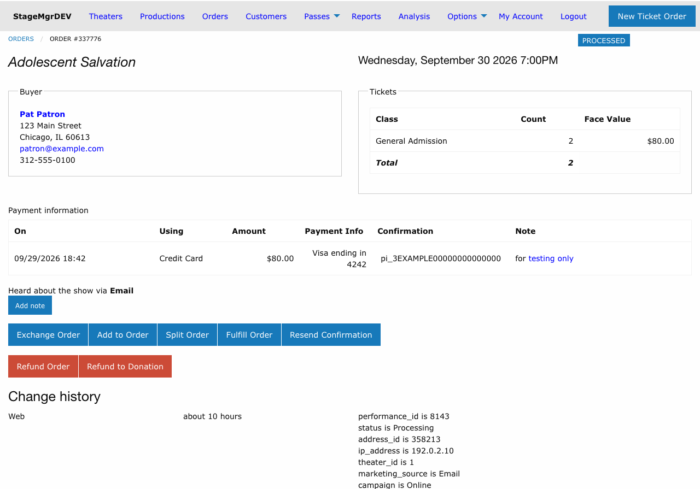

# Exchanges

!!! info "Role: Box Office Staff, Administrators"
    Exchanges allow patrons to move their tickets from one performance to another, or change their seats within the same performance. This page covers the complete exchange workflow.

**Navigation:** Stagemgr > Orders > Ticket Orders > [Select Order] > Exchange Order

## Overview

An exchange replaces an existing ticket order with a new one. The original order is marked as **Exchanged** (a terminal state), and a new order is created as **Processed**. Seats from the original order are released, and new seats or tickets are assigned on the new order.

## When to Use an Exchange

Common exchange scenarios:

- Patron wants to attend a different performance date or time
- Patron wants to change seats for the same performance (reserved seating)
- Patron needs to switch ticket classes (e.g., upgrading from Student to Adult)
- Group needs to move to a performance with more availability

!!! tip "Adding Tickets Instead"
    If the patron wants to keep their tickets and add more for the same performance -- a guest's seat, a captioning tablet -- use [Add to Order](add-to-order.md) instead of an exchange.

!!! warning "Orders Paid With a Pass and Money"
    An order paid with both a pass (membership or flex pass) and a money payment -- for example a membership order with a card-paid seat added -- cannot be exchanged, because the system cannot tell which seats the pass paid for. The Exchange Order button is hidden and the order page shows *Orders paid with both a pass and another payment can't be exchanged; refund the order and place a new one instead.* For reserved seating, **Update seating** still lets you change seats for the same performance.

## Exchange Workflow

### Step 1: Initiate the Exchange

1. Navigate to the existing ticket order
2. Click **Exchange Order**
3. The original order status changes to **Exchanging**

!!! warning "Point of No Return"
    Once you click Exchange Order, the original order enters the **Exchanging** state. Complete the exchange or the order will remain in this transitional state.

### Step 2: Create the New Order

A new order form appears, pre-populated with the patron's information:

1. **Performance** -- Select the new performance using the autocomplete field
2. **Tickets/Seats** -- For general admission, select ticket class and quantity. For reserved seating, select new seats on the seat map.
3. **Special Offer Code** -- A new special offer code can be applied to the exchange order if applicable
4. **Notes** -- Add any exchange-related notes

### Step 3: Review Price Differential

The system calculates the difference between the original and new order:

| Scenario | What Happens |
|----------|-------------|
| **New order costs more** | Patron pays the difference |
| **New order costs less** | With **Exchange Order** the difference is written off as a *Carryover* on the new order. With **Exchange and Refund** the difference is returned to the patron (see below). |
| **Same price** | No additional payment required |

#### Refunding the difference

When an exchange to a cheaper performance or ticket class is the theater's error, use the red **Exchange and Refund** button instead of **Exchange Order**. The exchange is processed exactly the same way, but the price difference is returned to the patron:

- **Credit card** -- a partial refund of the original charge is sent to Stripe for the exact difference. The patron's card is credited without re-entering it.
- **Cash or check** -- a *Refund* row is recorded against the original payment for the box office to hand back.

The refund appears on the **original order** as a *Credit Card Refund* (or *Cash Refund*) line alongside the exchange offset, and the original nets to $0.00. The Stripe refund reference (`re_...`) is stored as the confirmation code.

!!! warning "Refund Rules"
    - The button is available to Box Office and Administrator users only.
    - If the new order costs **the same** as the original, the exchange goes through with no refund, and a blue note says *Nothing to refund*.
    - If it costs **more**, the exchange is refused with *Nothing to refund* and the amount of the increase; use **Exchange Order** to charge the difference.
    - Only cash, check and credit card payments can be refunded. Flex pass, membership, comp and exchange-credit payments cannot; if they do not cover the difference, the exchange is refused and nothing is changed.
    - Exchange service fees retained by the theater are never refunded. Remove the fee line on the form if the exchange is the theater's error.
    - If Stripe declines the refund, the whole exchange is cancelled: no new order is created and the original order is unchanged.

### Step 4: Exchange Service Fees

Exchange service fees may be applied depending on theater policy:

- The fee amount is configured at the theater or production level
- The fee is added to the new order total
- The patron is responsible for the service fee in addition to any price differential

### Step 5: Payment

The **Pay using** list offers the payment types the performance allows -- the same list a new order for that performance would show. The original order's payment type is preselected when it is one of them; you can choose any other type on the list.

If you move the order to a different performance that does not allow the chosen payment type, placing the exchange is refused with an error; pick another payment type.

!!! tip "Payment Flexibility"
    When the new order costs more, the patron can pay the difference using any payment type on the list.

### Step 6: Submit the Exchange

1. Review all details on the new order
2. Process payment for any amount due
3. Click **Exchange Order**, or **Exchange and Refund** to return the price difference to the patron

On successful submission:

- The **original order** status changes to **Exchanged** (terminal)
- The **new order** is created with status **Processed**
- Seats from the original order are released back to inventory
- New seats are assigned to the new order
- Confirmation email is sent to the patron

## Exchanging General Admission Orders

For GA performances, the exchange process involves:

1. Selecting the new performance
2. Choosing ticket classes and quantities for the new order
3. The original ticket allocations are released
4. New allocations are made against the new performance's inventory

No seat map interaction is required.

## Exchanging Reserved Seating Orders

For reserved seating performances, the exchange process additionally involves:

1. The original seats are released from the seat map
2. The new performance's seat map is displayed
3. Staff selects new seats for the patron
4. New seat assignments are created on the new order

!!! tip "Preferred Seats"
    When exchanging to a new performance, check if the patron's original seat locations are available in the new performance. Patrons often prefer comparable seats.

## Important Rules

1. **Only one exchange at a time** -- You cannot exchange an order that is already in the Exchanging state
2. **Terminal status** -- The original order becomes **Exchanged** and cannot be modified further
3. **New order is independent** -- The new order can be subsequently exchanged, refunded, or split like any other Processed order
4. **Audit trail** -- Both orders retain references to each other for tracking purposes
5. **Inventory updates** -- Seat releases and new assignments happen atomically during the exchange

## Troubleshooting

| Issue | Resolution |
|-------|------------|
| Exchange button not available | Verify the order is in Processed or Fulfilled status. Orders paid with both a pass and money cannot be exchanged; refund the order and place a new one. |
| Expected payment type not offered | The performance restricts that payment type; choose another |
| Price differential seems wrong | Check ticket class pricing for both the original and new performances |
| Cannot select seats on new performance | Verify the new performance has available seats and a valid seat map |
| Order stuck in Exchanging status | Contact an administrator to resolve the transitional state |
| Patron wants to undo the exchange | The Exchanged status is terminal; create a new exchange from the new order if needed |

!!! warning "No Undo"
    Exchanges cannot be reversed. If the patron changes their mind after an exchange, you must perform another exchange on the new order or process a refund.
