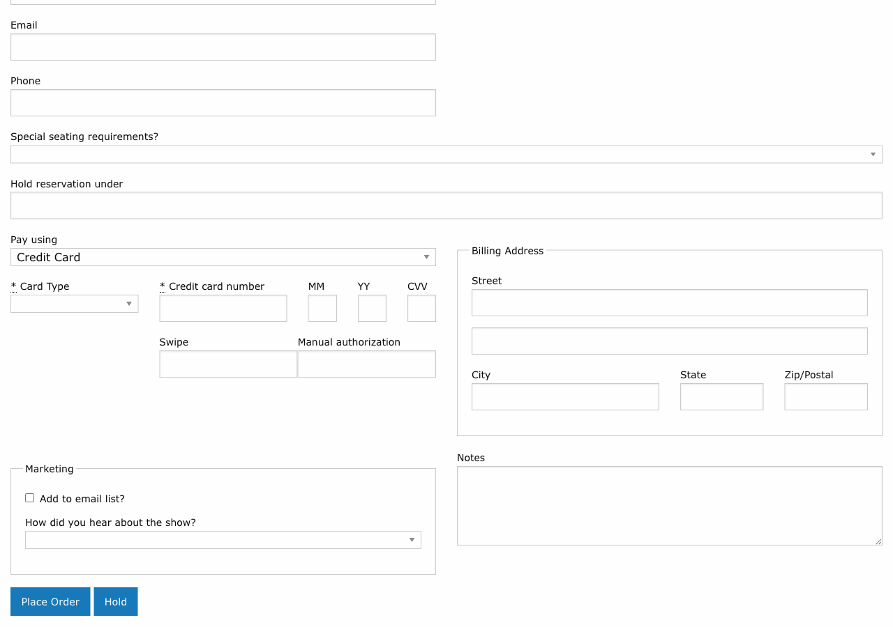

# Hold Orders

!!! info "Role: Box Office Staff, Administrators"
    Hold orders reserve seats for patrons without collecting payment. They are commonly used for phone reservations, VIP holds, and season seating assignments.

**Navigation:** Stagemgr > Orders > Ticket Orders > New Ticket Order

## Overview

A hold order reserves one or more seats for a patron without requiring immediate payment. The order remains in **Hold** status until it is either converted to a paid sale or canceled. Held seats are removed from available inventory, preventing them from being sold to other patrons.

## Creating a Hold Order

The process for creating a hold order is nearly identical to creating a standard ticket order, with two key differences: you skip the payment step and you fill in the **Hold Under** field.

### Step-by-Step

1. **Customer lookup** -- Find or create the patron's address record
2. **Select performance** -- Choose the performance using the autocomplete field
3. **Select tickets/seats** -- For general admission, choose ticket class and quantity. For reserved seating, select seats on the seat map.
4. **Hold Under** -- Enter the name the reservation is held under (typically the patron's last name)
5. **Notes** -- Add any relevant notes (e.g., "Will call back by Friday to pay," "Season subscriber")
6. **Submit without payment** -- The order is created in **Hold** status

### The Hold Under Field

| Detail | Description |
|--------|-------------|
| **Purpose** | Identifies who the reservation is held for, especially at will-call |
| **Default** | Typically the patron's last name |
| **Override** | Can be set to a different name (e.g., a corporate contact, group organizer, or gift recipient) |
| **Searchable** | The hold_under name appears in order searches and will-call lists |

!!! tip "Will-Call Clarity"
    If the person picking up tickets has a different name than the account holder, put the pickup person's name in the **Hold Under** field. This prevents confusion at will-call.

## Who Can Create Hold Orders

Hold orders can be created by:

- **Box office staff** -- For phone-in reservations and walk-up holds
- **Administrators** -- For VIP reservations, press holds, and season seating

## Converting a Hold to a Sale

When the patron is ready to pay, the hold order is converted to a processed sale:

1. Navigate to the hold order (search by order ID, patron name, or hold_under name)
2. Open the order detail page
3. Click **Process** (or the equivalent action to collect payment)
4. Enter payment information
5. Submit -- the order status changes from **Hold** to **Processed**

The seats remain assigned to the same order. No new order is created.

## Canceling a Hold

If the patron does not confirm the reservation:

1. Navigate to the hold order
2. Click **Cancel**
3. Confirm the cancellation
4. The order status changes to **Canceled**
5. All held seats are released back to available inventory

!!! warning "Unprocessed Holds"
    Regularly review outstanding hold orders, especially as a performance date approaches. Holds that are never converted tie up inventory and can prevent sales to other patrons.

## Season Seating Holds

For season subscribers or patrons with preferred seating arrangements, hold orders are used to reserve the same seats across multiple performances:

1. Create a hold order for each performance in the season
2. Assign the patron's preferred seats on each seat map
3. As the season progresses, convert each hold to a sale when payment is collected

This ensures that season subscribers retain their preferred seats throughout the run.

## Hold Orders and Inventory

Hold orders affect inventory in the following ways:

| Impact | Description |
|--------|-------------|
| **Seat reservation** | Held seats are removed from available inventory |
| **Capacity counting** | Hold orders are included in the "Holding Seat" status group |
| **House count** | Held seats count as occupied in house count calculations |
| **Availability display** | The performance shows reduced availability while holds are active |

## Best Practices

1. **Set deadlines** -- When creating a hold, note a deadline in the **Notes** field (e.g., "Must confirm by March 15"). Follow up before the deadline.
2. **Review holds regularly** -- Run a report or search for orders in Hold status to identify stale reservations.
3. **Communicate clearly** -- Tell the patron how long their hold will last and when they need to provide payment.
4. **Minimize hold duration** -- Long-standing holds reduce available inventory. Convert or cancel holds promptly.
5. **Use hold_under consistently** -- Always fill in the Hold Under field so holds can be easily found at will-call.

## Troubleshooting

| Issue | Resolution |
|-------|------------|
| Cannot find a hold order | Search by the hold_under name, patron last name, or order ID |
| Patron says seats were held but order is not found | Check if the hold was canceled or expired. Verify the correct performance. |
| Want to change held seats | Cancel the existing hold and create a new one with the correct seats |
| Hold order is blocking a sale | If the hold is no longer needed, cancel it to release the seats |
