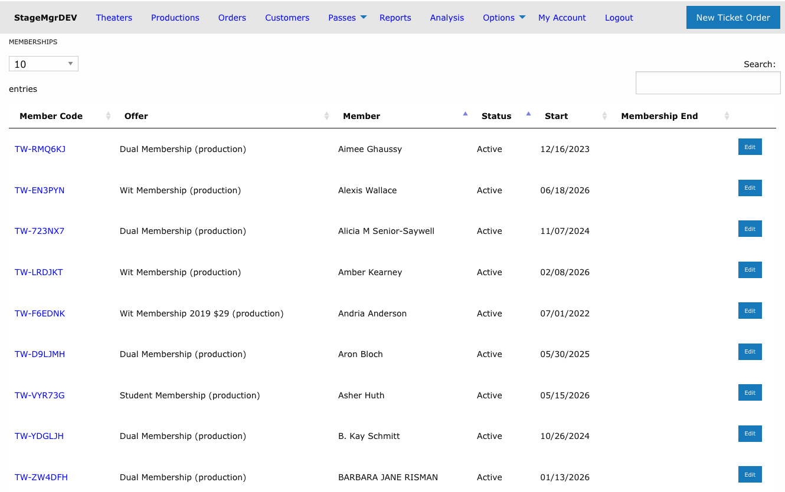

# Managing Memberships

!!! info "Access"
    The Memberships list is available to **Admin** and **Box Office** users only. Theater users do not see the Passes > Memberships menu entry.

**Navigation:** Passes > Memberships

---

## Overview

The Memberships list shows every individual membership in the system -- one row per membership record -- with live search, sorting, and paging. Use it to look up a member by name or member code, check whether a membership is still active, and see when it started and ended.

## Columns

| Column | Description |
|--------|-------------|
| **Member Code** | The membership's unique code. Click it to open the membership detail page. |
| **Offer** | The [membership offer](../offers/membership-offers.md) the membership was purchased or issued under, with its type (`production` or `timed`) in parentheses. |
| **Member** | The patron's name. Searching by first or last name matches this column. |
| **Status** | `Active`, `Suspended`, `Canceled`, `Pending`, or `Expired`. |
| **Start** | When the membership began -- the billing subscription's start date when one exists, otherwise the date the membership record was created. |
| **Membership End** | When the membership ended or will end. See below. |

### How Membership End is determined

- For canceled or expired memberships, this is the date the membership actually closed.
- For an active membership scheduled to cancel at the end of its billing period, the final billing date is shown with a **Cancel pending** label.
- A blank value means the membership is ongoing with no scheduled end.

## Sorting and Searching

- **Default order** puts memberships in status priority -- Active first, then Suspended, then Canceled -- with members alphabetical within each status.
- Click any column header to sort by that column instead; click again to reverse.
- The **Search** box matches member codes (by prefix), member first/last names, offer names, and statuses, narrowing as you type.
- Paging and your last search are remembered between visits.

!!! tip "Finding one member quickly"
    Type the first few characters of the member code (e.g. `TW-RM`) or the member's last name. The list filters server-side, so it stays fast no matter how many memberships exist.

## Row Actions

| Action | What it does |
|--------|--------------|
| **Member Code link** | Opens the membership's detail page. |
| **Edit** | Opens the membership's edit form (status, member since, preferred seating). |

## Creating a Membership

The **New Membership** button below the list creates a membership record directly -- without a purchase order. This is how staff issue shared [library passes](../offers/membership-offers.md) and complimentary memberships. For a paid membership, use **Create Order** on the [Membership Offers list](../offers/membership-offers.md#the-membership-offers-list) instead so billing is set up.

!!! note "Email list sync"
    When a membership becomes Active, the member's address is automatically added to the offer's MyEmma email group (if one is configured); when it is canceled, the address is removed -- unless the patron still holds another current membership. The sync runs as a background job. See [Membership Offers -- Email Integration](../offers/membership-offers.md#email-integration).

## Related Pages

- [Membership Offers](../offers/membership-offers.md)
- [Membership Orders](membership-orders.md)
- [Membership Reports](../reports/membership-reports.md)
