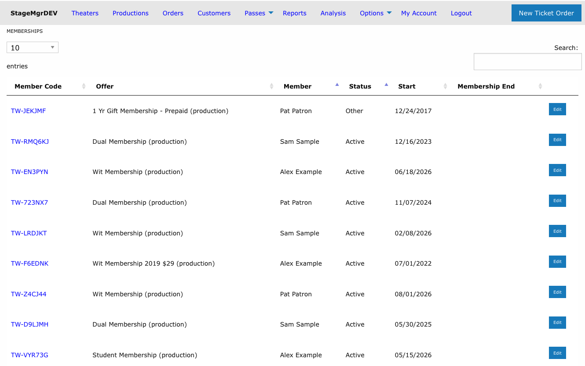

# Managing Memberships

!!! info "Access"
    The Memberships list is available to **Admin** and **Box Office** users only. Theater users do not see the Passes > Memberships menu entry.

**Navigation:** Passes > Memberships

---

## Overview

The Memberships list shows every individual membership in the system -- one row per membership record -- with live search, sorting, and paging. Use it to look up a member by name or member code, check whether a membership is still active, and see when it started and ended.

## Columns

| Column | Description |
|--------|-------------|
| **Member Code** | The membership's unique code. Click it to open the membership detail page. |
| **Offer** | The [membership offer](../offers/membership-offers.md) the membership was purchased or issued under, with its type (`production` or `timed`) in parentheses. |
| **Member** | The patron's name. Searching by first or last name matches this column. |
| **Status** | `Active`, `Suspended`, `Canceled`, `Pending`, or `Expired`. |
| **Start** | When the membership began -- the billing subscription's start date when one exists, otherwise the date the membership record was created. |
| **Membership End** | When the membership ended or will end. See below. |

### How Membership End is determined

- For canceled or expired memberships, this is the date the membership actually closed.
- For an active membership scheduled to cancel at the end of its billing period, the final billing date is shown with a **Cancel pending** label. This includes gift subscriptions, which are set to end after the offer's **Gift duration** cycles.
- A blank value means the membership is ongoing with no scheduled end, or that it is an active [one-time membership](#one-time-memberships), whose end date appears as **Expires** on its detail page.

## Sorting and Searching

- **Default order** puts memberships in status priority -- Active first, then Suspended, then Canceled -- with members alphabetical within each status.
- Click any column header to sort by that column instead; click again to reverse.
- The **Search** box matches member codes (by prefix), member first/last names, offer names, and statuses, narrowing as you type.
- Paging and your last search are remembered between visits.

!!! tip "Finding one member quickly"
    Type the first few characters of the member code (e.g. `TW-RM`) or the member's last name. The list filters server-side, so it stays fast no matter how many memberships exist.

## Row Actions

| Action | What it does |
|--------|--------------|
| **Member Code link** | Opens the membership's detail page. |
| **Edit** | Opens the membership's edit form (status, member since, preferred seating, and **Expires on** for a one-time membership). |

The detail page also offers **Generate Member ID Card**; see
[below](#generating-a-member-id-card).

## One-time memberships

A membership bought under an offer with a one-time Stripe price is paid once and runs for a
fixed term (see [Membership Offers -- One-time memberships](../offers/membership-offers.md#one-time-memberships)).
Instead of **Next Billing Date** and **Manage Subscription**, its detail page shows:

| Field | Meaning |
|-------|---------|
| **Expires** | The last day the membership can be used. Tickets for a performance after this date cannot be paid for with it. |

Its edit form adds an **Expires on** field, with the hint *Last day this one-time membership
can be used*. Change it to extend or shorten the term. Orders already booked are not
affected; the new date applies to tickets paid for with the membership from then on.

The day after **Expires**, a nightly job (1:15 am) sets the status to **Expired**, and
**Membership End** in the list shows the Expires date. Expiring removes the member from the
offer's MyEmma group like any other status change. If the job cannot save a membership,
it emails the `membership_notifications` address. The membership stays Active, and can
still be used to book, until the record is fixed.

## Redemptions

A membership's detail page lists its **Redemptions**: every order paid for in whole or in
part with the membership. The table works like **Order History** on a patron's page, with
the same columns (Order, Created, Description, Amount, Status) plus **Paid by membership**,
the share of the order the membership covered. **Amount** is the order's total paid, so an
order with a membership share smaller than its Amount was partly paid another way.
Exchanged and refunded orders stay listed with their status. A refunded order's membership
share nets to $0.00. An exchanged order still shows what the membership originally paid,
and its replacement order appears as a separate row.

## Generating a Member ID Card

A membership's detail page (open it from the Member Code link) has a
**Generate Member ID Card** button when the membership's offer has card artwork
uploaded (see [Membership Offers -- Member ID Card Artwork](../offers/membership-offers.md#member-id-card-artwork)).
Clicking it downloads a PNG named after the member code, for example
`member-card-tw-abc123.png`, ready to print on a CR-80 card printer.

The card shows four things from the record:

| On the card | Comes from |
|-------------|------------|
| Photo | The patron's photo on their [address record](../customers/managing-patrons.md). Without one the card prints with the background showing through the photo panel. Square-ish, face near the middle, at least 400 px on the short side prints best. |
| Name | The address's full name, as stored. Long names shrink and wrap onto two lines automatically. |
| Member number | The member code, printed exactly as shown. |
| Since | The year this patron *first* became a member, across all of their memberships -- a patron who lapsed and rejoined keeps their original year. |

!!! tip "Printing"
    The PNG is tagged 300 dpi. Print at 100%, never "fit to page": the artwork
    already allows for the printer's unprinted edge.

If the offer has no card background, the detail page shows a note instead of
the button, with a link to the offer's edit form for administrators.

## Creating a Membership

The **New Membership** button below the list creates a membership record directly -- without a purchase order. This is how staff issue shared [library passes](../offers/membership-offers.md) and complimentary memberships. For a paid membership, use **Create Order** on the [Membership Offers list](../offers/membership-offers.md#the-membership-offers-list) instead so billing is set up.

!!! note "Email list sync"
    When a membership becomes Active, the member's address is automatically added to the offer's MyEmma email group (if one is configured); when it is canceled, suspended or expired, the address is removed -- unless the patron still holds another current membership. The sync runs as a background job. See [Membership Offers -- Email Integration](../offers/membership-offers.md#email-integration).

## Related Pages

- [Membership Offers](../offers/membership-offers.md)
- [Membership Orders](membership-orders.md)
- [Membership Reports](../reports/membership-reports.md)
