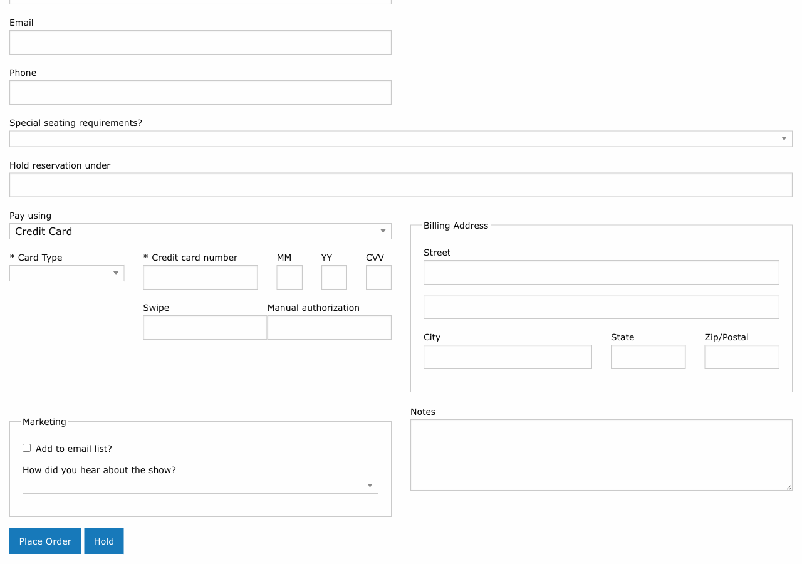

# Payment Processing

!!! info "Role: Box Office Staff, Administrators"
    Payment processing is the final step in order creation. Stagemgr supports multiple payment methods to accommodate different purchase scenarios.

**Navigation:** Stagemgr > Orders > [New Order] > Payment Section

## Overview

Every order (except hold orders) requires a payment method. The payment section appears at the bottom of the order form after all other details have been entered. Select the appropriate payment type and enter the required information to complete the transaction.

## Payment Methods

### Credit Card

Credit card payments are processed through Stripe, Stagemgr's primary payment gateway.

| Field | Description |
|-------|-------------|
| **Card Number** | The full credit card number |
| **Expiration Date** | Month and year of card expiration |
| **CVC** | The 3- or 4-digit security code |
| **Cardholder Name** | Name as printed on the card |

**How it works:**

1. Select **Credit Card** as the payment type
2. Enter the card details
3. On order submission, every check on the order runs first -- seats still held, balance, payment type allowed for the performance, special offer, any additional donation. The card is charged only after all of them pass.
4. If a check fails or the card is declined, an error message is displayed, the order is not created and the card is not charged
5. On success, the payment is recorded and linked to the order

!!! note "Automatic Refund on Late Failure"
    If something still goes wrong after the card has been charged, the order is not saved and the charge is refunded to the card automatically. The same applies to the price difference on an exchange and to [Add to Order](add-to-order.md).

### Additional Donations

An additional donation added to a ticket order is charged separately, after the tickets have been paid for. If the donation is declined:

- The ticket order still goes through and keeps its tickets and payment
- The on-screen notice after the order is placed adds *Your additional donation could not be processed; the box office will follow up with you.*
- A note starting *Additional donation not processed* is added to the order's notes, with the amount and reason
- An *Additional donation not processed* alert email goes to the box office address, with a link to the order and the patron's contact details

Follow up with the patron to take the donation another way.

!!! tip "Phone Orders"
    For phone orders, read the card details aloud and enter them carefully. Ask the patron to verify the billing ZIP code if the charge is declined.

!!! warning "PCI Compliance"
    Never write down or store credit card numbers outside of Stagemgr. The system handles card data securely through Stripe and does not store full card numbers.

### Cash

Cash payments are recorded when the patron pays with physical currency at the box office.

1. Select **Cash** as the payment type
2. The full order amount is recorded as a cash payment
3. No additional fields are required
4. Ensure you collect the correct amount and provide change as needed

### Check

Check payments are used when a patron pays by personal or organizational check.

1. Select **Check** as the payment type
2. The full order amount is recorded as a check payment
3. Record the check number in the **Notes** field for reference
4. Ensure the check is made out to the correct payee and for the correct amount

### External Payment

External payments cover payment methods processed outside of Stagemgr, such as PayPal transactions or wire transfers.

1. Select **External Payment** as the payment type
2. The amount is recorded but no actual transaction is processed through Stagemgr
3. Use the **Notes** field to document the external payment reference number or details

### Comp (Complimentary)

Comp orders are for tickets provided at no charge -- press comps, VIP guests, staff tickets, etc.

1. Select **Comp** as the payment type
2. No payment is collected
3. The order is recorded with a zero balance
4. Comp orders are tracked separately in reports

!!! tip "Comp Tracking"
    Even though no payment is collected, comp orders still count against inventory. Always create a proper order for complimentary tickets rather than leaving seats untracked.

### Flex Pass

Flex pass payments redeem a previously purchased flex pass for tickets.

1. Select **Flex Pass** as the payment type
2. Enter the **Flex Pass Code** in the provided field
3. The system validates the code and checks remaining uses
4. If valid, the pass is redeemed and the order is completed
5. The number of remaining uses on the pass is decremented

See [Flex Pass Orders](flex-pass-orders.md) for details on purchasing and managing flex passes.

!!! warning "Flex Pass Restrictions"
    Flex pass redemption may be limited by expiration date and remaining uses. If the pass is expired or has no remaining uses, the system will reject the payment.

### Membership

Membership payments use an active membership benefit to obtain tickets.

1. Select **Membership** as the payment type
2. Enter the **Member Code** (format: TW-XXXXXX)
3. The system validates the membership and checks eligibility
4. If valid, the tickets are issued under the membership benefit
5. Membership usage limits apply (tickets per performance, per-production visit frequency)

See [Membership Orders](membership-orders.md) for details on membership management.

## Payment and Order Type Compatibility

Not all payment types are available for all order types:

| Payment Type | Ticket Orders | Donation Orders | Flex Pass Orders | Membership Orders |
|-------------|:---:|:---:|:---:|:---:|
| Credit Card | Yes | Yes | Yes | Yes |
| Cash | Yes | Yes | Yes | Yes |
| Check | Yes | Yes | Yes | Yes |
| External | Yes | Yes | Yes | Yes |
| Comp | Yes | No | No | No |
| Flex Pass | Yes | No | No | No |
| Membership | Yes | No | No | No |

## Payment in Exchanges

When exchanging an order, the payment types offered are the ones the performance allows, with the original order's type preselected when it is allowed. The system calculates the price differential:

- **New order costs more:** The patron pays the difference.
- **New order costs less:** A credit or partial refund may apply.
- **Same price:** No additional payment is needed.

See [Exchanges](exchanges.md) for the full exchange workflow.

## Refund Behavior by Payment Type

When a refund is processed, the reversal method depends on the original payment:

| Original Payment | Refund Method |
|-----------------|---------------|
| Credit Card | Refund issued to the original card via Stripe |
| Cash | Cash refund issued at the box office |
| Check | Check refund issued by the organization |
| External | Refund processed through the original external method |
| Comp | No refund needed (no payment was made) |
| Flex Pass | Uses are restored to the flex pass |
| Membership | Membership usage is restored |

An order with several payments has each one refunded on its own tender. See [Refunds](refunds.md#orders-with-several-payments).

## Troubleshooting

| Issue | Resolution |
|-------|------------|
| Credit card declined | Verify card details, check expiration date, ask patron to contact their bank |
| Flex pass code not recognized | Verify the code, check if the pass has expired or has zero remaining uses |
| Membership code invalid | Verify the code format (TW-XXXXXX), check if the membership is active |
| Payment amount mismatch | Ensure all ticket classes and quantities are correct before processing |
| Duplicate charge | Check the order list for duplicate orders; contact Stripe support if needed |
