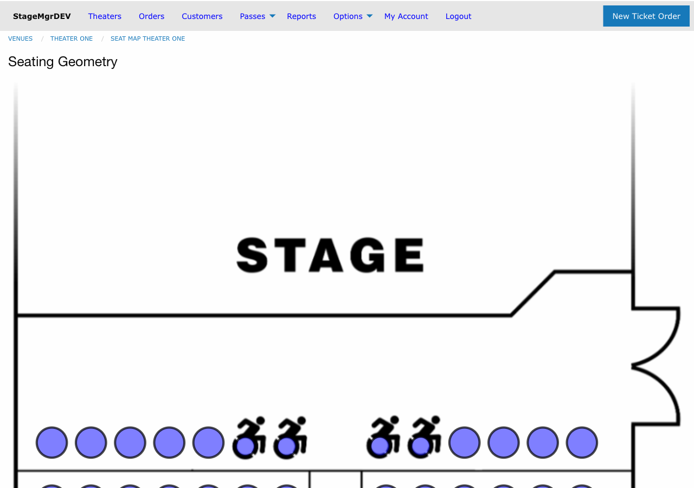

# Seat Selection

!!! info "Role: Box Office Staff, Administrators"
    The seat map interface is used whenever creating or modifying orders for reserved seating performances. Understanding how to navigate and use the seat map efficiently is essential for box office operations.

**Navigation:** Stagemgr > Orders > Ticket Orders > New Ticket Order > [Select Reserved Seating Performance]

## Overview

The seat map interface provides a visual representation of the venue layout. It displays every seat in the house, color-coded by status, and allows staff to reserve and release seats in real time during order creation.

## Seat Map Display

### Seat Status Colors

| Color/Indicator | Meaning |
|-----------------|---------|
| **Available** | Seat is open and can be selected |
| **Selected** | Seat has been selected for the current order (highlighted) |
| **Occupied** | Seat is sold or assigned to another order |
| **Held** | Seat is on hold for another order or reservation |
| **Wheelchair** | Designated wheelchair-accessible position |
| **Unavailable** | Seat is blocked or out of service |

### Navigating the Map

The seat map displays the venue from the audience perspective (stage at the top). Sections, rows, and seat numbers are labeled. For larger venues, you may need to scroll or zoom to locate specific seats.

## Selecting Seats

### Reserve a Seat

1. Locate the desired seat on the map
2. Click the seat to select it
3. The seat changes to the **Selected** indicator
4. The seat is temporarily held for your order while you complete the form

You can select multiple seats by clicking each one individually.

### Deselect a Seat

1. Click an already-selected seat
2. The seat returns to **Available** status
3. The temporary hold is released immediately

### Temporary Holds

When you select a seat on the map, it is placed in a **temporary hold** for the duration of your order creation session. This prevents other staff members from selecting the same seat simultaneously.

!!! warning "Session Timeout"
    Temporary holds are released if the order form is abandoned or the session times out. Do not leave an order form open indefinitely with seats selected, as the holds will eventually expire and the seats may be claimed by another order.

## Assigning Ticket Classes

After selecting seats, each seat must be assigned a ticket class:

1. Selected seats appear in a list below the seat map
2. For each seat (or group of seats), choose the appropriate ticket class from the dropdown
3. Pricing updates automatically based on the selected ticket class
4. The order total reflects all seat assignments

| Example Ticket Class | Typical Use |
|----------------------|-------------|
| Adult | Standard full-price ticket |
| Senior | Discounted rate for seniors |
| Student | Discounted rate for students |
| Child | Discounted rate for children |
| Comp | Complimentary ticket (no charge) |

## Wheelchair and Accessible Seating

### Wheelchair Positions

Wheelchair-accessible seats are marked on the seat map with a distinct indicator. These positions are designed for patrons who use wheelchairs.

1. Locate the wheelchair-designated positions on the map
2. Select the wheelchair seat(s) as needed
3. Companion seats adjacent to wheelchair positions can be selected for the patron's companions

### Wheelchair Conversion

Some venues allow standard seats to be temporarily converted to wheelchair-accessible positions when needed. This is managed through the seat map configuration and is not typically done during order creation.

!!! tip "Know Your Venue"
    Familiarize yourself with the location of all wheelchair-accessible positions in your venue. Patrons requiring accessible seating should be directed to these designated areas.

## Releasing Held Seats

If seats are currently on hold (from a hold order or another process), they can be released back to available inventory:

1. Held seats appear with the **Held** indicator on the map
2. If you have permission, you can release a held seat by selecting the appropriate action
3. Released seats immediately become available for selection

!!! warning "Releasing Holds"
    Releasing a held seat removes it from the hold order that reserved it. Only release holds when you are certain the original reservation is no longer needed.

## Best Practices

### Filling the House

When patrons have no seat preference, follow these guidelines for selecting seats:

1. **Start from center** -- fill center sections before sides
2. **Fill front-to-back** -- unless the patron requests otherwise
3. **Keep groups together** -- avoid splitting parties across rows or sections
4. **Leave accessible seats open** -- do not assign wheelchair positions to non-disabled patrons unless the house is nearly full

### Handling Seat Conflicts

If two staff members attempt to select the same seat simultaneously:

1. The first selection creates a temporary hold
2. The second staff member will see the seat as **Held** or **Occupied**
3. The second staff member should select a different seat
4. Temporary holds resolve automatically if the first order is not completed

### Large Group Orders

For large groups requiring many seats together:

1. Identify a section with enough contiguous available seats
2. Select seats row by row to keep the group together
3. Assign ticket classes after all seats are selected
4. Use the **Notes** field on the order to record group details

## Troubleshooting

| Issue | Resolution |
|-------|------------|
| Seat appears occupied but patron says it should be available | Check the order assigned to that seat; it may need to be refunded or canceled |
| Cannot select a seat | Verify the seat is not held, occupied, or blocked. Check permissions. |
| Seat map is not loading | Verify the performance has a seat map assigned. Refresh the page. |
| Temporary hold expired | Re-select the seat. If it was claimed, choose an alternative. |
